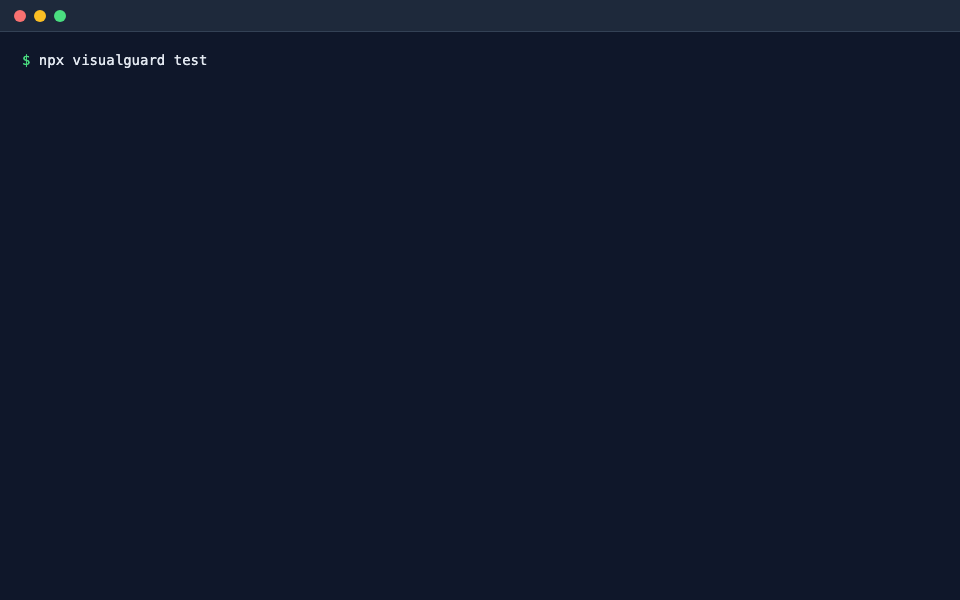
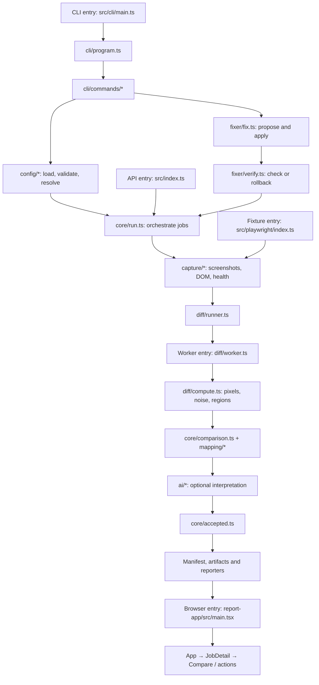

# VisualGuard

[](https://www.npmjs.com/package/visualguard) [](https://github.com/ShubhamTiwari909/visualguard-ai-testing/actions/workflows/ci.yml) [](LICENSE) [](https://nodejs.org) [](https://www.npmjs.com/package/visualguard)

**Capture visual differences, understand what changed, and propose repairs you can verify.**

VisualGuard uses Playwright to compare production and staging, a site and saved baselines, or checkpoints inside your existing browser tests. Pixel diffs and DOM snapshots explain changes without AI. Gemini or Ollama can add classifications and patch proposals. Reports keep screenshots, findings and verification evidence together.



> **Release status:** This README describes the current source checkout, including changes intended for the next major release. These changes are not a claim that v2 has been published. Existing users should read the [reliability and migration guide](docs/RELIABILITY-CHANGES.md) before upgrading; older npm versions may behave differently.

## Contents

- [Features](#features)
- [Install and run](#install-and-run)
- [Configure your project](#configure-your-project)
- [Results and reports](#results-and-reports)
- [Stable screenshots and dynamic content](#stable-screenshots-and-dynamic-content)
- [AI analysis, intent and budgets](#ai-analysis-intent-and-budgets)
- [Propose and verify fixes](#propose-and-verify-fixes)
- [Accept intentional changes](#accept-intentional-changes)
- [Saved baselines](#saved-baselines)
- [Use inside Playwright tests](#use-inside-playwright-tests)
- [Authentication and capture hooks](#authentication-and-capture-hooks)
- [Accessibility and performance](#accessibility-and-performance)
- [Watch mode and production monitoring](#watch-mode-and-production-monitoring)
- [CI, sharding and integrations](#ci-sharding-and-integrations)
- [Programmatic API and reporters](#programmatic-api-and-reporters)
- [Command reference](#command-reference)
- [Try the local example](#try-the-local-example)
- [Package architecture](#package-architecture)
- [Development and evaluation](#development-and-evaluation)
- [Compatibility and troubleshooting](#compatibility-and-troubleshooting)

## Features

| Capability                 | What you can do                                                                                                                                             |
| -------------------------- | ----------------------------------------------------------------------------------------------------------------------------------------------------------- |
| Live comparisons           | Compare production, staging, localhost or a PR preview, including pages whose paths differ between environments.                                            |
| Saved references           | Compare against explicit baselines, scan a single URL repeatedly, or monitor production against its previous capture.                                       |
| Responsive coverage        | Define multiple viewport sizes and select Chromium, Firefox or WebKit for a run.                                                                            |
| Route discovery            | Discover Next.js routes, sitemap URLs or links; expand dynamic parameters and include/exclude route globs.                                                  |
| Pixel and DOM evidence     | See changed regions, mapped elements, text/style changes, layout shifts and deterministic regression findings.                                              |
| Stable capture             | Wait for fonts and quiet networking, load lazy content, disable animations, pause media, freeze time, hide widgets and mask dynamic areas.                  |
| Noise detection            | Repeat the reference capture to identify changing areas; ignore anti-aliasing and configure pixel/ratio tolerances.                                         |
| Optional AI                | Classify uncertain differences with Gemini or Ollama; reuse validated request caches and re-analyze saved runs.                                             |
| Change intent and controls | Supply expected change context, keep AI advisory, and bound analyses, generation attempts, network requests, tokens and deadlines.                          |
| Verified repair            | Locate likely source files, preview deterministic or AI edits, apply with confirmation, run commands and check saved references for collateral changes.     |
| Interactive reports        | Compare images side by side, with a slider, onion-skin overlay or diff view; search/filter jobs, inspect regions, accept changes and propose fixes locally. |
| Independent checks         | Detect broken images, HTTP/request failures, overflow and other health findings; optionally compare axe accessibility and browser performance metrics.      |
| Playwright fixture         | Check an interactive test page with `visualguard.check`, replay the production state and attach evidence to the Playwright report.                          |
| CI and automation          | Emit JUnit/JSON, job summaries, sticky PR comments and webhooks; split work into shards and validate complete merges.                                       |
| Extensibility              | Use the programmatic run API, cancellation signals, capture hooks and custom reporters.                                                                     |

## Install and run

Requires **Node.js 22.12 or newer** and Playwright browser binaries. AI is optional.

```bash
npm install -D visualguard playwright
npx playwright install chromium
npx visualguard init
npx visualguard doctor
npx visualguard test
npx visualguard report
```

`init` creates a configuration and can generate a GitHub Actions workflow. Set your production/staging URLs and routes before running `test`. `doctor` checks the environment and configuration. `report` opens the latest report and keeps a local server running until you stop it.

### Start without a configuration

```bash
# Scan one site; the first scan saves snapshots, later scans compare and update them.
npx visualguard https://example.com --no-ai

# Compare two sites; discover routes from the production site.
npx visualguard https://example.com https://staging.example.com --no-ai

# Compare two specific pages, even with different paths.
npx visualguard https://example.com/pricing https://staging.example.com/plans
```

Zero-config scans limit discovered routes to 25. A configuration gives you explicit route, viewport, authentication and capture control. For a zero-config run, an available `GEMINI_API_KEY` can enable Gemini automatically; `--no-ai` skips analysis.

## Configure your project

Create `visualguard.config.ts` in your project root:

```ts
import { defineConfig } from "visualguard";

export default defineConfig({
  baseURL: {
    production: "https://example.com",
    staging: "http://localhost:3000",
  },
  routes: [
    "/",
    { path: "/pricing", staging: "/plans" },
    {
      path: "/checkout",
      waitFor: "[data-testid=order-summary]",
      mask: ["[data-testid=order-id]"],
    },
    { path: "/blog/[slug]", params: [{ slug: "hello-world" }] },
  ],
  viewports: {
    desktop: { width: 1440, height: 900 },
    mobile: { width: 390, height: 844, isMobile: true, hasTouch: true },
  },
  browser: { name: "chromium", locale: "en-US", colorScheme: "light" },
  stabilize: {
    freezeTime: "2026-01-01T00:00:00Z",
    hide: [".cookie-banner"],
    mask: ["[data-testid=live-price]"],
  },
  diff: { threshold: 0.1, maxDiffPixels: 20 },
  ai: { provider: "none" },
});
```

Alternatively, replace `routes` with discovery settings:

```ts
routes: {
  discover: ["nextjs", "sitemap", "crawl"],
  extra: [{ path: "/blog/[slug]", params: [{ slug: "hello-world" }] }],
  include: ["/**"],
  exclude: ["/admin/**"],
  limit: 50,
  crawlDepth: 2,
},
```

Configuration fragments in this README belong inside `defineConfig({ ... })`. `.ts`, `.mts`, `.js`, `.mjs` and `.cjs` configuration files are supported; select another file with `--config <path>`.

| Group                             | Controls                                                                                                 |
| --------------------------------- | -------------------------------------------------------------------------------------------------------- |
| `routes`, `viewports`, `browser`  | URLs, discovery, dimensions, touch/mobile settings, locale, timezone, theme, scale and browser timeouts. |
| `environments`, `hooks`           | Per-environment headers/storage state and page preparation callbacks.                                    |
| `stabilize`, `screenshot`, `diff` | Capture stability, full-page/max-height settings, pixel thresholds, regions, shifts and noise mapping.   |
| `ai`, `fix`                       | Providers, analysis policy/budgets, editable source scope, proposals and verification.                   |
| `baseline`, `monitor`, `output`   | Reference storage, update policy, acceptance and run retention.                                          |
| `checks`, `report`, `reporters`   | Independent checks, HTML/JUnit/webhooks and custom integrations.                                         |
| `concurrency`                     | Number of jobs captured concurrently.                                                                    |

A base path is preserved: `https://example.com/app` plus `/pricing` becomes `https://example.com/app/pricing`. Base URL query parameters are applied to each route.

### Overrides and environment variables

CLI overrides take precedence over environment variables, then configuration, then defaults. `.env` and `.env.local` are loaded from the working directory; existing shell/CI variables win.

| Variable                                                | Purpose                                                 |
| ------------------------------------------------------- | ------------------------------------------------------- |
| `VISUALGUARD_PRODUCTION_URL`, `VISUALGUARD_STAGING_URL` | Override environment base URLs, including PR previews.  |
| `VISUALGUARD_AI_PROVIDER`                               | Select `gemini`, `ollama` or `none`.                    |
| `GEMINI_API_KEY` / `GOOGLE_API_KEY`                     | Gemini credentials; `GEMINI_API_KEY` takes precedence.  |
| `OLLAMA_HOST`                                           | Address of your Ollama server.                          |
| `VISUALGUARD_BROWSER`, `VISUALGUARD_OUTPUT_DIR`         | Override the selected browser and run output directory. |
| `VISUALGUARD_RUN_GROUP`                                 | Shared identity for shards of one execution.            |
| `VISUALGUARD_WEBHOOK_URL`                               | Destination for run-summary webhooks.                   |

## Results and reports

Each route/viewport job receives a status:

| Status       | Meaning                                                                                |
| ------------ | -------------------------------------------------------------------------------------- |
| `pass`       | Within visual tolerance, or classified as noise without independent blocking findings. |
| `accepted`   | Matches an intentional change previously accepted by a reviewer.                       |
| `review`     | A difference or independent check needs review.                                        |
| `regression` | A deterministic failure or AI-classified regression.                                   |
| `error`      | Capture or processing failed.                                                          |

`--fail-on regression` is the default. `--fail-on review` also fails on reviews; `any` currently has the same failing statuses as `review`. Errors always fail, as do explicitly incomplete merged runs.

Every run writes `.visualguard/runs/<run>/` with `manifest.json`, available screenshots, DOM snapshots, diff images/region crops and `index.html`. The report supports search, status filters, light/dark themes, deep links and keyboard navigation (`j`/`k` for jobs, `1`–`4` for image views, `/` for search).

```bash
npx visualguard report
npx visualguard report --run <run-id>
npx visualguard report --no-serve  # write the HTML and print its location
```

HTML embeds application JS/CSS but references screenshot files: **share the entire run directory**. Static reports can open from disk; acceptance and fix actions require the local served report. `output.keepRuns` defaults to 10. Add `.visualguard/` to `.gitignore` (`init` does this).

## Stable screenshots and dynamic content

VisualGuard creates isolated browser contexts, disables CSS animations/transitions, waits for fonts and quiet networking, scrolls to load lazy content, hides common widgets, pauses media and the clock before capture, and checks consecutive screenshots for stability. Use `freezeTime` when dates must be repeatable.

Mask selectors preserve element dimensions; hide selectors conceal the element. Choose stable-size containers when masking variable content. You can also mark dynamic elements directly:

```html
<span data-visualguard-ignore>Live visitor count</span>
<div data-visualguard-ignore="hide">Rotating ticker</div>
```

When a page differs, the default noise map repeats the reference capture and excludes areas that vary between reference loads. It is skipped if its area exceeds `diff.noiseMapMaxRatio` (default 25%). Disable it with `diff: { noiseMap: false }` when those changing areas matter to your comparison.

`diff.threshold` is per-pixel colour tolerance; `maxDiffPixels` and `maxDiffRatio` control how much total change is allowed. Anti-aliasing is ignored by default. These settings can suppress small changes, so inspect tolerances and masks when an expected difference is absent.

## AI analysis, intent and budgets

Without AI, VisualGuard maps changed regions to DOM elements and reports style/text/presence/layout changes. Removed controls, new overlaps, clipping, low contrast, broken images and overflow can produce deterministic regressions. Other changes usually require review.

Enable Gemini in your configuration and put its key in your environment or ignored `.env.local`:

```ts
ai: {
  provider: "gemini",
  // Set model to a pinned model ID available to your account for repeatable CI.
  analyze: "uncertain",       // "all" also explains deterministic regressions
  thinking: "low",           // "off" | "low" | "default"
  imageDetail: "medium",      // "low" | "medium" | "high"
  advisory: true,             // attach analysis while preserving deterministic status
  maxCallsPerRun: 30,
  maxGenerationAttempts: 60,  // includes structured-answer repair attempts
  maxNetworkAttempts: 120,    // includes built-in provider retries
  maxTokens: 200_000,
  timeoutMs: 120_000,
  cacheTTLHours: 24,
  intent: {
    title: "Update pricing copy",
    description: "Layout and checkout controls should remain unchanged.",
    changedFiles: ["app/pricing/page.tsx"],
  },
},
```

For a locally hosted model, use `ai: { provider: "ollama", model: "qwen2.5vl" }` and a running Ollama server with the model installed. Use `provider: "none"` or `test --no-ai` for deterministic analysis.

AI classifies differences as regression, intentional, content or noise. With advisory mode off (the default), sufficiently confident noise may turn a review into a pass. AI cannot downgrade deterministic regressions or waive independent health/check reviews. Change intent provides context; it does not authorize bypassing checks. Self-reported confidence is not a calibrated probability.

Analysis sends prepared screenshot images and DOM context to the selected provider. Fix proposals may also send source excerpts after consent. Missing credentials or provider failures fall back to deterministic analysis. The default Gemini model is a moving alias; returned model revisions are retained when available.

```bash
# Analyze saved artifacts without capturing the site again.
npx visualguard analyze --run <run-id> --provider gemini
npx visualguard analyze --run <run-id> --provider gemini --no-cache
```

Caches hash the complete prepared request, validate stored answers and expire by default after 24 hours. Analysis and later repair share saved token/attempt usage. Each invocation has its own deadline. Reports and fix artifacts expose usage; limits stop subsequent work, but an in-flight request can exceed the token limit and some failed requests do not return billable usage.

## Propose and verify fixes

Fixing is disabled by default. Enable it and define source scope plus a verification server:

```ts
fix: {
  enabled: true,
  include: ["app/**", "components/**", "styles/**"],
  // compareRef: "origin/main", // prioritize files changed since this ref
  verify: {
    server: { command: "npm run dev", url: "http://localhost:3000" },
    commands: ["npx tsc --noEmit"],
    commandTimeoutMs: 300_000,
  },
  maxAttempts: 2,
},
```

```bash
npx visualguard fix
npx visualguard fix /checkout --include-review
npx visualguard fix --run <run-id> --allow-dirty
```

The repair loop locates likely source files, proposes deterministic class/CSS repairs or AI search/replace edits, shows the diff, asks for confirmation, applies edits and verifies. It requires a Git repository and a clean working tree unless you explicitly use `--allow-dirty`. Editable scope excludes lockfiles, environment and configuration files. AI edits are restricted to supplied candidate files, and source upload requires consent or `fix.allowSourceUpload: true`.

Visual verification uses saved reference screenshots and capture policy from the selected run. Failed commands or visual mismatches revert edits. A final check covers the original run's routes/viewports to detect collateral changes; failures revert the batch. Uncaptured routes cannot be verified. Current authentication and hook callbacks must still match the original capture because credentials/functions are not serialized.

Proposals are checked for intervening file changes. Multi-file write failures attempt rollback; verification commands have bounded process termination. `fix-results.json`, `fixes/` and `fix-checks/` retain outcomes, available usage and verification evidence under the source run. Without a server, interactive edits are labelled `unverified`.

The served report offers **Generate fix → review diff → Apply and verify**. Proposals expire and concurrent report applications are blocked.

### Automatic Git workflow

`fix --auto` requires a verification server, creates a branch/worktree and commits only verified fixes. `--pr` additionally pushes and opens a PR; `--in-place` uses the current checkout. AI source-upload consent must already exist or be configured. Use plain interactive `fix` when you want edits without automatic commits or pushes.

## Accept intentional changes

```bash
npx visualguard accept /pricing --note "Approved pricing redesign"
npx visualguard accept --all  # accept jobs marked review
```

The served report also has an **Accept change** action. Acceptance is recorded in `visualguard.accepted.json` (configurable with `output.acceptedFile`) for sharing through version control.

The default `output.acceptMatch: "similar"` permits the same accepted change despite minor rendering variation; `"exact"` requires identical image hashes. Different/additional changes are flagged again. **Acceptance cannot hide a new independent health, accessibility or performance failure/review.**

## Saved baselines

Use baseline mode when you have one site and want reviewed snapshots as the reference:

```ts
mode: "baseline",
baseURL: { staging: "http://localhost:3000" },
baseline: { dir: "visualguard/baselines" },
```

```bash
npx visualguard test --update-baselines  # explicitly create/update references
npx visualguard test                    # compare with existing references
```

Missing baselines fail by default. New references include PNG, rendering metadata, DOM and health sidecars; version them together. Incompatible browser/platform/viewport/theme/project settings require regeneration or the original settings. Fixture identities also include the test file, project and checkpoint.

`baseline.legacy: "allow"` permits temporary migration of legacy CLI snapshots; it does not bypass incompatible metadata. `baseline.missing: "create"` is an explicit onboarding option with different persistence semantics in the CLI and fixture. See the [migration guide](docs/RELIABILITY-CHANGES.md#migration) before using it.

## Use inside Playwright tests

Install `@playwright/test` alongside VisualGuard and configure Playwright's `use.baseURL` for staging. Import the extended test fixture:

```ts
import { test } from "visualguard/playwright";

test.use({
  visualguardOptions: { collectHealth: true, failOn: "review" },
});

test("cart opened", async ({ page, visualguard }) => {
  await page.goto("/shop");
  await page.getByRole("button", { name: "Cart" }).click();
  await visualguard.check(page, {
    name: "cart-open",
    waitFor: "[data-testid=cart]",
    mask: ["[data-testid=order-id]"],
    referenceSetup: async (reference) => {
      await reference.getByRole("button", { name: "Cart" }).click();
    },
  });
});
```

`check` compares the current page with the same path on production. `referenceSetup` brings the fresh production page to the matching interactive state. If no production URL is configured, it uses fixture baselines under `baseline.dir/playwright`; explicitly create/update them with `npx playwright test --update-snapshots`.

The fixture shares classification, AI/cache, acceptance and configured checks with the CLI, and attaches screenshots plus `result.json` evidence. Configure `config`, `configPath` and `failOn` through `visualguardOptions`; each check accepts `name`, `waitFor`, `mask`, `hide`, `failOn` and `referenceSetup`.

`collectHealth: true` instruments the provided `page` before navigation. Events that occurred before instrumentation on an externally created page cannot be recovered. AI sessions are per test; the test-owned clock stays under test control, and the fixture does not automatically replay the current page for a second noise capture. See the [fixture capability table](docs/RELIABILITY-CHANGES.md#playwright-fixture-capability-contract).

## Authentication and capture hooks

```bash
npx visualguard auth production
npx visualguard auth staging --until-url '**/dashboard'
```

Log in in the browser and save the session, then configure each environment:

```ts
environments: {
  production: { storageState: ".visualguard/auth/production.json" },
  staging: {
    storageState: ".visualguard/auth/staging.json",
    headers: { "x-vercel-protection-bypass": process.env.VERCEL_BYPASS_SECRET ?? "" },
  },
},
hooks: {
  beforeCapture: async ({ page }) => {
    await page.evaluate(() => window.scrollTo(0, 0));
  },
},
```

`beforeNavigate` and `beforeCapture` receive the Playwright page, environment, route, URL and viewport. Use them to prepare page state consistently. Session files contain credentials and should remain private; keep keys and bypass tokens in environment variables.

## Accessibility and performance

```bash
npx visualguard test --a11y --perf
```

Or enable checks in configuration:

```ts
checks: {
  accessibility: { minImpact: "serious", severity: "regression" },
  performance: {
    lcpIncreaseMs: 1000,
    clsIncrease: 0.1,
    weightIncreasePercent: 20,
    weightIncreaseKB: 100,
    severity: "review",
  },
},
```

Accessibility uses axe-core to compare new/worsened violations, including issues with unchanged pixels. Performance records browser timings and resource signals and checks LCP, CLS and page/JavaScript weight increases. Both are optional and default to `review` when enabled with `true`. Compare equivalent builds, browser settings and environments; a development server is not a reliable performance reference for a production build.

## Watch mode and production monitoring

```bash
# Compare your dev server with production as source files change.
npx visualguard watch --staging http://localhost:3000

# Compare production with its previous capture.
npx visualguard monitor https://example.com

# Generate a scheduled GitHub workflow; this writes a workflow file.
npx visualguard monitor --workflow "0 */6 * * *"
```

Watch mode re-tests routes connected to changed files through page imports; untraceable/shared changes re-test the full scope. It uses `fix.verify.server.url` or the staging override for the local site.

Monitor saves its first reference under `.visualguard/monitor/<host>/`. The default `monitor.update: "unless-regression"` retains references for regressed pages until repaired or explicitly reset with `--reset`; `"always"` rolls every page forward. Persist the monitor directory between CI runs. Webhooks can deliver summaries to Slack, n8n or another receiver.

## CI, sharding and integrations

The essential CI commands are:

```bash
npx playwright install --with-deps chromium
npx visualguard test --ci --junit visualguard-junit.xml
```

Upload the entire run directory and JUnit file even when the test exits nonzero. `init` can generate a GitHub workflow with report artifacts and a sticky PR comment. GitHub runs can append a job summary; `visualguard comment --link <artifact-url>` updates the PR comment and needs a token with PR write permission. Fork PR tokens may lack that permission.

For preview deployments, pass their URL through `VISUALGUARD_STAGING_URL` or `--staging`. The webhook integration (`report.webhook` / `VISUALGUARD_WEBHOOK_URL`) POSTs a JSON run summary with a ready-to-use `text` field. `report.publicURL` provides report links; it does not host the report.

### GitHub Action

The repository's [composite Action](action/README.md) installs the selected browser, runs the test, uploads artifacts, optionally comments and propagates failures. Select a release tag or commit containing the desired behavior.

Inputs include `working-directory`, `browser`, `output-directory`, `artifact-name`, `junit-path`, `args`, `fail-on`, `staging-url`, `gemini-api-key`, `comment`, `github-token` and `exec`. Browser/output inputs override configuration and match installation/artifact paths. Use distinct artifact names in matrix jobs. The Action exposes `report-url` and `outcome`; configure an AI provider as well as supplying credentials when AI is desired.

### Sharding

Use the same unique execution group, configuration, source revision and job scope on every shard:

```bash
npx visualguard test --ci --shard 1/2 --run-group ci-execution-123
npx visualguard test --ci --shard 2/2 --run-group ci-execution-123
# Download/copy the shard run directories into a common folder first.
npx visualguard merge downloaded-shards --ci --junit merged-junit.xml
```

GitHub Actions derives the group from the run ID/attempt automatically; other systems can set `VISUALGUARD_RUN_GROUP`. Jobs are sorted and distributed round-robin. Merge rejects mixed groups/settings/revisions, duplicate shards/jobs, legacy provenance and incomplete coverage. `--allow-partial` explicitly produces a diagnostic report with an incomplete banner and a failing exit code.

## Programmatic API and reporters

```ts
import { createRun, exitCodeFor, parseConfig, resolveConfig, terminalReporter } from "visualguard";

const config = resolveConfig(
  parseConfig({
    baseURL: { production: "https://example.com", staging: "http://localhost:3000" },
    routes: ["/", "/pricing"],
  }),
  { cwd: process.cwd() },
);

const controller = new AbortController();
const { manifest, runDir } = await createRun(config, {
  signal: controller.signal,
  reporters: [
    terminalReporter(),
    {
      name: "dashboard",
      async onRunEnd(result, context) {
        console.log(context.runDir, result.summary);
      },
    },
  ],
}).start();

console.log(runDir);
process.exitCode = exitCodeFor(manifest, "regression");
```

Custom reporters implement `onEvent` and/or `onRunEnd`. CLI users can add them through `reporters` in configuration; API callers supply them in run options. The package exports configuration helpers, run/event/result types, status helpers and terminal/JSON reporters. Programmatic runs select reporters explicitly; the CLI's HTML/JUnit/webhook setup is not automatically implied by this example. `RunOptions.signal` enables cancellation.

## Command reference

| Command                        | Purpose                                                          |
| ------------------------------ | ---------------------------------------------------------------- |
| `visualguard <url> [url2]`     | Scan one site or compare two URLs without setup.                 |
| `visualguard init`             | Create configuration and optionally a CI workflow.               |
| `visualguard doctor`           | Diagnose setup, browser, configuration and reachability.         |
| `visualguard test`             | Run the configured live comparison or baseline check.            |
| `visualguard analyze`          | Re-analyze saved captures with a provider/model or bypass cache. |
| `visualguard report`           | Open/serve a report; select a run or write static HTML only.     |
| `visualguard accept [routes]`  | Record intentional changes for later runs.                       |
| `visualguard fix [routes]`     | Propose, apply and verify repairs.                               |
| `visualguard watch [routes]`   | Re-test local source changes.                                    |
| `visualguard monitor [url]`    | Compare a site with its previous capture or generate a schedule. |
| `visualguard auth <env>`       | Save an authenticated browser session.                           |
| `visualguard merge <paths...>` | Validate and combine shard results.                              |
| `visualguard comment`          | Post/update a sticky GitHub PR comment; supports `--dry-run`.    |

Common `test` flags:

| Flags                                        | Purpose                                                                        |
| -------------------------------------------- | ------------------------------------------------------------------------------ |
| `--config`, `--production`, `--staging`      | Select configuration and override environment URLs.                            |
| `--route`, `--only`, `--viewport`            | Replace routes, filter route globs or select configured viewports; repeatable. |
| `--browser`, `--output-dir`, `--concurrency` | Select the browser, artifact directory and capture parallelism.                |
| `--provider`, `--model`, `--no-ai`           | Select or disable AI analysis.                                                 |
| `--a11y`, `--perf`                           | Enable independent checks for this run.                                        |
| `--update-baselines`                         | Explicitly update references in baseline mode.                                 |
| `--shard`, `--run-group`                     | Partition jobs and identify one execution.                                     |
| `--ci`, `--json`, `--junit`, `--debug`       | Plain CI output, JSON stdout, JUnit output or Playwright traces.               |
| `--list`, `--fail-on`                        | Inspect planned jobs without capture or select failure policy.                 |

Run `npx visualguard <command> --help` for command-specific options. Exit codes: `0` success, `1` failed jobs/incomplete results, `2` configuration/usage error, `3` environment error.

## Try the local example

The [Next.js + Tailwind example](examples/nextjs/README.md) includes three seedable regressions. From a clone, first run `pnpm install` and `pnpm build` at the repository root. Then use separate terminals:

```bash
# Terminal 1: build correct source before seeding; keep production running on :3101.
cd examples/nextjs
pnpm build
pnpm start
```

```bash
# Terminal 2: introduce regressions, then serve staging on :3100.
cd examples/nextjs
pnpm seed
pnpm dev
```

```bash
# Terminal 3: inspect differences and repair with confirmation.
cd examples/nextjs
pnpm exec visualguard test --no-ai --route / --route /pricing --route /checkout
pnpm exec visualguard report
# Stop the report server with Ctrl+C before the next command.
pnpm exec visualguard fix --no-ai --include-review --allow-dirty
pnpm exec visualguard test --no-ai --route / --route /pricing --route /checkout
```

These class changes exercise deterministic repairs without a key. Plain `fix` leaves source edits for you to review. `pnpm unseed` restores any remaining seeded changes. Rebuild production only from the correct source; building after seeding would make the regression your reference.

For a static demonstration, `node scripts/serve-fixtures.mjs` serves production on `:4100` and staging on `:4101`. In another terminal at the repository root, run `node packages/visualguard/dist/cli.js http://127.0.0.1:4100/alignment http://127.0.0.1:4101/alignment --no-ai` after building the package.

## Package architecture

The CLI enters through `src/cli/main.ts`, and `core/run.ts` coordinates the comparison pipeline. Paths in this section are relative to `packages/visualguard/`.

### Entry points

| Entry                                | Source file                                                             | What it does                                                                                          |
| ------------------------------------ | ----------------------------------------------------------------------- | ----------------------------------------------------------------------------------------------------- |
| CLI: `npx visualguard ...`           | [src/cli/main.ts](packages/visualguard/src/cli/main.ts)                 | Parses arguments through `cli/program.ts`, dispatches commands and handles process errors/exit codes. |
| API: `import ... from "visualguard"` | [src/index.ts](packages/visualguard/src/index.ts)                       | Exports the public API; your application calls `createRun(...).start()` to execute it.                |
| Playwright: `visualguard/playwright` | [src/playwright/index.ts](packages/visualguard/src/playwright/index.ts) | Extends Playwright fixtures and checks a test-owned page against production or baselines.             |
| Diff worker                          | [src/diff/worker.ts](packages/visualguard/src/diff/worker.ts)           | Receives image tasks in the built worker pool and returns computed diffs.                             |
| Report browser app                   | [report-app/src/main.tsx](packages/visualguard/report-app/src/main.tsx) | Reads embedded manifest data and mounts the React report.                                             |

`package.json` maps CLI/import names to built entry files. `tsup.config.ts` builds the Node entries; `report-app/vite.config.ts` builds the browser report assets.

### How the files work together

This diagram shows work and data flow. It groups related files; it is not an exhaustive import graph.



`capture/` gathers evidence, `diff/` identifies changed pixels, and `mapping/` explains those regions using DOM changes. `core/comparison.ts` combines visual classification with independent checks; `ai/` can add interpretation, and `core/accepted.ts` applies reviewer acceptance. Reporter callbacks present and export the stored results.

The fixture calls shared helpers directly rather than executing the entire CLI loop. Source-based diffing can also call `computeDiff` inline when the built worker is unavailable. The report's browser app calls the local server for accept/fix actions; it does not directly execute Node repair code. Repairs re-enter the capture/comparison pipeline for deterministic verification.

### Explore every file

New to JavaScript or TypeScript? Start with [Reading the code](docs/READING-THE-CODE.md) for the language patterns, data formats and a guided path through a comparison. Source files include responsibility headers and beginner-friendly function comments, including the small helpers and test fixtures.

- [Complete architecture guide](docs/PACKAGE-ARCHITECTURE.md): diagrams, reading order and all 149 package files, with each file's purpose, exported symbols, dependencies and callers.

The inventory excludes generated bundles, installed dependencies and temporary artifacts. It distinguishes type-only imports from runtime/build relationships. Start reading `cli/main.ts` → `cli/program.ts` → `cli/commands/test.ts` → `core/run.ts`; then follow the capture, diff, AI, repair or report module relevant to your change.

After changing files/imports, refresh the inventory from the repository root:

```bash
node scripts/package-map.mjs
```

The helper scans source syntax without running browsers, models or Git mutations. Add descriptions for new package files to its `roles` map.

## Development and evaluation

Requires the pnpm version declared in the root manifest (currently pnpm 9):

```bash
pnpm install
pnpm --filter visualguard exec playwright install chromium
pnpm build
pnpm test
pnpm lint
pnpm typecheck
pnpm format:check
pnpm test:pack
```

Run builds and tests sequentially because builds replace report artifacts. The suite includes unit, capture, report, fixture and repair checks. Focused tests for the reliability changes:

```bash
pnpm --filter visualguard exec vitest run \
  test/reliability.test.ts test/verification.test.ts test/transaction.test.ts

# Opt-in integration test; builds Next.js and temporarily seeds example source changes.
VG_E2E_NEXT=1 pnpm --filter visualguard exec vitest run test/nextjs-example.test.ts
```

Browser smoke checks:

```bash
pnpm --filter visualguard exec playwright install firefox webkit
VG_SMOKE_BROWSER=firefox pnpm --filter visualguard exec vitest run test/browser-smoke.test.ts
VG_SMOKE_BROWSER=webkit pnpm --filter visualguard exec vitest run test/browser-smoke.test.ts
```

After building, evaluate the labelled fixture dataset:

```bash
node evals/run.mjs --provider none \
  --min-regression-recall 0.6 --min-regression-precision 0.85

# Requires Gemini credentials and consumes provider usage.
node evals/run.mjs --provider gemini --all-ai \
  --min-regression-recall 0.9 --min-regression-precision 0.85
```

Evaluation saves results under `evals/results/`. Applicable cases come from labels: unexpected passes and missing captures remain scored. Results distinguish policy metrics from model-only accuracy and include fallback counts and confidence bins. CI runs heuristic gates; scheduled/manual evaluation can run Gemini. Thresholds express targets, not measured model guarantees. See [eval documentation](evals/README.md) and [recorded validation](docs/RELIABILITY-CHANGES.md#validation-recorded-on-9-october-2026).

| Repository path         | Purpose                                               |
| ----------------------- | ----------------------------------------------------- |
| `packages/visualguard/` | Published CLI/API, report app and Playwright fixture. |
| `action/`               | Composite GitHub Action.                              |
| `examples/nextjs/`      | App for manual capture/repair testing.                |
| `fixtures/site/`        | Known visual differences for tests/evaluation.        |
| `evals/`                | Labels, metrics, quality gates and saved results.     |
| `scripts/`              | Fixture servers and package smoke utilities.          |

Read the [package architecture map](docs/PACKAGE-ARCHITECTURE.md) for entry points, execution diagrams and every file's role and connections. [CONTRIBUTING.md](CONTRIBUTING.md) covers contribution guidance. Releases use Changesets; the current reliability changeset requests a major bump. Versioning or publishing requires an explicit release action.

## Compatibility and troubleshooting

| Situation                         | Next step                                                                                                  |
| --------------------------------- | ---------------------------------------------------------------------------------------------------------- |
| Browser executable missing        | Install the selected engine: `npx playwright install chromium` (or `firefox` / `webkit`); run `doctor`.    |
| Unexpected URL or route           | Run `test --list`; check base paths, environment overrides and route discovery.                            |
| Missing/incompatible baseline     | Explicitly update with the intended rendering settings; follow the migration guide for legacy references.  |
| Expected visual change is absent  | Inspect masks, ignored attributes, noise maps, anti-aliasing and diff thresholds.                          |
| AI is skipped or falls back       | Check the selected provider, credentials, local model availability, cache and budget/deadline diagnostics. |
| Repair is unverified              | Configure `fix.verify.server`; auto-fixing requires it before creating a branch.                           |
| Repair is rejected or rolled back | Check stale source contents, verification command output and original-scope collateral findings.           |
| Shard merge fails                 | Confirm shared group/config/revision, unique shard indices and full job coverage.                          |
| Artifact HTML has missing images  | Upload/share the entire run directory, not just `index.html`.                                              |

The declared Playwright peer range starts at 1.45; repository development currently pins 1.64. Chromium has the full configured Node 22/24 and Linux/macOS/Windows CI matrix. Firefox/WebKit have focused Linux CI smoke coverage, narrower than the Chromium suite. Firefox uses responsive viewport sizes but does not apply `isMobile` emulation.

Reports can contain page text, screenshots and source patches. Share artifacts according to your project's data policy. The [getting started guide](docs/getting-started.md) provides a shorter introduction; the [migration guide](docs/RELIABILITY-CHANGES.md) details current guarantees and limits. [PLAN.md](PLAN.md) and the [project analysis](docs/PROJECT-ANALYSIS-AND-ROADMAP.md) contain historical design and future ideas, not promises of shipped features.

## License

[MIT](LICENSE)
