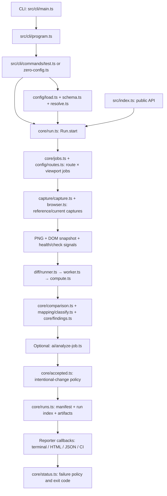
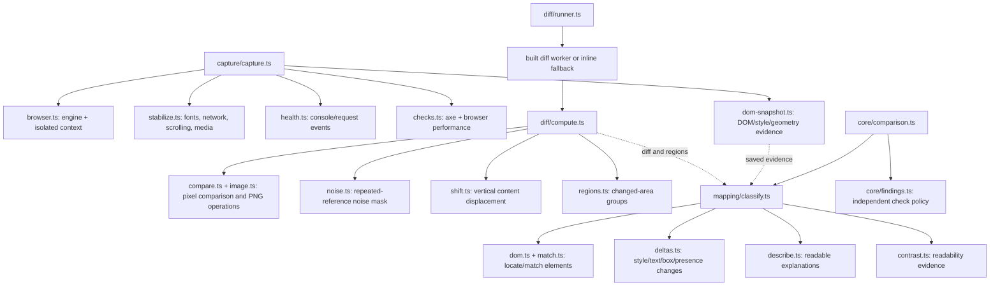
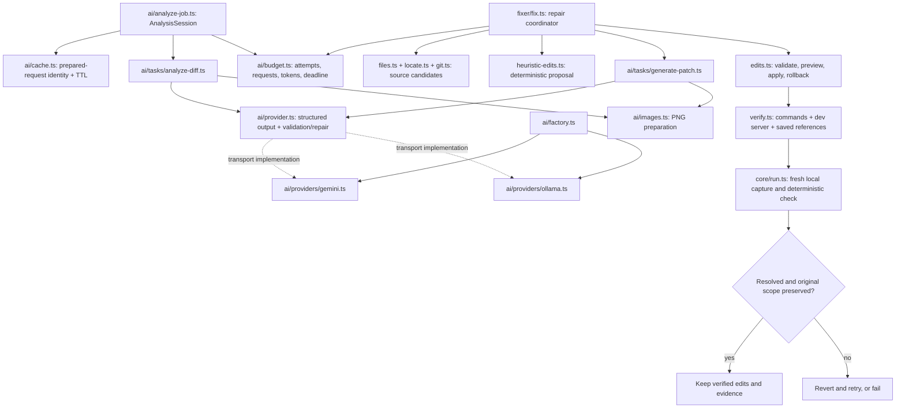
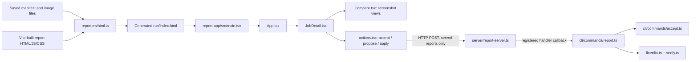

# VisualGuard: entry points, execution flow and every package file

This guide maps the current source checkout. Start with the diagrams, then use the complete inventory and expandable file connections to trace a particular feature. Source paths are relative to `packages/visualguard/` unless stated otherwise.

## Where execution starts

There is one CLI entry and several entries for different hosts. They are not interchangeable.

| How you use VisualGuard                         | Source entry                                                               | Built artifact                                              | What starts there                                                                                               |
| ----------------------------------------------- | -------------------------------------------------------------------------- | ----------------------------------------------------------- | --------------------------------------------------------------------------------------------------------------- |
| `npx visualguard ...`                           | [src/cli/main.ts](../packages/visualguard/src/cli/main.ts)                 | `dist/cli.js`                                               | Commander argument parsing, command dispatch and process error/exit handling.                                   |
| `import { createRun } from "visualguard"`       | [src/index.ts](../packages/visualguard/src/index.ts)                       | `dist/index.js` and declarations                            | Public exports; your application must call `createRun(...).start()`. Importing alone does not capture anything. |
| `import { test } from "visualguard/playwright"` | [src/playwright/index.ts](../packages/visualguard/src/playwright/index.ts) | `dist/playwright.js` and declarations                       | Extended Playwright fixtures; the test runner executes checkpoints.                                             |
| Built diff worker thread                        | [src/diff/worker.ts](../packages/visualguard/src/diff/worker.ts)           | `dist/diff-worker.js`                                       | Message handler for CPU-bound image comparisons; normally spawned by the diff runner.                           |
| Opening a generated report                      | [report-app/src/main.tsx](../packages/visualguard/report-app/src/main.tsx) | `dist/report-app/assets/app.js`, later embedded in run HTML | React rendering in the user's browser, reading embedded manifest data.                                          |

[package.json](../packages/visualguard/package.json) maps npm commands/imports to the built files. [tsup.config.ts](../packages/visualguard/tsup.config.ts) maps four Node entries to their bundles; [report-app/vite.config.ts](../packages/visualguard/report-app/vite.config.ts) builds the separate browser app. Shared chunk names in `dist/` are build outputs, not stable public APIs.

## The main comparison flow

This is a logical execution/data flow, not an exhaustive import graph. An arrow means the next component receives work or data; reporters are callbacks supplied to the run, not direct imports of every reporter by `run.ts`.



A passing pixel gate skips region artifacts and visual mapping/AI work; independent health/check findings can still affect the result. AI is optional. Its failure falls back to deterministic classification. Acceptance and AI cannot waive independent blocking findings. Baseline mode substitutes saved artifacts for a live reference; monitoring also controls which previous references roll forward.

The Playwright entry does not call the complete CLI run loop: it works with a page owned by a test and calls capture/diff/comparison/AI/acceptance helpers directly. That is why fixture-specific clock/event/replay limitations matter.

## Capture, diff and explanation internals



`compute.ts` deals with image files and writes pixel artifacts. `mapping/` explains those pixels using saved DOM evidence; it does not launch a browser. `core/comparison.ts` combines visual results with independent findings. `diff/runner.ts` uses the built worker file when available, and otherwise runs `computeDiff` inline, as in source-based tests.

## AI and repair are separate paths

Analysis asks **what changed**. Patch generation asks **what source edit could restore the reference**. Both use the provider contract, but they have separate prompts and schemas.



The provider subclasses implement transport behind `BaseProvider`; the diagram groups that polymorphic relationship. The exact import graph records the opposite subclass-to-base imports separately. The fixer runs deterministic proposals first, then an AI proposal when needed and authorized. An AI answer alone does not mark a repair verified: commands, saved-reference checks and final original-scope checks decide that.

`fixer/auto.ts` wraps the repair coordinator with an isolated Git workflow. It requires visual verification and can create commits; the optional PR path also pushes. Plain interactive `fix` applies source edits without the automatic Git workflow.

## How the report connects back to the package



The React app reads embedded manifest data through `report-app/src/data.ts`. It does not directly import the Node fixer or call Gemini from the browser. `report-server.ts` receives action callbacks from `cli/commands/report.ts`; it does not import those command handlers itself. Static HTML can display evidence; mutating actions require the local server and its session token. Images remain relative artifact files even though application JS/CSS are inlined.

## A practical reading order

1. `package.json`, `tsup.config.ts`, `src/cli/main.ts` and `src/cli/program.ts`: understand how npm/CLI execution enters the code.
2. `src/cli/commands/test.ts`, `src/cli/shared.ts`, `src/config/schema.ts` and `src/config/resolve.ts`: understand input and defaults.
3. `src/core/run.ts`, `jobs.ts`, `types.ts` and `runs.ts`: understand orchestration and stored evidence.
4. `capture/capture.ts`, `diff/compute.ts`, `core/comparison.ts` and `mapping/classify.ts`: follow one job to its deterministic result.
5. `ai/analyze-job.ts`, `tasks/analyze-diff.ts`, `provider.ts`, `budget.ts` and `cache.ts`: follow optional interpretation.
6. `fixer/fix.ts`, `locate.ts`, `edits.ts` and `verify.ts`: follow proposal to verified edit or rollback.
7. `reporters/html.ts`, `report-app/src/main.tsx`, `App.tsx` and `actions.tsx`: follow stored results into the UI and local action API.
8. Find the relevant test in the inventory below before changing behavior.

## Full dependency graph and reproducibility

[PACKAGE-DEPENDENCIES.mmd](PACKAGE-DEPENDENCIES.mmd) is the complete package file graph in Mermaid format. It includes every inventory file, with dependencies grouped by directory. Entry files have rounded nodes. A solid arrow means a detected module import/re-export; dotted edges represent type-only or explicit lifecycle relationships. Large graphs are easier to navigate by module than as one screenshot.

[PACKAGE-DEPENDENCIES.json](PACKAGE-DEPENDENCIES.json) contains the machine-readable inventory, explanations, exports, incoming/outgoing links, edge kinds and source line numbers for detected module references. The expandable index below exposes the same connections without a large graph.

The snapshot is generated by the repository helper [scripts/package-map.mjs](../scripts/package-map.mjs). It parses TypeScript syntax without running application code, opening browsers, calling models or executing Git mutations. To refresh after files/imports change, run from the repository root:

```bash
node scripts/package-map.mjs
```

The helper preserves the authored diagrams above and rebuilds everything below the generated marker. New files require a role description in its `roles` map so an unexplained file cannot silently enter the inventory. Runtime/build links are deliberately listed in the generator; static imports alone do not reveal them. This is an architecture snapshot, not a measured call trace.

<!-- generated-file-index -->

## Complete file inventory

The package contains **149 non-ignored files** in this snapshot. The scanner found **565 local static dependency edges**, plus **20 explicitly recorded lifecycle links**. A dependency points from the importing/using file to the file it needs. Type-only edges are compile-time relationships.

Paths below are relative to `packages/visualguard/`. Every inventory row links to source and to its exact connection details. Generated `dist/` chunks, `node_modules/`, caches and browser artifacts are excluded. Root workflows, examples, fixtures and evals are outside the package; relevant external imports are listed in the connection details.

### Build and documentation

| File                                                                           | What the code does                                                                                       | Connections                                |
| ------------------------------------------------------------------------------ | -------------------------------------------------------------------------------------------------------- | ------------------------------------------ |
| [CHANGELOG.md](../packages/visualguard/CHANGELOG.md)                           | Records published package changes; no executable code.                                                   | [Details](#file-CHANGELOG-md)              |
| [LICENSE](../packages/visualguard/LICENSE)                                     | MIT license text; no executable code.                                                                    | [Details](#file-LICENSE)                   |
| [README.md](../packages/visualguard/README.md)                                 | Package-level usage documentation; no executable code.                                                   | [Details](#file-README-md)                 |
| [package.json](../packages/visualguard/package.json)                           | Declares npm CLI/API exports, version, published files, dependencies and build/test scripts.             | [Details](#file-package-json)              |
| [report-app/index.html](../packages/visualguard/report-app/index.html)         | Report HTML shell with root element, data-injection placeholder and browser module entry.                | [Details](#file-report-app-index-html)     |
| [report-app/tsconfig.json](../packages/visualguard/report-app/tsconfig.json)   | TypeScript configuration for React report source and shared global declarations.                         | [Details](#file-report-app-tsconfig-json)  |
| [report-app/vite.config.ts](../packages/visualguard/report-app/vite.config.ts) | Builds React/Tailwind assets under dist/report-app in the layout expected by the HTML reporter.          | [Details](#file-report-app-vite-config-ts) |
| [tsconfig.json](../packages/visualguard/tsconfig.json)                         | TypeScript compiler configuration for the Node package source and tests.                                 | [Details](#file-tsconfig-json)             |
| [tsup.config.ts](../packages/visualguard/tsup.config.ts)                       | Bundles API, CLI, Playwright fixture and diff worker; emits public declarations and injects the version. | [Details](#file-tsup-config-ts)            |
| [vitest.config.ts](../packages/visualguard/vitest.config.ts)                   | Selects Vitest suites, test timeouts, report global setup and compile-time version replacement.          | [Details](#file-vitest-config-ts)          |

### report-app/src

| File                                                                                 | What the code does                                                                                                       | Connections                                   |
| ------------------------------------------------------------------------------------ | ------------------------------------------------------------------------------------------------------------------------ | --------------------------------------------- |
| [report-app/src/App.tsx](../packages/visualguard/report-app/src/App.tsx)             | Report shell: search/status filtering, selected job, navigation/hash state, themes, incomplete banner and usage summary. | [Details](#file-report-app-src-App-tsx)       |
| [report-app/src/Compare.tsx](../packages/visualguard/report-app/src/Compare.tsx)     | Screenshot comparison modes: side by side, slider, onion-skin overlay, diff, zoom and region display.                    | [Details](#file-report-app-src-Compare-tsx)   |
| [report-app/src/JobDetail.tsx](../packages/visualguard/report-app/src/JobDetail.tsx) | Selected job's capture/region/DOM/finding/AI/health details and connections to comparison views and actions.             | [Details](#file-report-app-src-JobDetail-tsx) |
| [report-app/src/actions.tsx](../packages/visualguard/report-app/src/actions.tsx)     | Accept/fix UI; calls local token-protected APIs, previews proposal diffs and displays apply/verification results.        | [Details](#file-report-app-src-actions-tsx)   |
| [report-app/src/data.ts](../packages/visualguard/report-app/src/data.ts)             | Browser report data contracts, injected-data access, formatting/sorting and URL hash state; imports shared types only.   | [Details](#file-report-app-src-data-ts)       |
| [report-app/src/main.tsx](../packages/visualguard/report-app/src/main.tsx) **ENTRY** | Browser entry: reads embedded report data and mounts the React App or a missing-data message.                            | [Details](#file-report-app-src-main-tsx)      |
| [report-app/src/styles.css](../packages/visualguard/report-app/src/styles.css)       | Tailwind/report styling, theme and comparison/application appearance.                                                    | [Details](#file-report-app-src-styles-css)    |
| [report-app/src/ui.tsx](../packages/visualguard/report-app/src/ui.tsx)               | Reusable report controls: status badges/icons, pills, sections, keyboard hints, segmented controls and copy actions.     | [Details](#file-report-app-src-ui-tsx)        |

### src/ai

| File                                                                                     | What the code does                                                                                                                | Connections                                     |
| ---------------------------------------------------------------------------------------- | --------------------------------------------------------------------------------------------------------------------------------- | ----------------------------------------------- |
| [src/ai/analyze-job.ts](../packages/visualguard/src/ai/analyze-job.ts)                   | Per-run/test analysis session: request caching, budget/provider fallback and guarded application of AI status changes.            | [Details](#file-src-ai-analyze-job-ts)          |
| [src/ai/budget.ts](../packages/visualguard/src/ai/budget.ts)                             | Shared generation/network/token/deadline ledger, provider wrapping and cumulative saved run-usage persistence.                    | [Details](#file-src-ai-budget-ts)               |
| [src/ai/cache.ts](../packages/visualguard/src/ai/cache.ts)                               | Hashes prepared requests and stores/reads versioned, validated, expiring analysis cache records.                                  | [Details](#file-src-ai-cache-ts)                |
| [src/ai/factory.ts](../packages/visualguard/src/ai/factory.ts)                           | Chooses Gemini/Ollama/no provider from config/env and reports missing-credential fallback.                                        | [Details](#file-src-ai-factory-ts)              |
| [src/ai/images.ts](../packages/visualguard/src/ai/images.ts)                             | Prepares/resizes/composites PNG images for provider image limits and request payloads.                                            | [Details](#file-src-ai-images-ts)               |
| [src/ai/provider.ts](../packages/visualguard/src/ai/provider.ts)                         | Provider contract and structured-output base implementation; extracts/validates JSON, repairs invalid answers and records usage.  | [Details](#file-src-ai-provider-ts)             |
| [src/ai/providers/gemini.ts](../packages/visualguard/src/ai/providers/gemini.ts)         | Gemini SDK transport: image/schema requests, thinking/detail settings, retry/quota handling and returned model/token metadata.    | [Details](#file-src-ai-providers-gemini-ts)     |
| [src/ai/providers/ollama.ts](../packages/visualguard/src/ai/providers/ollama.ts)         | Ollama HTTP transport for multimodal structured generation, local model settings, timeouts and cancellation.                      | [Details](#file-src-ai-providers-ollama-ts)     |
| [src/ai/tasks/analyze-diff.ts](../packages/visualguard/src/ai/tasks/analyze-diff.ts)     | Defines analysis prompt/schema, selects regions, builds trusted/untrusted context and validates visual classifications/selectors. | [Details](#file-src-ai-tasks-analyze-diff-ts)   |
| [src/ai/tasks/generate-patch.ts](../packages/visualguard/src/ai/tasks/generate-patch.ts) | Defines patch prompt/schema and builds requests from screenshot/DOM evidence, source excerpts and retry feedback.                 | [Details](#file-src-ai-tasks-generate-patch-ts) |

### src/capture

| File                                                                               | What the code does                                                                                                         | Connections                                  |
| ---------------------------------------------------------------------------------- | -------------------------------------------------------------------------------------------------------------------------- | -------------------------------------------- |
| [src/capture/browser.ts](../packages/visualguard/src/capture/browser.ts)           | Loads Playwright lazily, launches the selected engine and creates isolated contexts with auth/render/network settings.     | [Details](#file-src-capture-browser-ts)      |
| [src/capture/capture.ts](../packages/visualguard/src/capture/capture.ts)           | Runs one page capture: instrument, navigate, prepare/stabilize, retry, screenshot, gather DOM/health/checks and traces.    | [Details](#file-src-capture-capture-ts)      |
| [src/capture/checks.ts](../packages/visualguard/src/capture/checks.ts)             | Injects/runs axe accessibility checks and preserves/reads browser performance timing/resource metrics.                     | [Details](#file-src-capture-checks-ts)       |
| [src/capture/dom-snapshot.ts](../packages/visualguard/src/capture/dom-snapshot.ts) | Serializes relevant visible DOM structure, selectors, text, computed styles and bounding boxes for later explanation.      | [Details](#file-src-capture-dom-snapshot-ts) |
| [src/capture/health.ts](../packages/visualguard/src/capture/health.ts)             | Attaches console/page-error/request listeners to a page and exposes cleanup for collected signals.                         | [Details](#file-src-capture-health-ts)       |
| [src/capture/stabilize.ts](../packages/visualguard/src/capture/stabilize.ts)       | Browser-side stability helpers: CSS, network tracking, fonts, lazy-load scrolling, image readiness and media/page metrics. | [Details](#file-src-capture-stabilize-ts)    |

### src/cli

| File                                                                                       | What the code does                                                                                             | Connections                                      |
| ------------------------------------------------------------------------------------------ | -------------------------------------------------------------------------------------------------------------- | ------------------------------------------------ |
| [src/cli/commands/accept.ts](../packages/visualguard/src/cli/commands/accept.ts)           | Records intentional screenshot/change fingerprints and reapplies acceptance without waiving health findings.   | [Details](#file-src-cli-commands-accept-ts)      |
| [src/cli/commands/analyze.ts](../packages/visualguard/src/cli/commands/analyze.ts)         | Re-analyzes saved run artifacts, restores accumulated usage and updates the manifest/report.                   | [Details](#file-src-cli-commands-analyze-ts)     |
| [src/cli/commands/auth.ts](../packages/visualguard/src/cli/commands/auth.ts)               | Opens an authenticated browser workflow and persists an environment's storage state.                           | [Details](#file-src-cli-commands-auth-ts)        |
| [src/cli/commands/comment.ts](../packages/visualguard/src/cli/commands/comment.ts)         | Finds the associated GitHub PR and posts/updates a sticky Markdown run-summary comment.                        | [Details](#file-src-cli-commands-comment-ts)     |
| [src/cli/commands/doctor.ts](../packages/visualguard/src/cli/commands/doctor.ts)           | Runs environment/config/browser/URL diagnostics and prints actionable setup results.                           | [Details](#file-src-cli-commands-doctor-ts)      |
| [src/cli/commands/fix.ts](../packages/visualguard/src/cli/commands/fix.ts)                 | CLI repair prompts, source-upload consent and progress; dispatches interactive or automatic fixing.            | [Details](#file-src-cli-commands-fix-ts)         |
| [src/cli/commands/init.ts](../packages/visualguard/src/cli/commands/init.ts)               | Interactive/noninteractive setup: discovers project routes and writes config, env and optional workflow files. | [Details](#file-src-cli-commands-init-ts)        |
| [src/cli/commands/merge.ts](../packages/visualguard/src/cli/commands/merge.ts)             | CLI wrapper for shard merge, reporting and incomplete/failing exit policy.                                     | [Details](#file-src-cli-commands-merge-ts)       |
| [src/cli/commands/monitor.ts](../packages/visualguard/src/cli/commands/monitor.ts)         | Compares a site with prior captures, rolls eligible references forward, or generates a scheduled workflow.     | [Details](#file-src-cli-commands-monitor-ts)     |
| [src/cli/commands/report.ts](../packages/visualguard/src/cli/commands/report.ts)           | Opens/serves saved reports and binds accept/propose/apply API handlers, proposal freshness and apply locking.  | [Details](#file-src-cli-commands-report-ts)      |
| [src/cli/commands/test.ts](../packages/visualguard/src/cli/commands/test.ts)               | Implements configured comparisons/baselines, capture flags, planned-job listing and failure exits.             | [Details](#file-src-cli-commands-test-ts)        |
| [src/cli/commands/watch.ts](../packages/visualguard/src/cli/commands/watch.ts)             | Watches source files, traces page import relationships and re-runs affected routes against a dev server.       | [Details](#file-src-cli-commands-watch-ts)       |
| [src/cli/commands/zero-config.ts](../packages/visualguard/src/cli/commands/zero-config.ts) | Splits positional URLs into routes; orchestrates single-site scans or two-site comparisons.                    | [Details](#file-src-cli-commands-zero-config-ts) |
| [src/cli/main.ts](../packages/visualguard/src/cli/main.ts) **ENTRY**                       | Executable CLI entry: parses arguments, catches command errors and assigns process exit codes.                 | [Details](#file-src-cli-main-ts)                 |
| [src/cli/program.ts](../packages/visualguard/src/cli/program.ts)                           | Creates the Commander program and registers every subcommand plus positional URL mode.                         | [Details](#file-src-cli-program-ts)              |
| [src/cli/shared.ts](../packages/visualguard/src/cli/shared.ts)                             | Loads/resolves config, maps CLI options, selects standard reporters and formats common errors.                 | [Details](#file-src-cli-shared-ts)               |

### src/config

| File                                                                                   | What the code does                                                                                     | Connections                                    |
| -------------------------------------------------------------------------------------- | ------------------------------------------------------------------------------------------------------ | ---------------------------------------------- |
| [src/config/discover/nextjs.ts](../packages/visualguard/src/config/discover/nextjs.ts) | Reads Next.js App/Pages Router files, accounting for routing conventions, to discover page paths.      | [Details](#file-src-config-discover-nextjs-ts) |
| [src/config/discover/web.ts](../packages/visualguard/src/config/discover/web.ts)       | Reads sitemap/robots URLs and crawls same-site links within configured scope/depth.                    | [Details](#file-src-config-discover-web-ts)    |
| [src/config/glob.ts](../packages/visualguard/src/config/glob.ts)                       | Converts supported glob syntax to regular expressions for route and source filtering.                  | [Details](#file-src-config-glob-ts)            |
| [src/config/load.ts](../packages/visualguard/src/config/load.ts)                       | Finds/imports config, loads env files, rejects literal keys and reports schema validation errors.      | [Details](#file-src-config-load-ts)            |
| [src/config/resolve.ts](../packages/visualguard/src/config/resolve.ts)                 | Resolves CLI > environment > config precedence and absolute output paths; validates selected settings. | [Details](#file-src-config-resolve-ts)         |
| [src/config/routes.ts](../packages/visualguard/src/config/routes.ts)                   | Combines discovery sources/extra routes, expands dynamic parameters and filters the route plan.        | [Details](#file-src-config-routes-ts)          |
| [src/config/schema.ts](../packages/visualguard/src/config/schema.ts)                   | Zod configuration schemas/defaults and hook/route/viewport types; validates every configuration group. | [Details](#file-src-config-schema-ts)          |
| [src/config/urls.ts](../packages/visualguard/src/config/urls.ts)                       | Normalizes/joins base URLs, expands dynamic segments and creates safe slugs/stable short hashes.       | [Details](#file-src-config-urls-ts)            |

### src/core

| File                                                                         | What the code does                                                                                                                           | Connections                               |
| ---------------------------------------------------------------------------- | -------------------------------------------------------------------------------------------------------------------------------------------- | ----------------------------------------- |
| [src/core/accepted.ts](../packages/visualguard/src/core/accepted.ts)         | Reads/writes accepted changes, hashes screenshots and compares exact/similar change fingerprints with health guards.                         | [Details](#file-src-core-accepted-ts)     |
| [src/core/comparison.ts](../packages/visualguard/src/core/comparison.ts)     | Shared CLI/fixture classification: loads DOM evidence and combines visual classification with independent check findings.                    | [Details](#file-src-core-comparison-ts)   |
| [src/core/errors.ts](../packages/visualguard/src/core/errors.ts)             | Defines categorized usage/environment errors, exit codes and readable error messages.                                                        | [Details](#file-src-core-errors-ts)       |
| [src/core/events.ts](../packages/visualguard/src/core/events.ts)             | Typed run-event definitions and emitter used to notify reporters/listeners.                                                                  | [Details](#file-src-core-events-ts)       |
| [src/core/findings.ts](../packages/visualguard/src/core/findings.ts)         | Converts health/accessibility/performance changes into findings and raises result severity without downgrading failures.                     | [Details](#file-src-core-findings-ts)     |
| [src/core/jobs.ts](../packages/visualguard/src/core/jobs.ts)                 | Builds uniquely identified route × viewport jobs with per-environment URLs, waits, masks and hides.                                          | [Details](#file-src-core-jobs-ts)         |
| [src/core/merge.ts](../packages/visualguard/src/core/merge.ts)               | Discovers shard manifests, validates shared identity/full coverage and copies artifacts into one merged run.                                 | [Details](#file-src-core-merge-ts)        |
| [src/core/provenance.ts](../packages/visualguard/src/core/provenance.ts)     | Canonical hashes, Git revision, capture-policy snapshots and baseline rendering metadata/compatibility checks.                               | [Details](#file-src-core-provenance-ts)   |
| [src/core/reachability.ts](../packages/visualguard/src/core/reachability.ts) | Performs an upfront base-URL reachability check and returns environment diagnostics.                                                         | [Details](#file-src-core-reachability-ts) |
| [src/core/run.ts](../packages/visualguard/src/core/run.ts)                   | Central orchestrator: plans jobs, captures references/current pages, diffs/classifies/analyzes/accepts results, emits events and saves runs. | [Details](#file-src-core-run-ts)          |
| [src/core/runs.ts](../packages/visualguard/src/core/runs.ts)                 | Creates numbered run directories, maintains the run index/retention, and reads/writes manifests.                                             | [Details](#file-src-core-runs-ts)         |
| [src/core/status.ts](../packages/visualguard/src/core/status.ts)             | Counts statuses and translates failure policy/incomplete results to failing process exit codes.                                              | [Details](#file-src-core-status-ts)       |
| [src/core/types.ts](../packages/visualguard/src/core/types.ts)               | Shared data contracts for jobs, captures, health, pixel regions, DOM deltas, AI analysis and manifests; type-only.                           | [Details](#file-src-core-types-ts)        |
| [src/core/util.ts](../packages/visualguard/src/core/util.ts)                 | Small shared helpers for timeouts, durations, pluralization and PNG dimensions.                                                              | [Details](#file-src-core-util-ts)         |
| [src/core/version.ts](../packages/visualguard/src/core/version.ts)           | Exposes the package version injected by the bundler.                                                                                         | [Details](#file-src-core-version-ts)      |

### src/diff

| File                                                                       | What the code does                                                                                                            | Connections                          |
| -------------------------------------------------------------------------- | ----------------------------------------------------------------------------------------------------------------------------- | ------------------------------------ |
| [src/diff/compare.ts](../packages/visualguard/src/diff/compare.ts)         | Pixelmatch engine adapter plus rendering of the visual difference image.                                                      | [Details](#file-src-diff-compare-ts) |
| [src/diff/compute.ts](../packages/visualguard/src/diff/compute.ts)         | Complete image job: pad sizes, compare pixels, remove noise, enforce tolerances, detect shifts and write diff/crop artifacts. | [Details](#file-src-diff-compute-ts) |
| [src/diff/image.ts](../packages/visualguard/src/diff/image.ts)             | PNG decode/encode/file I/O and RGBA image creation, padding and crop helpers.                                                 | [Details](#file-src-diff-image-ts)   |
| [src/diff/noise.ts](../packages/visualguard/src/diff/noise.ts)             | Builds changing-area masks from repeat captures, aligns them to DOM boxes and clears ignored pixels.                          | [Details](#file-src-diff-noise-ts)   |
| [src/diff/regions.ts](../packages/visualguard/src/diff/regions.ts)         | Groups changed pixel cells into nearby/merged bounding regions and limits/sorts the result.                                   | [Details](#file-src-diff-regions-ts) |
| [src/diff/runner.ts](../packages/visualguard/src/diff/runner.ts)           | Chooses inline diffing in source runs or queues CPU work in a pool of built worker threads.                                   | [Details](#file-src-diff-runner-ts)  |
| [src/diff/shift.ts](../packages/visualguard/src/diff/shift.ts)             | Hashes image rows to detect vertical insertion/removal shifts and computes a residual diff after alignment.                   | [Details](#file-src-diff-shift-ts)   |
| [src/diff/worker.ts](../packages/visualguard/src/diff/worker.ts) **ENTRY** | Worker entry: receives image-diff tasks, calls computeDiff and sends results/errors to the parent thread.                     | [Details](#file-src-diff-worker-ts)  |

### src/fixer

| File                                                                                 | What the code does                                                                                                                       | Connections                                   |
| ------------------------------------------------------------------------------------ | ---------------------------------------------------------------------------------------------------------------------------------------- | --------------------------------------------- |
| [src/fixer/auto.ts](../packages/visualguard/src/fixer/auto.ts)                       | Automatic Git workflow: enforce visual verification, create isolated worktree/branch, commit verified edits and optionally push/open PR. | [Details](#file-src-fixer-auto-ts)            |
| [src/fixer/edits.ts](../packages/visualguard/src/fixer/edits.ts)                     | Validates/previews/renders edits, checks original contents, applies multi-file changes and rolls back failures.                          | [Details](#file-src-fixer-edits-ts)           |
| [src/fixer/files.ts](../packages/visualguard/src/fixer/files.ts)                     | Enumerates eligible source files with protected paths/extensions, size/count limits and skipped build/dependency directories.            | [Details](#file-src-fixer-files-ts)           |
| [src/fixer/fix.ts](../packages/visualguard/src/fixer/fix.ts)                         | Repair coordinator: choose jobs, obtain proposals/consent, confirm/apply/verify/retry, record artifacts and verify final batch scope.    | [Details](#file-src-fixer-fix-ts)             |
| [src/fixer/git.ts](../packages/visualguard/src/fixer/git.ts)                         | Git subprocess helpers for repository root, dirty paths and files changed since a ref.                                                   | [Details](#file-src-fixer-git-ts)             |
| [src/fixer/heuristic-edits.ts](../packages/visualguard/src/fixer/heuristic-edits.ts) | Produces deterministic search/replace repairs for unambiguous class-list and CSS-value changes.                                          | [Details](#file-src-fixer-heuristic-edits-ts) |
| [src/fixer/locate.ts](../packages/visualguard/src/fixer/locate.ts)                   | Collects DOM/source clues, follows page imports, ranks candidate files and selects source excerpts.                                      | [Details](#file-src-fixer-locate-ts)          |
| [src/fixer/verify.ts](../packages/visualguard/src/fixer/verify.ts)                   | Runs bounded verification commands, manages the dev-server process and compares new captures with immutable saved references.            | [Details](#file-src-fixer-verify-ts)          |

### src (public entry and declarations)

| File                                                           | What the code does                                                                                      | Connections                       |
| -------------------------------------------------------------- | ------------------------------------------------------------------------------------------------------- | --------------------------------- |
| [src/globals.d.ts](../packages/visualguard/src/globals.d.ts)   | Declares the build-injected version constant for TypeScript; erased at runtime.                         | [Details](#file-src-globals-d-ts) |
| [src/index.ts](../packages/visualguard/src/index.ts) **ENTRY** | Public API barrel: exports configuration/run/status helpers, reporters and types; does not start a run. | [Details](#file-src-index-ts)     |

### src/mapping

| File                                                                       | What the code does                                                                                                             | Connections                              |
| -------------------------------------------------------------------------- | ------------------------------------------------------------------------------------------------------------------------------ | ---------------------------------------- |
| [src/mapping/classify.ts](../packages/visualguard/src/mapping/classify.ts) | Deterministic visual classifier: explains regions, finds removed controls/readability/overlap problems and filters tiny noise. | [Details](#file-src-mapping-classify-ts) |
| [src/mapping/contrast.ts](../packages/visualguard/src/mapping/contrast.ts) | Parses colours and computes effective backgrounds and text contrast ratios for readability findings.                           | [Details](#file-src-mapping-contrast-ts) |
| [src/mapping/deltas.ts](../packages/visualguard/src/mapping/deltas.ts)     | Maps a pixel region to matched elements and generates style, text, box and presence deltas.                                    | [Details](#file-src-mapping-deltas-ts)   |
| [src/mapping/describe.ts](../packages/visualguard/src/mapping/describe.ts) | Turns DOM deltas into concise explanations such as changed colour, spacing, text or alignment.                                 | [Details](#file-src-mapping-describe-ts) |
| [src/mapping/dom.ts](../packages/visualguard/src/mapping/dom.ts)           | Indexes DOM nodes, resolves labels/ancestry and provides geometry intersection/area/shift operations.                          | [Details](#file-src-mapping-dom-ts)      |
| [src/mapping/match.ts](../packages/visualguard/src/mapping/match.ts)       | Matches production and staging DOM trees, including stable keys, sibling changes and moved elements.                           | [Details](#file-src-mapping-match-ts)    |

### src/playwright

| File                                                                                 | What the code does                                                                                                                      | Connections                              |
| ------------------------------------------------------------------------------------ | --------------------------------------------------------------------------------------------------------------------------------------- | ---------------------------------------- |
| [src/playwright/index.ts](../packages/visualguard/src/playwright/index.ts) **ENTRY** | Playwright fixture entry: extends test/page, loads config, checks interactive state against production/baselines and attaches evidence. | [Details](#file-src-playwright-index-ts) |

### src/reporters

| File                                                                                       | What the code does                                                                                 | Connections                                      |
| ------------------------------------------------------------------------------------------ | -------------------------------------------------------------------------------------------------- | ------------------------------------------------ |
| [src/reporters/ci.ts](../packages/visualguard/src/reporters/ci.ts)                         | JUnit XML, GitHub job summary and webhook reporter implementations.                                | [Details](#file-src-reporters-ci-ts)             |
| [src/reporters/github-comment.ts](../packages/visualguard/src/reporters/github-comment.ts) | GitHub context/REST helpers for PR lookup, sticky comment updates and PR creation.                 | [Details](#file-src-reporters-github-comment-ts) |
| [src/reporters/html.ts](../packages/visualguard/src/reporters/html.ts)                     | Loads the prebuilt React report, embeds JS/CSS plus escaped manifest data and writes per-run HTML. | [Details](#file-src-reporters-html-ts)           |
| [src/reporters/json.ts](../packages/visualguard/src/reporters/json.ts)                     | Reporter that prints the final manifest as JSON.                                                   | [Details](#file-src-reporters-json-ts)           |
| [src/reporters/markdown.ts](../packages/visualguard/src/reporters/markdown.ts)             | Escapes/formats Markdown run summaries and detailed findings for comments/job summaries.           | [Details](#file-src-reporters-markdown-ts)       |
| [src/reporters/terminal.ts](../packages/visualguard/src/reporters/terminal.ts)             | Human-readable progress, statuses, findings and AI/usage output for the terminal.                  | [Details](#file-src-reporters-terminal-ts)       |

### src/server

| File                                                                               | What the code does                                                                                        | Connections                                  |
| ---------------------------------------------------------------------------------- | --------------------------------------------------------------------------------------------------------- | -------------------------------------------- |
| [src/server/report-server.ts](../packages/visualguard/src/server/report-server.ts) | Local artifact server: renders current manifest data and dispatches token-protected POST action handlers. | [Details](#file-src-server-report-server-ts) |

### src/setup

| File                                                                                     | What the code does                                                                                                  | Connections                                     |
| ---------------------------------------------------------------------------------------- | ------------------------------------------------------------------------------------------------------------------- | ----------------------------------------------- |
| [src/setup/config-template.ts](../packages/visualguard/src/setup/config-template.ts)     | Renders typed VisualGuard config from setup answers and viewport/provider choices.                                  | [Details](#file-src-setup-config-template-ts)   |
| [src/setup/project.ts](../packages/visualguard/src/setup/project.ts)                     | Detects framework/package manager and updates gitignore, package scripts/env files; suggests install/exec commands. | [Details](#file-src-setup-project-ts)           |
| [src/setup/workflow-template.ts](../packages/visualguard/src/setup/workflow-template.ts) | Renders comparison and scheduled monitor GitHub workflow YAML.                                                      | [Details](#file-src-setup-workflow-template-ts) |

### test suites

| File                                                                                       | What the code does                                                                                                          | Connections                                      |
| ------------------------------------------------------------------------------------------ | --------------------------------------------------------------------------------------------------------------------------- | ------------------------------------------------ |
| [test/accepted.test.ts](../packages/visualguard/test/accepted.test.ts)                     | Tests stored exact/similar acceptance, changed fingerprints, legacy entries and health protections.                         | [Details](#file-test-accepted-test-ts)           |
| [test/ai-run.test.ts](../packages/visualguard/test/ai-run.test.ts)                         | Tests AI integration with capture runs, status guards, analysis scope, manifest usage and saved-run reanalysis.             | [Details](#file-test-ai-run-test-ts)             |
| [test/ai.test.ts](../packages/visualguard/test/ai.test.ts)                                 | Tests JSON extraction/schema repair, analysis sessions, cache/policy behavior and patch request preparation.                | [Details](#file-test-ai-test-ts)                 |
| [test/auto-fix.test.ts](../packages/visualguard/test/auto-fix.test.ts)                     | Tests automatic fixing in temporary repositories/worktrees with a simulated PR API and verified Git outcomes.               | [Details](#file-test-auto-fix-test-ts)           |
| [test/baseline.test.ts](../packages/visualguard/test/baseline.test.ts)                     | Tests explicit baseline creation/update and comparison with saved references.                                               | [Details](#file-test-baseline-test-ts)           |
| [test/browser-smoke.test.ts](../packages/visualguard/test/browser-smoke.test.ts)           | Smoke-tests an identical fixture in the selected Chromium/Firefox/WebKit engine.                                            | [Details](#file-test-browser-smoke-test-ts)      |
| [test/checks.test.ts](../packages/visualguard/test/checks.test.ts)                         | Tests configured accessibility/performance capture and threshold-based independent findings.                                | [Details](#file-test-checks-test-ts)             |
| [test/ci.test.ts](../packages/visualguard/test/ci.test.ts)                                 | Tests acceptance/report APIs, escaped Markdown, JUnit, webhook/job summary and GitHub integration output.                   | [Details](#file-test-ci-test-ts)                 |
| [test/cli.test.ts](../packages/visualguard/test/cli.test.ts)                               | Tests CLI version and subcommand option routing.                                                                            | [Details](#file-test-cli-test-ts)                |
| [test/config.test.ts](../packages/visualguard/test/config.test.ts)                         | Tests schema/defaults/invalid secrets, overrides/env precedence and config loading.                                         | [Details](#file-test-config-test-ts)             |
| [test/diff.test.ts](../packages/visualguard/test/diff.test.ts)                             | Tests complete image comparisons, size padding, thresholds and written diff/region artifacts.                               | [Details](#file-test-diff-test-ts)               |
| [test/discovery.test.ts](../packages/visualguard/test/discovery.test.ts)                   | Tests Next.js route conventions, base-path URLs, sitemap/robots and web crawling.                                           | [Details](#file-test-discovery-test-ts)          |
| [test/explanations.test.ts](../packages/visualguard/test/explanations.test.ts)             | Tests end-to-end human explanations for text, colour, layout/spacing and deterministic failures.                            | [Details](#file-test-explanations-test-ts)       |
| [test/findings.test.ts](../packages/visualguard/test/findings.test.ts)                     | Tests differential health findings, scan policy and severity escalation.                                                    | [Details](#file-test-findings-test-ts)           |
| [test/fixer.test.ts](../packages/visualguard/test/fixer.test.ts)                           | Tests edits, deterministic CSS/class repairs, source location, command/server checks and interactive fixing.                | [Details](#file-test-fixer-test-ts)              |
| [test/global-setup.ts](../packages/visualguard/test/global-setup.ts)                       | Builds the report app once before Vitest suites that load the real HTML bundle.                                             | [Details](#file-test-global-setup-ts)            |
| [test/integration.test.ts](../packages/visualguard/test/integration.test.ts)               | Tests capture pipeline/statuses, errors, retention, dynamic content and deterministic stability on fixture pages.           | [Details](#file-test-integration-test-ts)        |
| [test/mapping.test.ts](../packages/visualguard/test/mapping.test.ts)                       | Tests DOM tree matching, moved/keyed elements, inherited styles and region-to-delta explanations.                           | [Details](#file-test-mapping-test-ts)            |
| [test/nextjs-example.test.ts](../packages/visualguard/test/nextjs-example.test.ts)         | Opt-in real Next.js build/dev test: seeds three regressions and verifies repairs; skipped without VG_E2E_NEXT.              | [Details](#file-test-nextjs-example-test-ts)     |
| [test/noise.test.ts](../packages/visualguard/test/noise.test.ts)                           | Tests noise area snapping/limits and conservative handling of oversized DOM containers.                                     | [Details](#file-test-noise-test-ts)              |
| [test/playwright-fixture.test.ts](../packages/visualguard/test/playwright-fixture.test.ts) | Builds the fixture entry and launches the nested Playwright suite to verify real public imports.                            | [Details](#file-test-playwright-fixture-test-ts) |
| [test/providers.test.ts](../packages/visualguard/test/providers.test.ts)                   | Tests Gemini/Ollama transport shape, retries, settings fallback, quota handling and usage with mocked services.             | [Details](#file-test-providers-test-ts)          |
| [test/regions.test.ts](../packages/visualguard/test/regions.test.ts)                       | Tests changed-cell region extraction, sorting, transitive merging and caps.                                                 | [Details](#file-test-regions-test-ts)            |
| [test/reliability.test.ts](../packages/visualguard/test/reliability.test.ts)               | Tests F01-F12 invariants: acceptance/AI guards, baseline identity, eval denominator, budgets/cache, stale edits and shards. | [Details](#file-test-reliability-test-ts)        |
| [test/report-fix.test.ts](../packages/visualguard/test/report-fix.test.ts)                 | Browser-tests the served report's propose → confirm → apply/verify repair flow.                                             | [Details](#file-test-report-fix-test-ts)         |
| [test/report.test.ts](../packages/visualguard/test/report.test.ts)                         | Tests static/served report rendering, embedded-data safety, screenshot loading, navigation and accessibility.               | [Details](#file-test-report-test-ts)             |
| [test/setup.test.ts](../packages/visualguard/test/setup.test.ts)                           | Tests project detection, idempotent setup edits, generated config/init and doctor diagnostics.                              | [Details](#file-test-setup-test-ts)              |
| [test/shard-monitor.test.ts](../packages/visualguard/test/shard-monitor.test.ts)           | Tests deterministic sharding/merge and production-monitor rolling references/generated schedule.                            | [Details](#file-test-shard-monitor-test-ts)      |
| [test/shift.test.ts](../packages/visualguard/test/shift.test.ts)                           | Tests inserted/removed vertical layout bands and cases without a meaningful shift.                                          | [Details](#file-test-shift-test-ts)              |
| [test/transaction.test.ts](../packages/visualguard/test/transaction.test.ts)               | Simulates failure during a multi-file write and verifies restoration of already-written files.                              | [Details](#file-test-transaction-test-ts)        |
| [test/urls.test.ts](../packages/visualguard/test/urls.test.ts)                             | Tests URL joining/validation and single/catch-all/optional dynamic route parameter expansion.                               | [Details](#file-test-urls-test-ts)               |
| [test/verification.test.ts](../packages/visualguard/test/verification.test.ts)             | Tests immutable references when production is offline and rollback of collateral viewport damage.                           | [Details](#file-test-verification-test-ts)       |
| [test/zero-config.test.ts](../packages/visualguard/test/zero-config.test.ts)               | Tests positional URL routing and first/subsequent single-site snapshot scans.                                               | [Details](#file-test-zero-config-test-ts)        |

### test/helpers

| File                                                                                               | What the code does                                                                           | Connections                                          |
| -------------------------------------------------------------------------------------------------- | -------------------------------------------------------------------------------------------- | ---------------------------------------------------- |
| [test/helpers/config.ts](../packages/visualguard/test/helpers/config.ts)                           | Creates isolated temporary test configurations and output directories.                       | [Details](#file-test-helpers-config-ts)              |
| [test/helpers/dom.ts](../packages/visualguard/test/helpers/dom.ts)                                 | Constructs synthetic DOM snapshots/nodes used in matching and classification tests.          | [Details](#file-test-helpers-dom-ts)                 |
| [test/helpers/fixture-server.ts](../packages/visualguard/test/helpers/fixture-server.ts)           | Serves production/staging fixture pages and returns server lifecycle helpers.                | [Details](#file-test-helpers-fixture-server-ts)      |
| [test/helpers/mock-provider.ts](../packages/visualguard/test/helpers/mock-provider.ts)             | Mock structured AI provider, canned analysis responses and usage for deterministic tests.    | [Details](#file-test-helpers-mock-provider-ts)       |
| [test/helpers/static-site-server.mjs](../packages/visualguard/test/helpers/static-site-server.mjs) | Child-process static site server whose files can be edited during repair/verification tests. | [Details](#file-test-helpers-static-site-server-mjs) |

### test/pw

| File                                                                                 | What the code does                                                                                            | Connections                                   |
| ------------------------------------------------------------------------------------ | ------------------------------------------------------------------------------------------------------------- | --------------------------------------------- |
| [test/pw/fixture.spec.ts](../packages/visualguard/test/pw/fixture.spec.ts)           | Real Playwright tests for passing/failing checkpoints, baselines, referenceSetup and early health collection. | [Details](#file-test-pw-fixture-spec-ts)      |
| [test/pw/global-setup.ts](../packages/visualguard/test/pw/global-setup.ts)           | Starts/stops fixture production/staging servers for the nested Playwright runner.                             | [Details](#file-test-pw-global-setup-ts)      |
| [test/pw/playwright.config.ts](../packages/visualguard/test/pw/playwright.config.ts) | Selects fixture specs, global setup, one worker, viewport and report/output settings.                         | [Details](#file-test-pw-playwright-config-ts) |

## Exact file connections

These lists come from AST-parsed literal imports, re-exports, dynamic imports and `require` calls, plus the explicit entry/build/resource/subprocess links above. They do not infer every callback invocation, computed import, glob-selected test, command string, network request or filesystem artifact. A file without incoming imports can still be launched by a tool or referenced through generated output. External module strings are references, not assertions about transitive dependency trees.

<a id="file-CHANGELOG-md"></a>

<details>
<summary>CHANGELOG.md</summary>

Records published package changes; no executable code.

**Depends on:** No detected local dependency.

**Used by:** No detected local incoming dependency; see build/test/documentation role.

</details>

<a id="file-LICENSE"></a>

<details>
<summary>LICENSE</summary>

MIT license text; no executable code.

**Depends on:** No detected local dependency.

**Used by:** No detected local incoming dependency; see build/test/documentation role.

</details>

<a id="file-README-md"></a>

<details>
<summary>README.md</summary>

Package-level usage documentation; no executable code.

**Depends on:** No detected local dependency.

**Used by:** No detected local incoming dependency; see build/test/documentation role.

</details>

<a id="file-package-json"></a>

<details>
<summary>package.json</summary>

Declares npm CLI/API exports, version, published files, dependencies and build/test scripts.

**Depends on:** [src/cli/main.ts](../packages/visualguard/src/cli/main.ts) (entry); [src/index.ts](../packages/visualguard/src/index.ts) (entry); [src/playwright/index.ts](../packages/visualguard/src/playwright/index.ts) (entry).

**Used by:** [tsup.config.ts](../packages/visualguard/tsup.config.ts) (build); [vitest.config.ts](../packages/visualguard/vitest.config.ts) (test-config).

</details>

<a id="file-report-app-index-html"></a>

<details>
<summary>report-app/index.html</summary>

Report HTML shell with root element, data-injection placeholder and browser module entry.

**Depends on:** [report-app/src/main.tsx](../packages/visualguard/report-app/src/main.tsx) (html-entry).

**Used by:** [report-app/vite.config.ts](../packages/visualguard/report-app/vite.config.ts) (build); [src/reporters/html.ts](../packages/visualguard/src/reporters/html.ts) (built-resource).

</details>

<a id="file-report-app-src-App-tsx"></a>

<details>
<summary>report-app/src/App.tsx</summary>

Report shell: search/status filtering, selected job, navigation/hash state, themes, incomplete banner and usage summary.

**Exported symbols:** `App`.

**Depends on:** [report-app/src/actions.tsx](../packages/visualguard/report-app/src/actions.tsx) (import); [report-app/src/Compare.tsx](../packages/visualguard/report-app/src/Compare.tsx) (import); [report-app/src/data.ts](../packages/visualguard/report-app/src/data.ts) (import); [report-app/src/JobDetail.tsx](../packages/visualguard/report-app/src/JobDetail.tsx) (import); [report-app/src/ui.tsx](../packages/visualguard/report-app/src/ui.tsx) (import).

**Outside the package / platform:** `react` (import).

**Used by:** [report-app/src/main.tsx](../packages/visualguard/report-app/src/main.tsx#L14) (import).

</details>

<a id="file-report-app-src-Compare-tsx"></a>

<details>
<summary>report-app/src/Compare.tsx</summary>

Screenshot comparison modes: side by side, slider, onion-skin overlay, diff, zoom and region display.

**Exported symbols:** `COMPARE_MODES`, `Compare`, `CompareMode`.

**Depends on:** [report-app/src/data.ts](../packages/visualguard/report-app/src/data.ts) (import).

**Outside the package / platform:** `react` (import).

**Used by:** [report-app/src/App.tsx](../packages/visualguard/report-app/src/App.tsx#L13) (import); [report-app/src/JobDetail.tsx](../packages/visualguard/report-app/src/JobDetail.tsx#L13) (import).

</details>

<a id="file-report-app-src-JobDetail-tsx"></a>

<details>
<summary>report-app/src/JobDetail.tsx</summary>

Selected job's capture/region/DOM/finding/AI/health details and connections to comparison views and actions.

**Exported symbols:** `CompareMode`, `JobDetail`.

**Depends on:** [report-app/src/Compare.tsx](../packages/visualguard/report-app/src/Compare.tsx) (import); [report-app/src/data.ts](../packages/visualguard/report-app/src/data.ts) (import); [report-app/src/ui.tsx](../packages/visualguard/report-app/src/ui.tsx) (import); [src/core/types.ts](../packages/visualguard/src/core/types.ts) (type).

**Outside the package / platform:** `react` (type).

**Used by:** [report-app/src/App.tsx](../packages/visualguard/report-app/src/App.tsx#L26) (import).

</details>

<a id="file-report-app-src-actions-tsx"></a>

<details>
<summary>report-app/src/actions.tsx</summary>

Accept/fix UI; calls local token-protected APIs, previews proposal diffs and displays apply/verification results.

**Exported symbols:** `JobActions`.

**Depends on:** [report-app/src/data.ts](../packages/visualguard/report-app/src/data.ts) (import); [report-app/src/ui.tsx](../packages/visualguard/report-app/src/ui.tsx) (import).

**Outside the package / platform:** `react` (import).

**Used by:** [report-app/src/App.tsx](../packages/visualguard/report-app/src/App.tsx#L25) (import).

</details>

<a id="file-report-app-src-data-ts"></a>

<details>
<summary>report-app/src/data.ts</summary>

Browser report data contracts, injected-data access, formatting/sorting and URL hash state; imports shared types only.

**Exported symbols:** `Env`, `HashState`, `JobResult`, `ReportData`, `RunManifest`, `STATUS_LABEL`, `STATUS_ORDER`, `ServerInfo`, `Status`, `canvasSize`, `envLabels`, `formatDuration`, `formatPercent`, `jobSummary`, `loadReportData`, `readHash`, `serverInfo`, `sortJobs`, `writeHash`.

**Depends on:** [src/core/types.ts](../packages/visualguard/src/core/types.ts) (type).

**Used by:** [report-app/src/actions.tsx](../packages/visualguard/report-app/src/actions.tsx#L13) (import); [report-app/src/App.tsx](../packages/visualguard/report-app/src/App.tsx#L14) (import); [report-app/src/Compare.tsx](../packages/visualguard/report-app/src/Compare.tsx#L13) (import); [report-app/src/JobDetail.tsx](../packages/visualguard/report-app/src/JobDetail.tsx#L14) (import); [report-app/src/main.tsx](../packages/visualguard/report-app/src/main.tsx#L15) (import); [report-app/src/ui.tsx](../packages/visualguard/report-app/src/ui.tsx#L13) (import).

</details>

<a id="file-report-app-src-main-tsx"></a>

<details>
<summary>report-app/src/main.tsx — entry point</summary>

Browser entry: reads embedded report data and mounts the React App or a missing-data message.

**Entry:** report browser entry → dist/report-app/assets/app.js.

**Depends on:** [report-app/src/App.tsx](../packages/visualguard/report-app/src/App.tsx) (import); [report-app/src/data.ts](../packages/visualguard/report-app/src/data.ts) (import); [report-app/src/styles.css](../packages/visualguard/report-app/src/styles.css) (import).

**Outside the package / platform:** `react` (import); `react-dom/client` (import).

**Used by:** [report-app/index.html](../packages/visualguard/report-app/index.html) (html-entry).

</details>

<a id="file-report-app-src-styles-css"></a>

<details>
<summary>report-app/src/styles.css</summary>

Tailwind/report styling, theme and comparison/application appearance.

**Depends on:** No detected local dependency.

**Used by:** [report-app/src/main.tsx](../packages/visualguard/report-app/src/main.tsx#L16) (import).

</details>

<a id="file-report-app-src-ui-tsx"></a>

<details>
<summary>report-app/src/ui.tsx</summary>

Reusable report controls: status badges/icons, pills, sections, keyboard hints, segmented controls and copy actions.

**Exported symbols:** `CopyButton`, `Kbd`, `Pill`, `SectionTitle`, `SegmentedControl`, `StatusBadge`, `StatusIcon`.

**Depends on:** [report-app/src/data.ts](../packages/visualguard/report-app/src/data.ts) (import).

**Outside the package / platform:** `react` (type).

**Used by:** [report-app/src/actions.tsx](../packages/visualguard/report-app/src/actions.tsx#L14) (import); [report-app/src/App.tsx](../packages/visualguard/report-app/src/App.tsx#L27) (import); [report-app/src/JobDetail.tsx](../packages/visualguard/report-app/src/JobDetail.tsx#L22) (import).

</details>

<a id="file-report-app-tsconfig-json"></a>

<details>
<summary>report-app/tsconfig.json</summary>

TypeScript configuration for React report source and shared global declarations.

**Depends on:** No detected local dependency.

**Used by:** No detected local incoming dependency; see build/test/documentation role.

</details>

<a id="file-report-app-vite-config-ts"></a>

<details>
<summary>report-app/vite.config.ts</summary>

Builds React/Tailwind assets under dist/report-app in the layout expected by the HTML reporter.

**Depends on:** [report-app/index.html](../packages/visualguard/report-app/index.html) (build).

**Outside the package / platform:** `@tailwindcss/vite` (import); `node:url` (import); `vite` (import).

**Used by:** [test/global-setup.ts](../packages/visualguard/test/global-setup.ts) (test-config).

</details>

<a id="file-src-ai-analyze-job-ts"></a>

<details>
<summary>src/ai/analyze-job.ts</summary>

Per-run/test analysis session: request caching, budget/provider fallback and guarded application of AI status changes.

**Exported symbols:** `AnalysisSession`, `AnalysisSettings`, `needsAnalysis`, `statusWithAnalysis`.

**Depends on:** [src/ai/budget.ts](../packages/visualguard/src/ai/budget.ts) (import); [src/ai/cache.ts](../packages/visualguard/src/ai/cache.ts) (import); [src/ai/provider.ts](../packages/visualguard/src/ai/provider.ts) (import); [src/ai/tasks/analyze-diff.ts](../packages/visualguard/src/ai/tasks/analyze-diff.ts) (import); [src/capture/dom-snapshot.ts](../packages/visualguard/src/capture/dom-snapshot.ts) (type); [src/core/errors.ts](../packages/visualguard/src/core/errors.ts) (import); [src/core/types.ts](../packages/visualguard/src/core/types.ts) (type).

**Outside the package / platform:** `node:fs` (import); `node:path` (import).

**Used by:** [src/cli/commands/analyze.ts](../packages/visualguard/src/cli/commands/analyze.ts#L18) (import); [src/core/run.ts](../packages/visualguard/src/core/run.ts#L22) (import); [src/playwright/index.ts](../packages/visualguard/src/playwright/index.ts#L24) (import); [test/ai.test.ts](../packages/visualguard/test/ai.test.ts#L17) (import); [test/reliability.test.ts](../packages/visualguard/test/reliability.test.ts#L21) (import).

</details>

<a id="file-src-ai-budget-ts"></a>

<details>
<summary>src/ai/budget.ts</summary>

Shared generation/network/token/deadline ledger, provider wrapping and cumulative saved run-usage persistence.

**Exported symbols:** `AIBudget`, `budgetedProvider`, `persistRunUsage`, `restoreRunUsage`.

**Depends on:** [src/ai/provider.ts](../packages/visualguard/src/ai/provider.ts) (import).

**Outside the package / platform:** `node:fs` (import); `node:path` (import).

**Used by:** [src/ai/analyze-job.ts](../packages/visualguard/src/ai/analyze-job.ts#L28) (import); [src/ai/provider.ts](../packages/visualguard/src/ai/provider.ts#L20) (type); [src/cli/commands/analyze.ts](../packages/visualguard/src/cli/commands/analyze.ts#L13) (import); [src/cli/commands/report.ts](../packages/visualguard/src/cli/commands/report.ts#L13) (import); [src/fixer/fix.ts](../packages/visualguard/src/fixer/fix.ts#L27) (import); [test/reliability.test.ts](../packages/visualguard/test/reliability.test.ts#L19) (import).

</details>

<a id="file-src-ai-cache-ts"></a>

<details>
<summary>src/ai/cache.ts</summary>

Hashes prepared requests and stores/reads versioned, validated, expiring analysis cache records.

**Exported symbols:** `AnalysisCache`, `requestCacheKey`.

**Depends on:** [src/ai/tasks/analyze-diff.ts](../packages/visualguard/src/ai/tasks/analyze-diff.ts) (import); [src/ai/tasks/analyze-diff.ts](../packages/visualguard/src/ai/tasks/analyze-diff.ts) (type); [src/core/provenance.ts](../packages/visualguard/src/core/provenance.ts) (import).

**Outside the package / platform:** `node:crypto` (import); `node:fs` (import); `node:path` (import).

**Used by:** [src/ai/analyze-job.ts](../packages/visualguard/src/ai/analyze-job.ts#L18) (import); [test/reliability.test.ts](../packages/visualguard/test/reliability.test.ts#L20) (import).

</details>

<a id="file-src-ai-factory-ts"></a>

<details>
<summary>src/ai/factory.ts</summary>

Chooses Gemini/Ollama/no provider from config/env and reports missing-credential fallback.

**Exported symbols:** `ProviderName`, `ProviderResult`, `createProvider`.

**Depends on:** [src/ai/provider.ts](../packages/visualguard/src/ai/provider.ts) (type); [src/ai/providers/gemini.ts](../packages/visualguard/src/ai/providers/gemini.ts) (import); [src/ai/providers/ollama.ts](../packages/visualguard/src/ai/providers/ollama.ts) (import); [src/config/schema.ts](../packages/visualguard/src/config/schema.ts) (type).

**Used by:** [src/cli/commands/analyze.ts](../packages/visualguard/src/cli/commands/analyze.ts#L19) (import); [src/cli/commands/doctor.ts](../packages/visualguard/src/cli/commands/doctor.ts#L16) (import); [src/cli/commands/fix.ts](../packages/visualguard/src/cli/commands/fix.ts#L16) (import); [src/cli/commands/report.ts](../packages/visualguard/src/cli/commands/report.ts#L21) (import); [src/core/run.ts](../packages/visualguard/src/core/run.ts#L23) (import); [src/playwright/index.ts](../packages/visualguard/src/playwright/index.ts#L25) (import).

</details>

<a id="file-src-ai-images-ts"></a>

<details>
<summary>src/ai/images.ts</summary>

Prepares/resizes/composites PNG images for provider image limits and request payloads.

**Exported symbols:** `compositePNG`, `downscale`, `preparedPNG`, `sideBySide`.

**Depends on:** [src/diff/image.ts](../packages/visualguard/src/diff/image.ts) (import).

**Used by:** [src/ai/tasks/analyze-diff.ts](../packages/visualguard/src/ai/tasks/analyze-diff.ts#L17) (import); [src/ai/tasks/generate-patch.ts](../packages/visualguard/src/ai/tasks/generate-patch.ts#L18) (import).

</details>

<a id="file-src-ai-provider-ts"></a>

<details>
<summary>src/ai/provider.ts</summary>

Provider contract and structured-output base implementation; extracts/validates JSON, repairs invalid answers and records usage.

**Exported symbols:** `AIError`, `AIProvider`, `BaseProvider`, `Completion`, `CompletionRequest`, `GenerateRequest`, `GenerateResult`, `Part`, `Usage`, `addUsage`, `extractJSON`, `jsonSchemaFor`, `repairInstruction`.

**Depends on:** [src/ai/budget.ts](../packages/visualguard/src/ai/budget.ts) (type).

**Outside the package / platform:** `zod` (import).

**Used by:** [src/ai/analyze-job.ts](../packages/visualguard/src/ai/analyze-job.ts#L19) (import); [src/ai/budget.ts](../packages/visualguard/src/ai/budget.ts#L13) (import); [src/ai/factory.ts](../packages/visualguard/src/ai/factory.ts#L14) (type); [src/ai/providers/gemini.ts](../packages/visualguard/src/ai/providers/gemini.ts#L21) (import); [src/ai/providers/ollama.ts](../packages/visualguard/src/ai/providers/ollama.ts#L13) (import); [src/ai/tasks/analyze-diff.ts](../packages/visualguard/src/ai/tasks/analyze-diff.ts#L18) (type); [src/ai/tasks/generate-patch.ts](../packages/visualguard/src/ai/tasks/generate-patch.ts#L19) (type); [src/cli/commands/analyze.ts](../packages/visualguard/src/cli/commands/analyze.ts#L20) (type); [src/cli/commands/fix.ts](../packages/visualguard/src/cli/commands/fix.ts#L17) (type); [src/core/run.ts](../packages/visualguard/src/core/run.ts#L24) (type); [src/fixer/auto.ts](../packages/visualguard/src/fixer/auto.ts#L16) (type); [src/fixer/fix.ts](../packages/visualguard/src/fixer/fix.ts#L15) (type); [test/ai.test.ts](../packages/visualguard/test/ai.test.ts#L18) (import); [test/helpers/mock-provider.ts](../packages/visualguard/test/helpers/mock-provider.ts#L12) (import); [test/providers.test.ts](../packages/visualguard/test/providers.test.ts#L16) (import).

</details>

<a id="file-src-ai-providers-gemini-ts"></a>

<details>
<summary>src/ai/providers/gemini.ts</summary>

Gemini SDK transport: image/schema requests, thinking/detail settings, retry/quota handling and returned model/token metadata.

**Exported symbols:** `DEFAULT_GEMINI_MODEL`, `GeminiOptions`, `GeminiProvider`, `GeminiThinking`, `ImageDetail`, `retryDelayMs`.

**Depends on:** [src/ai/provider.ts](../packages/visualguard/src/ai/provider.ts) (import).

**Outside the package / platform:** `@google/genai` (import).

**Used by:** [src/ai/factory.ts](../packages/visualguard/src/ai/factory.ts#L15) (import); [src/cli/commands/doctor.ts](../packages/visualguard/src/cli/commands/doctor.ts#L17) (import); [test/providers.test.ts](../packages/visualguard/test/providers.test.ts#L17) (import).

</details>

<a id="file-src-ai-providers-ollama-ts"></a>

<details>
<summary>src/ai/providers/ollama.ts</summary>

Ollama HTTP transport for multimodal structured generation, local model settings, timeouts and cancellation.

**Exported symbols:** `DEFAULT_OLLAMA_HOST`, `DEFAULT_OLLAMA_MODEL`, `OllamaOptions`, `OllamaProvider`.

**Depends on:** [src/ai/provider.ts](../packages/visualguard/src/ai/provider.ts) (import).

**Used by:** [src/ai/factory.ts](../packages/visualguard/src/ai/factory.ts#L16) (import); [src/cli/commands/doctor.ts](../packages/visualguard/src/cli/commands/doctor.ts#L18) (import); [test/providers.test.ts](../packages/visualguard/test/providers.test.ts#L18) (import).

</details>

<a id="file-src-ai-tasks-analyze-diff-ts"></a>

<details>
<summary>src/ai/tasks/analyze-diff.ts</summary>

Defines analysis prompt/schema, selects regions, builds trusted/untrusted context and validates visual classifications/selectors.

**Exported symbols:** `AnalyzeInput`, `AnalyzeOutput`, `PROMPT_VERSION`, `SYSTEM_PROMPT`, `VisualAnalysis`, `VisualAnalysisSchema`, `analyzeVisualDiff`, `buildParts`, `regionsForAnalysis`.

**Depends on:** [src/ai/images.ts](../packages/visualguard/src/ai/images.ts) (import); [src/ai/provider.ts](../packages/visualguard/src/ai/provider.ts) (type); [src/core/types.ts](../packages/visualguard/src/core/types.ts) (type); [src/mapping/describe.ts](../packages/visualguard/src/mapping/describe.ts) (import).

**Outside the package / platform:** `node:path` (import); `zod` (import).

**Used by:** [src/ai/analyze-job.ts](../packages/visualguard/src/ai/analyze-job.ts#L20) (import); [src/ai/cache.ts](../packages/visualguard/src/ai/cache.ts#L16) (type); [src/ai/cache.ts](../packages/visualguard/src/ai/cache.ts#L18) (import); [test/ai.test.ts](../packages/visualguard/test/ai.test.ts#L19) (import).

</details>

<a id="file-src-ai-tasks-generate-patch-ts"></a>

<details>
<summary>src/ai/tasks/generate-patch.ts</summary>

Defines patch prompt/schema and builds requests from screenshot/DOM evidence, source excerpts and retry feedback.

**Exported symbols:** `PATCH_PROMPT_VERSION`, `PATCH_SYSTEM_PROMPT`, `PatchInput`, `PatchOutput`, `PatchSchema`, `buildPatchParts`, `generatePatch`.

**Depends on:** [src/ai/images.ts](../packages/visualguard/src/ai/images.ts) (import); [src/ai/provider.ts](../packages/visualguard/src/ai/provider.ts) (type); [src/core/types.ts](../packages/visualguard/src/core/types.ts) (type); [src/fixer/edits.ts](../packages/visualguard/src/fixer/edits.ts) (type); [src/mapping/describe.ts](../packages/visualguard/src/mapping/describe.ts) (import).

**Outside the package / platform:** `node:path` (import); `zod` (import).

**Used by:** [src/fixer/fix.ts](../packages/visualguard/src/fixer/fix.ts#L16) (import).

</details>

<a id="file-src-capture-browser-ts"></a>

<details>
<summary>src/capture/browser.ts</summary>

Loads Playwright lazily, launches the selected engine and creates isolated contexts with auth/render/network settings.

**Exported symbols:** `createContext`, `launchBrowser`, `loadPlaywright`, `playwrightVersion`.

**Depends on:** [src/config/resolve.ts](../packages/visualguard/src/config/resolve.ts) (type); [src/config/schema.ts](../packages/visualguard/src/config/schema.ts) (type); [src/core/errors.ts](../packages/visualguard/src/core/errors.ts) (import); [src/core/types.ts](../packages/visualguard/src/core/types.ts) (type).

**Outside the package / platform:** `node:fs` (import); `node:module` (import); `node:path` (import); `playwright` (dynamic-import); `playwright` (type); `playwright/package.json` (require).

**Used by:** [src/capture/capture.ts](../packages/visualguard/src/capture/capture.ts#L20) (import); [src/cli/commands/auth.ts](../packages/visualguard/src/cli/commands/auth.ts#L17) (import); [src/cli/commands/doctor.ts](../packages/visualguard/src/cli/commands/doctor.ts#L19) (import); [src/core/run.ts](../packages/visualguard/src/core/run.ts#L18) (import).

</details>

<a id="file-src-capture-capture-ts"></a>

<details>
<summary>src/capture/capture.ts</summary>

Runs one page capture: instrument, navigate, prepare/stabilize, retry, screenshot, gather DOM/health/checks and traces.

**Exported symbols:** `CaptureOutcome`, `CaptureRequest`, `ShootContext`, `capturePage`, `stabilizeAndShoot`.

**Depends on:** [src/capture/browser.ts](../packages/visualguard/src/capture/browser.ts) (import); [src/capture/checks.ts](../packages/visualguard/src/capture/checks.ts) (import); [src/capture/stabilize.ts](../packages/visualguard/src/capture/stabilize.ts) (import); [src/config/resolve.ts](../packages/visualguard/src/config/resolve.ts) (type); [src/config/schema.ts](../packages/visualguard/src/config/schema.ts) (type); [src/core/errors.ts](../packages/visualguard/src/core/errors.ts) (import); [src/core/types.ts](../packages/visualguard/src/core/types.ts) (type); [src/core/util.ts](../packages/visualguard/src/core/util.ts) (import); [src/diff/image.ts](../packages/visualguard/src/diff/image.ts) (import).

**Outside the package / platform:** `playwright` (type).

**Used by:** [src/core/run.ts](../packages/visualguard/src/core/run.ts#L19) (import); [src/playwright/index.ts](../packages/visualguard/src/playwright/index.ts#L16) (import).

</details>

<a id="file-src-capture-checks-ts"></a>

<details>
<summary>src/capture/checks.ts</summary>

Injects/runs axe accessibility checks and preserves/reads browser performance timing/resource metrics.

**Exported symbols:** `preservePerformanceTimeline`, `readPerformance`, `runAccessibilityCheck`.

**Depends on:** [src/core/types.ts](../packages/visualguard/src/core/types.ts) (type); [src/core/util.ts](../packages/visualguard/src/core/util.ts) (import).

**Outside the package / platform:** `axe-core` (dynamic-import); `axe-core` (type); `playwright` (type).

**Used by:** [src/capture/capture.ts](../packages/visualguard/src/capture/capture.ts#L21) (import); [src/playwright/index.ts](../packages/visualguard/src/playwright/index.ts#L34) (import).

</details>

<a id="file-src-capture-dom-snapshot-ts"></a>

<details>
<summary>src/capture/dom-snapshot.ts</summary>

Serializes relevant visible DOM structure, selectors, text, computed styles and bounding boxes for later explanation.

**Exported symbols:** `DomNode`, `DomSnapshot`, `STYLE_PROPERTIES`, `captureDomSnapshot`.

**Depends on:** No detected local dependency.

**Outside the package / platform:** `playwright` (type).

**Used by:** [src/ai/analyze-job.ts](../packages/visualguard/src/ai/analyze-job.ts#L15) (type); [src/core/comparison.ts](../packages/visualguard/src/core/comparison.ts#L15) (type); [src/core/run.ts](../packages/visualguard/src/core/run.ts#L20) (import); [src/fixer/locate.ts](../packages/visualguard/src/fixer/locate.ts#L15) (type); [src/mapping/classify.ts](../packages/visualguard/src/mapping/classify.ts#L13) (type); [src/mapping/dom.ts](../packages/visualguard/src/mapping/dom.ts#L13) (type); [src/playwright/index.ts](../packages/visualguard/src/playwright/index.ts#L17) (import); [test/helpers/dom.ts](../packages/visualguard/test/helpers/dom.ts#L11) (type).

</details>

<a id="file-src-capture-health-ts"></a>

<details>
<summary>src/capture/health.ts</summary>

Attaches console/page-error/request listeners to a page and exposes cleanup for collected signals.

**Exported symbols:** `instrumentHealth`.

**Depends on:** [src/core/types.ts](../packages/visualguard/src/core/types.ts) (type).

**Outside the package / platform:** `playwright` (type).

**Used by:** [src/playwright/index.ts](../packages/visualguard/src/playwright/index.ts#L33) (import).

</details>

<a id="file-src-capture-stabilize-ts"></a>

<details>
<summary>src/capture/stabilize.ts</summary>

Browser-side stability helpers: CSS, network tracking, fonts, lazy-load scrolling, image readiness and media/page metrics.

**Exported symbols:** `DEFAULT_HIDE_SELECTORS`, `IGNORE_HIDE_SELECTOR`, `IGNORE_MASK_SELECTOR`, `NetworkTracker`, `PageMetrics`, `hideScrollbars`, `pauseMedia`, `readPageMetrics`, `scrollThrough`, `stabilizationCSS`, `waitForFonts`, `waitForImages`.

**Depends on:** [src/core/util.ts](../packages/visualguard/src/core/util.ts) (import).

**Outside the package / platform:** `playwright` (type).

**Used by:** [src/capture/capture.ts](../packages/visualguard/src/capture/capture.ts#L22) (import).

</details>

<a id="file-src-cli-commands-accept-ts"></a>

<details>
<summary>src/cli/commands/accept.ts</summary>

Records intentional screenshot/change fingerprints and reapplies acceptance without waiving health findings.

**Exported symbols:** `AcceptFlags`, `AcceptOptions`, `AcceptResult`, `acceptChanges`, `registerAcceptCommand`.

**Depends on:** [src/cli/shared.ts](../packages/visualguard/src/cli/shared.ts) (import); [src/config/glob.ts](../packages/visualguard/src/config/glob.ts) (import); [src/config/resolve.ts](../packages/visualguard/src/config/resolve.ts) (type); [src/core/accepted.ts](../packages/visualguard/src/core/accepted.ts) (import); [src/core/errors.ts](../packages/visualguard/src/core/errors.ts) (import); [src/core/runs.ts](../packages/visualguard/src/core/runs.ts) (import); [src/core/status.ts](../packages/visualguard/src/core/status.ts) (import); [src/core/types.ts](../packages/visualguard/src/core/types.ts) (type); [src/core/util.ts](../packages/visualguard/src/core/util.ts) (import); [src/reporters/html.ts](../packages/visualguard/src/reporters/html.ts) (import).

**Outside the package / platform:** `commander` (type); `node:path` (import); `picocolors` (import).

**Used by:** [src/cli/commands/report.ts](../packages/visualguard/src/cli/commands/report.ts#L29) (import); [src/cli/program.ts](../packages/visualguard/src/cli/program.ts#L14) (import); [test/ci.test.ts](../packages/visualguard/test/ci.test.ts#L18) (import).

</details>

<a id="file-src-cli-commands-analyze-ts"></a>

<details>
<summary>src/cli/commands/analyze.ts</summary>

Re-analyzes saved run artifacts, restores accumulated usage and updates the manifest/report.

**Exported symbols:** `AnalyzeFlags`, `ReanalyzeOptions`, `ReanalyzeResult`, `reanalyzeRun`, `registerAnalyzeCommand`, `runAnalyzeCommand`.

**Depends on:** [src/ai/analyze-job.ts](../packages/visualguard/src/ai/analyze-job.ts) (import); [src/ai/budget.ts](../packages/visualguard/src/ai/budget.ts) (import); [src/ai/factory.ts](../packages/visualguard/src/ai/factory.ts) (import); [src/ai/provider.ts](../packages/visualguard/src/ai/provider.ts) (type); [src/cli/shared.ts](../packages/visualguard/src/cli/shared.ts) (import); [src/config/glob.ts](../packages/visualguard/src/config/glob.ts) (import); [src/config/resolve.ts](../packages/visualguard/src/config/resolve.ts) (type); [src/core/errors.ts](../packages/visualguard/src/core/errors.ts) (import); [src/core/runs.ts](../packages/visualguard/src/core/runs.ts) (import); [src/core/status.ts](../packages/visualguard/src/core/status.ts) (import); [src/core/types.ts](../packages/visualguard/src/core/types.ts) (type); [src/core/util.ts](../packages/visualguard/src/core/util.ts) (import); [src/reporters/html.ts](../packages/visualguard/src/reporters/html.ts) (import); [src/reporters/terminal.ts](../packages/visualguard/src/reporters/terminal.ts) (import).

**Outside the package / platform:** `commander` (import); `node:path` (import); `p-limit` (import); `picocolors` (import).

**Used by:** [src/cli/program.ts](../packages/visualguard/src/cli/program.ts#L15) (import); [test/ai-run.test.ts](../packages/visualguard/test/ai-run.test.ts#L15) (import).

</details>

<a id="file-src-cli-commands-auth-ts"></a>

<details>
<summary>src/cli/commands/auth.ts</summary>

Opens an authenticated browser workflow and persists an environment's storage state.

**Exported symbols:** `AuthFlags`, `registerAuthCommand`, `runAuth`.

**Depends on:** [src/capture/browser.ts](../packages/visualguard/src/capture/browser.ts) (import); [src/cli/shared.ts](../packages/visualguard/src/cli/shared.ts) (import); [src/core/errors.ts](../packages/visualguard/src/core/errors.ts) (import); [src/core/types.ts](../packages/visualguard/src/core/types.ts) (type).

**Outside the package / platform:** `commander` (type); `node:fs` (import); `node:path` (import); `node:readline` (import); `picocolors` (import).

**Used by:** [src/cli/program.ts](../packages/visualguard/src/cli/program.ts#L16) (import); [test/setup.test.ts](../packages/visualguard/test/setup.test.ts#L178) (dynamic-import).

</details>

<a id="file-src-cli-commands-comment-ts"></a>

<details>
<summary>src/cli/commands/comment.ts</summary>

Finds the associated GitHub PR and posts/updates a sticky Markdown run-summary comment.

**Exported symbols:** `CommentFlags`, `registerCommentCommand`, `runCommentCommand`.

**Depends on:** [src/cli/shared.ts](../packages/visualguard/src/cli/shared.ts) (import); [src/core/runs.ts](../packages/visualguard/src/core/runs.ts) (import); [src/reporters/github-comment.ts](../packages/visualguard/src/reporters/github-comment.ts) (import); [src/reporters/markdown.ts](../packages/visualguard/src/reporters/markdown.ts) (import).

**Outside the package / platform:** `commander` (type).

**Used by:** [src/cli/program.ts](../packages/visualguard/src/cli/program.ts#L17) (import).

</details>

<a id="file-src-cli-commands-doctor-ts"></a>

<details>
<summary>src/cli/commands/doctor.ts</summary>

Runs environment/config/browser/URL diagnostics and prints actionable setup results.

**Exported symbols:** `CheckResult`, `CheckStatus`, `printResults`, `registerDoctorCommand`, `runDoctor`.

**Depends on:** [src/ai/factory.ts](../packages/visualguard/src/ai/factory.ts) (import); [src/ai/providers/gemini.ts](../packages/visualguard/src/ai/providers/gemini.ts) (import); [src/ai/providers/ollama.ts](../packages/visualguard/src/ai/providers/ollama.ts) (import); [src/capture/browser.ts](../packages/visualguard/src/capture/browser.ts) (import); [src/cli/shared.ts](../packages/visualguard/src/cli/shared.ts) (import); [src/config/load.ts](../packages/visualguard/src/config/load.ts) (import); [src/config/resolve.ts](../packages/visualguard/src/config/resolve.ts) (import); [src/core/errors.ts](../packages/visualguard/src/core/errors.ts) (import); [src/core/reachability.ts](../packages/visualguard/src/core/reachability.ts) (import); [src/core/types.ts](../packages/visualguard/src/core/types.ts) (import).

**Outside the package / platform:** `commander` (type); `node:fs` (import); `node:path` (import); `picocolors` (import).

**Used by:** [src/cli/program.ts](../packages/visualguard/src/cli/program.ts#L18) (import); [test/setup.test.ts](../packages/visualguard/test/setup.test.ts#L16) (import).

</details>

<a id="file-src-cli-commands-fix-ts"></a>

<details>
<summary>src/cli/commands/fix.ts</summary>

CLI repair prompts, source-upload consent and progress; dispatches interactive or automatic fixing.

**Exported symbols:** `FixFlags`, `registerFixCommand`, `runFixCommand`.

**Depends on:** [src/ai/factory.ts](../packages/visualguard/src/ai/factory.ts) (import); [src/ai/provider.ts](../packages/visualguard/src/ai/provider.ts) (type); [src/cli/shared.ts](../packages/visualguard/src/cli/shared.ts) (import); [src/core/errors.ts](../packages/visualguard/src/core/errors.ts) (import); [src/fixer/auto.ts](../packages/visualguard/src/fixer/auto.ts) (import); [src/fixer/fix.ts](../packages/visualguard/src/fixer/fix.ts) (import).

**Outside the package / platform:** `@clack/prompts` (import); `commander` (type); `picocolors` (import).

**Used by:** [src/cli/program.ts](../packages/visualguard/src/cli/program.ts#L19) (import).

</details>

<a id="file-src-cli-commands-init-ts"></a>

<details>
<summary>src/cli/commands/init.ts</summary>

Interactive/noninteractive setup: discovers project routes and writes config, env and optional workflow files.

**Exported symbols:** `InitFlags`, `InitResult`, `registerInitCommand`, `runInit`.

**Depends on:** [src/config/discover/nextjs.ts](../packages/visualguard/src/config/discover/nextjs.ts) (import); [src/config/discover/web.ts](../packages/visualguard/src/config/discover/web.ts) (import); [src/config/load.ts](../packages/visualguard/src/config/load.ts) (import); [src/config/urls.ts](../packages/visualguard/src/config/urls.ts) (import); [src/core/errors.ts](../packages/visualguard/src/core/errors.ts) (import); [src/core/reachability.ts](../packages/visualguard/src/core/reachability.ts) (import); [src/setup/config-template.ts](../packages/visualguard/src/setup/config-template.ts) (import); [src/setup/project.ts](../packages/visualguard/src/setup/project.ts) (import); [src/setup/workflow-template.ts](../packages/visualguard/src/setup/workflow-template.ts) (import).

**Outside the package / platform:** `@clack/prompts` (import); `commander` (import); `node:child_process` (import); `node:fs` (import); `node:path` (import); `picocolors` (import).

**Used by:** [src/cli/program.ts](../packages/visualguard/src/cli/program.ts#L20) (import); [test/setup.test.ts](../packages/visualguard/test/setup.test.ts#L17) (import).

</details>

<a id="file-src-cli-commands-merge-ts"></a>

<details>
<summary>src/cli/commands/merge.ts</summary>

CLI wrapper for shard merge, reporting and incomplete/failing exit policy.

**Exported symbols:** `MergeFlags`, `registerMergeCommand`, `runMergeCommand`.

**Depends on:** [src/cli/shared.ts](../packages/visualguard/src/cli/shared.ts) (import); [src/core/merge.ts](../packages/visualguard/src/core/merge.ts) (import); [src/core/status.ts](../packages/visualguard/src/core/status.ts) (import); [src/core/types.ts](../packages/visualguard/src/core/types.ts) (type).

**Outside the package / platform:** `commander` (import).

**Used by:** [src/cli/program.ts](../packages/visualguard/src/cli/program.ts#L21) (import).

</details>

<a id="file-src-cli-commands-monitor-ts"></a>

<details>
<summary>src/cli/commands/monitor.ts</summary>

Compares a site with prior captures, rolls eligible references forward, or generates a scheduled workflow.

**Exported symbols:** `MonitorFlags`, `registerMonitorCommand`, `runMonitorCommand`.

**Depends on:** [src/cli/commands/test.ts](../packages/visualguard/src/cli/commands/test.ts) (import); [src/cli/shared.ts](../packages/visualguard/src/cli/shared.ts) (import); [src/config/urls.ts](../packages/visualguard/src/config/urls.ts) (import); [src/core/errors.ts](../packages/visualguard/src/core/errors.ts) (import); [src/core/run.ts](../packages/visualguard/src/core/run.ts) (import); [src/core/status.ts](../packages/visualguard/src/core/status.ts) (import); [src/core/types.ts](../packages/visualguard/src/core/types.ts) (type); [src/setup/project.ts](../packages/visualguard/src/setup/project.ts) (import); [src/setup/workflow-template.ts](../packages/visualguard/src/setup/workflow-template.ts) (import).

**Outside the package / platform:** `commander` (import); `node:fs` (import); `node:path` (import); `picocolors` (import).

**Used by:** [src/cli/program.ts](../packages/visualguard/src/cli/program.ts#L22) (import).

</details>

<a id="file-src-cli-commands-report-ts"></a>

<details>
<summary>src/cli/commands/report.ts</summary>

Opens/serves saved reports and binds accept/propose/apply API handlers, proposal freshness and apply locking.

**Exported symbols:** `ReportFlags`, `registerReportCommand`, `reportActions`, `runReportCommand`.

**Depends on:** [src/ai/budget.ts](../packages/visualguard/src/ai/budget.ts) (import); [src/ai/factory.ts](../packages/visualguard/src/ai/factory.ts) (import); [src/cli/commands/accept.ts](../packages/visualguard/src/cli/commands/accept.ts) (import); [src/cli/shared.ts](../packages/visualguard/src/cli/shared.ts) (import); [src/config/resolve.ts](../packages/visualguard/src/config/resolve.ts) (type); [src/core/provenance.ts](../packages/visualguard/src/core/provenance.ts) (import); [src/core/runs.ts](../packages/visualguard/src/core/runs.ts) (import); [src/core/types.ts](../packages/visualguard/src/core/types.ts) (type); [src/fixer/edits.ts](../packages/visualguard/src/fixer/edits.ts) (import); [src/fixer/edits.ts](../packages/visualguard/src/fixer/edits.ts) (type); [src/fixer/fix.ts](../packages/visualguard/src/fixer/fix.ts) (import); [src/fixer/git.ts](../packages/visualguard/src/fixer/git.ts) (import); [src/fixer/verify.ts](../packages/visualguard/src/fixer/verify.ts) (import); [src/reporters/html.ts](../packages/visualguard/src/reporters/html.ts) (import); [src/server/report-server.ts](../packages/visualguard/src/server/report-server.ts) (import).

**Outside the package / platform:** `commander` (type); `node:path` (import); `node:url` (import); `open` (import); `picocolors` (import).

**Used by:** [src/cli/program.ts](../packages/visualguard/src/cli/program.ts#L23) (import); [test/ci.test.ts](../packages/visualguard/test/ci.test.ts#L19) (import); [test/report-fix.test.ts](../packages/visualguard/test/report-fix.test.ts#L18) (import).

</details>

<a id="file-src-cli-commands-test-ts"></a>

<details>
<summary>src/cli/commands/test.ts</summary>

Implements configured comparisons/baselines, capture flags, planned-job listing and failure exits.

**Exported symbols:** `TestFlags`, `addConfigOptions`, `printJobList`, `registerTestCommand`, `runTestCommand`.

**Depends on:** [src/cli/shared.ts](../packages/visualguard/src/cli/shared.ts) (import); [src/config/resolve.ts](../packages/visualguard/src/config/resolve.ts) (type); [src/core/errors.ts](../packages/visualguard/src/core/errors.ts) (import); [src/core/jobs.ts](../packages/visualguard/src/core/jobs.ts) (import); [src/core/run.ts](../packages/visualguard/src/core/run.ts) (import); [src/core/status.ts](../packages/visualguard/src/core/status.ts) (import); [src/core/types.ts](../packages/visualguard/src/core/types.ts) (type); [src/core/util.ts](../packages/visualguard/src/core/util.ts) (import).

**Outside the package / platform:** `commander` (import); `node:path` (import); `picocolors` (import).

**Used by:** [src/cli/commands/monitor.ts](../packages/visualguard/src/cli/commands/monitor.ts#L30) (import); [src/cli/program.ts](../packages/visualguard/src/cli/program.ts#L24) (import).

</details>

<a id="file-src-cli-commands-watch-ts"></a>

<details>
<summary>src/cli/commands/watch.ts</summary>

Watches source files, traces page import relationships and re-runs affected routes against a dev server.

**Exported symbols:** `WatchFlags`, `affectedRoutes`, `importers`, `registerWatchCommand`, `runWatch`, `watchRoots`.

**Depends on:** [src/cli/shared.ts](../packages/visualguard/src/cli/shared.ts) (import); [src/config/discover/nextjs.ts](../packages/visualguard/src/config/discover/nextjs.ts) (import); [src/config/glob.ts](../packages/visualguard/src/config/glob.ts) (import); [src/config/resolve.ts](../packages/visualguard/src/config/resolve.ts) (type); [src/config/routes.ts](../packages/visualguard/src/config/routes.ts) (import); [src/core/errors.ts](../packages/visualguard/src/core/errors.ts) (import); [src/core/run.ts](../packages/visualguard/src/core/run.ts) (import); [src/fixer/files.ts](../packages/visualguard/src/fixer/files.ts) (import); [src/fixer/locate.ts](../packages/visualguard/src/fixer/locate.ts) (import); [src/fixer/verify.ts](../packages/visualguard/src/fixer/verify.ts) (import); [src/reporters/html.ts](../packages/visualguard/src/reporters/html.ts) (import); [src/reporters/terminal.ts](../packages/visualguard/src/reporters/terminal.ts) (import).

**Outside the package / platform:** `commander` (type); `node:fs` (import); `node:path` (import); `picocolors` (import).

**Used by:** [src/cli/program.ts](../packages/visualguard/src/cli/program.ts#L25) (import); [test/fixer.test.ts](../packages/visualguard/test/fixer.test.ts#L384) (dynamic-import).

</details>

<a id="file-src-cli-commands-zero-config-ts"></a>

<details>
<summary>src/cli/commands/zero-config.ts</summary>

Splits positional URLs into routes; orchestrates single-site scans or two-site comparisons.

**Exported symbols:** `TargetURL`, `ZeroConfigFlags`, `parseTargetURL`, `registerZeroConfigCommand`, `routesForTargets`, `runZeroConfig`.

**Depends on:** [src/cli/shared.ts](../packages/visualguard/src/cli/shared.ts) (import); [src/config/schema.ts](../packages/visualguard/src/config/schema.ts) (type); [src/core/errors.ts](../packages/visualguard/src/core/errors.ts) (import); [src/core/run.ts](../packages/visualguard/src/core/run.ts) (import); [src/core/status.ts](../packages/visualguard/src/core/status.ts) (import); [src/core/types.ts](../packages/visualguard/src/core/types.ts) (type).

**Outside the package / platform:** `commander` (import); `commander` (type); `node:path` (import).

**Used by:** [src/cli/program.ts](../packages/visualguard/src/cli/program.ts#L26) (import); [test/zero-config.test.ts](../packages/visualguard/test/zero-config.test.ts#L14) (import).

</details>

<a id="file-src-cli-main-ts"></a>

<details>
<summary>src/cli/main.ts — entry point</summary>

Executable CLI entry: parses arguments, catches command errors and assigns process exit codes.

**Entry:** CLI executable → dist/cli.js.

**Depends on:** [src/cli/program.ts](../packages/visualguard/src/cli/program.ts) (import); [src/cli/shared.ts](../packages/visualguard/src/cli/shared.ts) (import); [src/core/errors.ts](../packages/visualguard/src/core/errors.ts) (import).

**Outside the package / platform:** `commander` (import).

**Used by:** [package.json](../packages/visualguard/package.json) (entry); [tsup.config.ts](../packages/visualguard/tsup.config.ts) (build).

</details>

<a id="file-src-cli-program-ts"></a>

<details>
<summary>src/cli/program.ts</summary>

Creates the Commander program and registers every subcommand plus positional URL mode.

**Exported symbols:** `createProgram`.

**Depends on:** [src/cli/commands/accept.ts](../packages/visualguard/src/cli/commands/accept.ts) (import); [src/cli/commands/analyze.ts](../packages/visualguard/src/cli/commands/analyze.ts) (import); [src/cli/commands/auth.ts](../packages/visualguard/src/cli/commands/auth.ts) (import); [src/cli/commands/comment.ts](../packages/visualguard/src/cli/commands/comment.ts) (import); [src/cli/commands/doctor.ts](../packages/visualguard/src/cli/commands/doctor.ts) (import); [src/cli/commands/fix.ts](../packages/visualguard/src/cli/commands/fix.ts) (import); [src/cli/commands/init.ts](../packages/visualguard/src/cli/commands/init.ts) (import); [src/cli/commands/merge.ts](../packages/visualguard/src/cli/commands/merge.ts) (import); [src/cli/commands/monitor.ts](../packages/visualguard/src/cli/commands/monitor.ts) (import); [src/cli/commands/report.ts](../packages/visualguard/src/cli/commands/report.ts) (import); [src/cli/commands/test.ts](../packages/visualguard/src/cli/commands/test.ts) (import); [src/cli/commands/watch.ts](../packages/visualguard/src/cli/commands/watch.ts) (import); [src/cli/commands/zero-config.ts](../packages/visualguard/src/cli/commands/zero-config.ts) (import); [src/core/version.ts](../packages/visualguard/src/core/version.ts) (import).

**Outside the package / platform:** `commander` (import).

**Used by:** [src/cli/main.ts](../packages/visualguard/src/cli/main.ts#L14) (import); [test/cli.test.ts](../packages/visualguard/test/cli.test.ts#L12) (import).

</details>

<a id="file-src-cli-shared-ts"></a>

<details>
<summary>src/cli/shared.ts</summary>

Loads/resolves config, maps CLI options, selects standard reporters and formats common errors.

**Exported symbols:** `ConfigFlags`, `OutputFlags`, `addAIOptions`, `addCheckOptions`, `collect`, `isCI`, `loadResolvedConfig`, `parsePositiveInt`, `reportError`, `requireCompareURLs`, `standardReporters`, `usePlainOutput`.

**Depends on:** [src/config/load.ts](../packages/visualguard/src/config/load.ts) (import); [src/config/resolve.ts](../packages/visualguard/src/config/resolve.ts) (import); [src/core/errors.ts](../packages/visualguard/src/core/errors.ts) (import); [src/core/run.ts](../packages/visualguard/src/core/run.ts) (type); [src/core/types.ts](../packages/visualguard/src/core/types.ts) (type); [src/reporters/ci.ts](../packages/visualguard/src/reporters/ci.ts) (import); [src/reporters/html.ts](../packages/visualguard/src/reporters/html.ts) (import); [src/reporters/json.ts](../packages/visualguard/src/reporters/json.ts) (import); [src/reporters/terminal.ts](../packages/visualguard/src/reporters/terminal.ts) (import).

**Outside the package / platform:** `commander` (import); `node:path` (import); `picocolors` (import).

**Used by:** [src/cli/commands/accept.ts](../packages/visualguard/src/cli/commands/accept.ts#L31) (import); [src/cli/commands/analyze.ts](../packages/visualguard/src/cli/commands/analyze.ts#L35) (import); [src/cli/commands/auth.ts](../packages/visualguard/src/cli/commands/auth.ts#L20) (import); [src/cli/commands/comment.ts](../packages/visualguard/src/cli/commands/comment.ts#L16) (import); [src/cli/commands/doctor.ts](../packages/visualguard/src/cli/commands/doctor.ts#L25) (import); [src/cli/commands/fix.ts](../packages/visualguard/src/cli/commands/fix.ts#L26) (import); [src/cli/commands/merge.ts](../packages/visualguard/src/cli/commands/merge.ts#L16) (import); [src/cli/commands/monitor.ts](../packages/visualguard/src/cli/commands/monitor.ts#L24) (import); [src/cli/commands/report.ts](../packages/visualguard/src/cli/commands/report.ts#L32) (import); [src/cli/commands/test.ts](../packages/visualguard/src/cli/commands/test.ts#L23) (import); [src/cli/commands/watch.ts](../packages/visualguard/src/cli/commands/watch.ts#L28) (import); [src/cli/commands/zero-config.ts](../packages/visualguard/src/cli/commands/zero-config.ts#L21) (import); [src/cli/main.ts](../packages/visualguard/src/cli/main.ts#L15) (import).

</details>

<a id="file-src-config-discover-nextjs-ts"></a>

<details>
<summary>src/config/discover/nextjs.ts</summary>

Reads Next.js App/Pages Router files, accounting for routing conventions, to discover page paths.

**Exported symbols:** `FileRoute`, `NextRouterInfo`, `appRouterRoutes`, `discoverNextRoutes`, `findNextRouters`, `pagesRouterRoutes`.

**Depends on:** No detected local dependency.

**Outside the package / platform:** `node:fs` (import); `node:path` (import).

**Used by:** [src/cli/commands/init.ts](../packages/visualguard/src/cli/commands/init.ts#L20) (import); [src/cli/commands/watch.ts](../packages/visualguard/src/cli/commands/watch.ts#L18) (import); [src/config/routes.ts](../packages/visualguard/src/config/routes.ts#L14) (import); [src/fixer/locate.ts](../packages/visualguard/src/fixer/locate.ts#L16) (import); [src/setup/project.ts](../packages/visualguard/src/setup/project.ts#L16) (import); [test/discovery.test.ts](../packages/visualguard/test/discovery.test.ts#L15) (import).

</details>

<a id="file-src-config-discover-web-ts"></a>

<details>
<summary>src/config/discover/web.ts</summary>

Reads sitemap/robots URLs and crawls same-site links within configured scope/depth.

**Exported symbols:** `crawlRoutes`, `discoverSitemapRoutes`, `toRoutePath`.

**Depends on:** [src/config/urls.ts](../packages/visualguard/src/config/urls.ts) (import).

**Used by:** [src/cli/commands/init.ts](../packages/visualguard/src/cli/commands/init.ts#L21) (import); [src/config/routes.ts](../packages/visualguard/src/config/routes.ts#L15) (import); [test/discovery.test.ts](../packages/visualguard/test/discovery.test.ts#L16) (import).

</details>

<a id="file-src-config-glob-ts"></a>

<details>
<summary>src/config/glob.ts</summary>

Converts supported glob syntax to regular expressions for route and source filtering.

**Exported symbols:** `globToRegExp`, `matchesAny`, `matchesGlob`.

**Depends on:** No detected local dependency.

**Used by:** [src/cli/commands/accept.ts](../packages/visualguard/src/cli/commands/accept.ts#L17) (import); [src/cli/commands/analyze.ts](../packages/visualguard/src/cli/commands/analyze.ts#L22) (import); [src/cli/commands/watch.ts](../packages/visualguard/src/cli/commands/watch.ts#L17) (import); [src/config/routes.ts](../packages/visualguard/src/config/routes.ts#L13) (import); [src/core/jobs.ts](../packages/visualguard/src/core/jobs.ts#L13) (import); [src/fixer/files.ts](../packages/visualguard/src/fixer/files.ts#L15) (import); [src/fixer/fix.ts](../packages/visualguard/src/fixer/fix.ts#L18) (import); [test/urls.test.ts](../packages/visualguard/test/urls.test.ts#L20) (import).

</details>

<a id="file-src-config-load-ts"></a>

<details>
<summary>src/config/load.ts</summary>

Finds/imports config, loads env files, rejects literal keys and reports schema validation errors.

**Exported symbols:** `CONFIG_FILE_NAMES`, `LoadedConfig`, `defineConfig`, `findConfigFile`, `formatZodIssues`, `importConfigFile`, `loadConfig`, `loadEnvFiles`, `parseConfig`.

**Depends on:** [src/config/schema.ts](../packages/visualguard/src/config/schema.ts) (import); [src/core/errors.ts](../packages/visualguard/src/core/errors.ts) (import).

**Outside the package / platform:** `jiti` (import); `node:fs` (import); `node:path` (import); `node:url` (import); `node:util` (import); `zod` (type).

**Used by:** [src/cli/commands/doctor.ts](../packages/visualguard/src/cli/commands/doctor.ts#L20) (import); [src/cli/commands/init.ts](../packages/visualguard/src/cli/commands/init.ts#L19) (import); [src/cli/shared.ts](../packages/visualguard/src/cli/shared.ts#L15) (import); [src/index.ts](../packages/visualguard/src/index.ts#L15) (re-export); [src/playwright/index.ts](../packages/visualguard/src/playwright/index.ts#L18) (import); [test/auto-fix.test.ts](../packages/visualguard/test/auto-fix.test.ts#L20) (import); [test/checks.test.ts](../packages/visualguard/test/checks.test.ts#L13) (import); [test/config.test.ts](../packages/visualguard/test/config.test.ts#L15) (import); [test/fixer.test.ts](../packages/visualguard/test/fixer.test.ts#L18) (import); [test/helpers/config.ts](../packages/visualguard/test/helpers/config.ts#L14) (import); [test/nextjs-example.test.ts](../packages/visualguard/test/nextjs-example.test.ts#L16) (import); [test/noise.test.ts](../packages/visualguard/test/noise.test.ts#L15) (import); [test/report-fix.test.ts](../packages/visualguard/test/report-fix.test.ts#L19) (import); [test/setup.test.ts](../packages/visualguard/test/setup.test.ts#L18) (import); [test/setup.test.ts](../packages/visualguard/test/setup.test.ts#L197) (dynamic-import).

</details>

<a id="file-src-config-resolve-ts"></a>

<details>
<summary>src/config/resolve.ts</summary>

Resolves CLI > environment > config precedence and absolute output paths; validates selected settings.

**Exported symbols:** `ConfigOverrides`, `ENV_VARS`, `ResolvedConfig`, `defaultConcurrency`, `resolveConfig`.

**Depends on:** [src/config/schema.ts](../packages/visualguard/src/config/schema.ts) (type); [src/config/urls.ts](../packages/visualguard/src/config/urls.ts) (import); [src/core/errors.ts](../packages/visualguard/src/core/errors.ts) (import); [src/core/types.ts](../packages/visualguard/src/core/types.ts) (type).

**Outside the package / platform:** `node:os` (import); `node:path` (import).

**Used by:** [src/capture/browser.ts](../packages/visualguard/src/capture/browser.ts#L17) (type); [src/capture/capture.ts](../packages/visualguard/src/capture/capture.ts#L14) (type); [src/cli/commands/accept.ts](../packages/visualguard/src/cli/commands/accept.ts#L16) (type); [src/cli/commands/analyze.ts](../packages/visualguard/src/cli/commands/analyze.ts#L21) (type); [src/cli/commands/doctor.ts](../packages/visualguard/src/cli/commands/doctor.ts#L21) (import); [src/cli/commands/report.ts](../packages/visualguard/src/cli/commands/report.ts#L19) (type); [src/cli/commands/test.ts](../packages/visualguard/src/cli/commands/test.ts#L17) (type); [src/cli/commands/watch.ts](../packages/visualguard/src/cli/commands/watch.ts#L19) (type); [src/cli/shared.ts](../packages/visualguard/src/cli/shared.ts#L16) (import); [src/config/routes.ts](../packages/visualguard/src/config/routes.ts#L16) (type); [src/core/jobs.ts](../packages/visualguard/src/core/jobs.ts#L14) (type); [src/core/merge.ts](../packages/visualguard/src/core/merge.ts#L15) (type); [src/core/provenance.ts](../packages/visualguard/src/core/provenance.ts#L16) (type); [src/core/run.ts](../packages/visualguard/src/core/run.ts#L25) (type); [src/fixer/auto.ts](../packages/visualguard/src/fixer/auto.ts#L17) (type); [src/fixer/fix.ts](../packages/visualguard/src/fixer/fix.ts#L17) (type); [src/fixer/verify.ts](../packages/visualguard/src/fixer/verify.ts#L17) (type); [src/index.ts](../packages/visualguard/src/index.ts#L16) (re-export); [src/playwright/index.ts](../packages/visualguard/src/playwright/index.ts#L19) (import); [test/auto-fix.test.ts](../packages/visualguard/test/auto-fix.test.ts#L21) (import); [test/config.test.ts](../packages/visualguard/test/config.test.ts#L16) (import); [test/fixer.test.ts](../packages/visualguard/test/fixer.test.ts#L19) (import); [test/helpers/config.ts](../packages/visualguard/test/helpers/config.ts#L15) (import); [test/nextjs-example.test.ts](../packages/visualguard/test/nextjs-example.test.ts#L17) (import); [test/report-fix.test.ts](../packages/visualguard/test/report-fix.test.ts#L20) (import).

</details>

<a id="file-src-config-routes-ts"></a>

<details>
<summary>src/config/routes.ts</summary>

Combines discovery sources/extra routes, expands dynamic parameters and filters the route plan.

**Exported symbols:** `DiscoveryResult`, `ResolvedRoutes`, `discoverRoutes`, `resolveRoutes`.

**Depends on:** [src/config/discover/nextjs.ts](../packages/visualguard/src/config/discover/nextjs.ts) (import); [src/config/discover/web.ts](../packages/visualguard/src/config/discover/web.ts) (import); [src/config/glob.ts](../packages/visualguard/src/config/glob.ts) (import); [src/config/resolve.ts](../packages/visualguard/src/config/resolve.ts) (type); [src/config/schema.ts](../packages/visualguard/src/config/schema.ts) (type); [src/config/urls.ts](../packages/visualguard/src/config/urls.ts) (import).

**Used by:** [src/cli/commands/watch.ts](../packages/visualguard/src/cli/commands/watch.ts#L20) (import); [src/core/jobs.ts](../packages/visualguard/src/core/jobs.ts#L15) (import); [test/discovery.test.ts](../packages/visualguard/test/discovery.test.ts#L17) (import).

</details>

<a id="file-src-config-schema-ts"></a>

<details>
<summary>src/config/schema.ts</summary>

Zod configuration schemas/defaults and hook/route/viewport types; validates every configuration group.

**Exported symbols:** `CaptureHook`, `CaptureHookContext`, `DiscoverySource`, `ParsedConfig`, `RouteDiscovery`, `RouteInput`, `RouteObject`, `ViewportConfig`, `VisualGuardConfig`, `configSchema`, `discoverySourceSchema`, `routeDiscoverySchema`, `routeInputSchema`, `routeObjectSchema`, `routePathSchema`, `urlSchema`, `viewportSchema`.

**Depends on:** [src/core/run.ts](../packages/visualguard/src/core/run.ts) (type); [src/core/types.ts](../packages/visualguard/src/core/types.ts) (type).

**Outside the package / platform:** `playwright` (type); `zod` (import).

**Used by:** [src/ai/factory.ts](../packages/visualguard/src/ai/factory.ts#L13) (type); [src/capture/browser.ts](../packages/visualguard/src/capture/browser.ts#L18) (type); [src/capture/capture.ts](../packages/visualguard/src/capture/capture.ts#L15) (type); [src/cli/commands/zero-config.ts](../packages/visualguard/src/cli/commands/zero-config.ts#L16) (type); [src/config/load.ts](../packages/visualguard/src/config/load.ts#L20) (import); [src/config/resolve.ts](../packages/visualguard/src/config/resolve.ts#L18) (type); [src/config/routes.ts](../packages/visualguard/src/config/routes.ts#L17) (type); [src/config/urls.ts](../packages/visualguard/src/config/urls.ts#L16) (type); [src/core/comparison.ts](../packages/visualguard/src/core/comparison.ts#L16) (type); [src/core/findings.ts](../packages/visualguard/src/core/findings.ts#L13) (type); [src/index.ts](../packages/visualguard/src/index.ts#L18) (type); [src/playwright/index.ts](../packages/visualguard/src/playwright/index.ts#L20) (type); [test/helpers/config.ts](../packages/visualguard/test/helpers/config.ts#L16) (type).

</details>

<a id="file-src-config-urls-ts"></a>

<details>
<summary>src/config/urls.ts</summary>

Normalizes/joins base URLs, expands dynamic segments and creates safe slugs/stable short hashes.

**Exported symbols:** `ExpandRoutesResult`, `ExpandedRoute`, `applyParams`, `expandRoutes`, `isDynamicRoute`, `joinURL`, `normalizeBaseURL`, `routeSlug`, `shortHash`.

**Depends on:** [src/config/schema.ts](../packages/visualguard/src/config/schema.ts) (type); [src/core/errors.ts](../packages/visualguard/src/core/errors.ts) (import); [src/core/types.ts](../packages/visualguard/src/core/types.ts) (type).

**Outside the package / platform:** `node:crypto` (import).

**Used by:** [src/cli/commands/init.ts](../packages/visualguard/src/cli/commands/init.ts#L22) (import); [src/cli/commands/monitor.ts](../packages/visualguard/src/cli/commands/monitor.ts#L17) (import); [src/config/discover/web.ts](../packages/visualguard/src/config/discover/web.ts#L12) (import); [src/config/resolve.ts](../packages/visualguard/src/config/resolve.ts#L17) (import); [src/config/routes.ts](../packages/visualguard/src/config/routes.ts#L18) (import); [src/core/jobs.ts](../packages/visualguard/src/core/jobs.ts#L16) (import); [src/fixer/auto.ts](../packages/visualguard/src/fixer/auto.ts#L18) (import); [src/fixer/verify.ts](../packages/visualguard/src/fixer/verify.ts#L15) (import); [src/index.ts](../packages/visualguard/src/index.ts#L17) (re-export); [src/playwright/index.ts](../packages/visualguard/src/playwright/index.ts#L21) (import); [test/config.test.ts](../packages/visualguard/test/config.test.ts#L18) (import); [test/urls.test.ts](../packages/visualguard/test/urls.test.ts#L13) (import).

</details>

<a id="file-src-core-accepted-ts"></a>

<details>
<summary>src/core/accepted.ts</summary>

Reads/writes accepted changes, hashes screenshots and compares exact/similar change fingerprints with health guards.

**Exported symbols:** `AcceptMatch`, `AcceptedEntry`, `AcceptedFile`, `ChangeFingerprint`, `acceptJobs`, `applyAccepted`, `changeFingerprint`, `readAccepted`, `sameChange`, `screenshotHash`, `writeAccepted`.

**Depends on:** [src/core/errors.ts](../packages/visualguard/src/core/errors.ts) (import); [src/core/types.ts](../packages/visualguard/src/core/types.ts) (type).

**Outside the package / platform:** `node:crypto` (import); `node:fs` (import); `node:path` (import).

**Used by:** [src/cli/commands/accept.ts](../packages/visualguard/src/cli/commands/accept.ts#L18) (import); [src/core/run.ts](../packages/visualguard/src/core/run.ts#L28) (import); [src/playwright/index.ts](../packages/visualguard/src/playwright/index.ts#L23) (import); [test/accepted.test.ts](../packages/visualguard/test/accepted.test.ts#L16) (import); [test/ci.test.ts](../packages/visualguard/test/ci.test.ts#L20) (import); [test/reliability.test.ts](../packages/visualguard/test/reliability.test.ts#L22) (import).

</details>

<a id="file-src-core-comparison-ts"></a>

<details>
<summary>src/core/comparison.ts</summary>

Shared CLI/fixture classification: loads DOM evidence and combines visual classification with independent check findings.

**Exported symbols:** `classifyComparison`.

**Depends on:** [src/capture/dom-snapshot.ts](../packages/visualguard/src/capture/dom-snapshot.ts) (type); [src/config/schema.ts](../packages/visualguard/src/config/schema.ts) (type); [src/core/findings.ts](../packages/visualguard/src/core/findings.ts) (import); [src/core/types.ts](../packages/visualguard/src/core/types.ts) (type); [src/mapping/classify.ts](../packages/visualguard/src/mapping/classify.ts) (import).

**Outside the package / platform:** `node:fs` (import); `node:path` (import).

**Used by:** [src/core/run.ts](../packages/visualguard/src/core/run.ts#L21) (import); [src/playwright/index.ts](../packages/visualguard/src/playwright/index.ts#L22) (import).

</details>

<a id="file-src-core-errors-ts"></a>

<details>
<summary>src/core/errors.ts</summary>

Defines categorized usage/environment errors, exit codes and readable error messages.

**Exported symbols:** `ConfigError`, `EnvironmentError`, `ExitCode`, `VisualGuardError`, `errorMessage`.

**Depends on:** No detected local dependency.

**Used by:** [src/ai/analyze-job.ts](../packages/visualguard/src/ai/analyze-job.ts#L16) (import); [src/capture/browser.ts](../packages/visualguard/src/capture/browser.ts#L19) (import); [src/capture/capture.ts](../packages/visualguard/src/capture/capture.ts#L16) (import); [src/cli/commands/accept.ts](../packages/visualguard/src/cli/commands/accept.ts#L25) (import); [src/cli/commands/analyze.ts](../packages/visualguard/src/cli/commands/analyze.ts#L23) (import); [src/cli/commands/auth.ts](../packages/visualguard/src/cli/commands/auth.ts#L18) (import); [src/cli/commands/doctor.ts](../packages/visualguard/src/cli/commands/doctor.ts#L22) (import); [src/cli/commands/fix.ts](../packages/visualguard/src/cli/commands/fix.ts#L18) (import); [src/cli/commands/init.ts](../packages/visualguard/src/cli/commands/init.ts#L23) (import); [src/cli/commands/monitor.ts](../packages/visualguard/src/cli/commands/monitor.ts#L18) (import); [src/cli/commands/test.ts](../packages/visualguard/src/cli/commands/test.ts#L15) (import); [src/cli/commands/watch.ts](../packages/visualguard/src/cli/commands/watch.ts#L21) (import); [src/cli/commands/zero-config.ts](../packages/visualguard/src/cli/commands/zero-config.ts#L17) (import); [src/cli/main.ts](../packages/visualguard/src/cli/main.ts#L13) (import); [src/cli/shared.ts](../packages/visualguard/src/cli/shared.ts#L18) (import); [src/config/load.ts](../packages/visualguard/src/config/load.ts#L19) (import); [src/config/resolve.ts](../packages/visualguard/src/config/resolve.ts#L15) (import); [src/config/urls.ts](../packages/visualguard/src/config/urls.ts#L15) (import); [src/core/accepted.ts](../packages/visualguard/src/core/accepted.ts#L16) (import); [src/core/jobs.ts](../packages/visualguard/src/core/jobs.ts#L17) (import); [src/core/merge.ts](../packages/visualguard/src/core/merge.ts#L16) (import); [src/core/provenance.ts](../packages/visualguard/src/core/provenance.ts#L17) (import); [src/core/reachability.ts](../packages/visualguard/src/core/reachability.ts#L12) (import); [src/core/run.ts](../packages/visualguard/src/core/run.ts#L29) (import); [src/core/runs.ts](../packages/visualguard/src/core/runs.ts#L15) (import); [src/core/status.ts](../packages/visualguard/src/core/status.ts#L13) (import); [src/fixer/auto.ts](../packages/visualguard/src/fixer/auto.ts#L19) (import); [src/fixer/fix.ts](../packages/visualguard/src/fixer/fix.ts#L19) (import); [src/fixer/verify.ts](../packages/visualguard/src/fixer/verify.ts#L18) (import); [src/index.ts](../packages/visualguard/src/index.ts#L41) (re-export); [src/reporters/github-comment.ts](../packages/visualguard/src/reporters/github-comment.ts#L13) (import); [src/reporters/html.ts](../packages/visualguard/src/reporters/html.ts#L16) (import).

</details>

<a id="file-src-core-events-ts"></a>

<details>
<summary>src/core/events.ts</summary>

Typed run-event definitions and emitter used to notify reporters/listeners.

**Exported symbols:** `RunEmitter`, `RunEvent`, `RunEventOf`, `RunEventType`.

**Depends on:** [src/core/types.ts](../packages/visualguard/src/core/types.ts) (type).

**Used by:** [src/core/run.ts](../packages/visualguard/src/core/run.ts#L31) (import); [src/index.ts](../packages/visualguard/src/index.ts#L37) (type).

</details>

<a id="file-src-core-findings-ts"></a>

<details>
<summary>src/core/findings.ts</summary>

Converts health/accessibility/performance changes into findings and raises result severity without downgrading failures.

**Exported symbols:** `accessibilityFindings`, `applyFindings`, `healthFindings`, `performanceFindings`.

**Depends on:** [src/config/schema.ts](../packages/visualguard/src/config/schema.ts) (type); [src/core/types.ts](../packages/visualguard/src/core/types.ts) (type).

**Used by:** [src/core/comparison.ts](../packages/visualguard/src/core/comparison.ts#L18) (import); [src/core/run.ts](../packages/visualguard/src/core/run.ts#L30) (import); [test/checks.test.ts](../packages/visualguard/test/checks.test.ts#L14) (import); [test/findings.test.ts](../packages/visualguard/test/findings.test.ts#L12) (import).

</details>

<a id="file-src-core-jobs-ts"></a>

<details>
<summary>src/core/jobs.ts</summary>

Builds uniquely identified route × viewport jobs with per-environment URLs, waits, masks and hides.

**Exported symbols:** `JobPlan`, `buildJobs`, `planJobs`.

**Depends on:** [src/config/glob.ts](../packages/visualguard/src/config/glob.ts) (import); [src/config/resolve.ts](../packages/visualguard/src/config/resolve.ts) (type); [src/config/routes.ts](../packages/visualguard/src/config/routes.ts) (import); [src/config/urls.ts](../packages/visualguard/src/config/urls.ts) (import); [src/core/errors.ts](../packages/visualguard/src/core/errors.ts) (import); [src/core/types.ts](../packages/visualguard/src/core/types.ts) (type).

**Used by:** [src/cli/commands/test.ts](../packages/visualguard/src/cli/commands/test.ts#L18) (import); [src/core/run.ts](../packages/visualguard/src/core/run.ts#L32) (import); [src/index.ts](../packages/visualguard/src/index.ts#L38) (re-export); [test/config.test.ts](../packages/visualguard/test/config.test.ts#L17) (import).

</details>

<a id="file-src-core-merge-ts"></a>

<details>
<summary>src/core/merge.ts</summary>

Discovers shard manifests, validates shared identity/full coverage and copies artifacts into one merged run.

**Exported symbols:** `MergeOptions`, `findRunDirs`, `mergeRuns`.

**Depends on:** [src/config/resolve.ts](../packages/visualguard/src/config/resolve.ts) (type); [src/core/errors.ts](../packages/visualguard/src/core/errors.ts) (import); [src/core/run.ts](../packages/visualguard/src/core/run.ts) (type); [src/core/runs.ts](../packages/visualguard/src/core/runs.ts) (import); [src/core/status.ts](../packages/visualguard/src/core/status.ts) (import); [src/core/types.ts](../packages/visualguard/src/core/types.ts) (type).

**Outside the package / platform:** `node:fs` (import); `node:path` (import).

**Used by:** [src/cli/commands/merge.ts](../packages/visualguard/src/cli/commands/merge.ts#L13) (import); [test/reliability.test.ts](../packages/visualguard/test/reliability.test.ts#L23) (import); [test/shard-monitor.test.ts](../packages/visualguard/test/shard-monitor.test.ts#L17) (import).

</details>

<a id="file-src-core-provenance-ts"></a>

<details>
<summary>src/core/provenance.ts</summary>

Canonical hashes, Git revision, capture-policy snapshots and baseline rendering metadata/compatibility checks.

**Exported symbols:** `CapturePolicy`, `assertBaselineCompatible`, `canonical`, `capturePolicy`, `fingerprint`, `renderingIdentity`, `sourceRevision`, `writeBaselineMetadata`.

**Depends on:** [src/config/resolve.ts](../packages/visualguard/src/config/resolve.ts) (type); [src/core/errors.ts](../packages/visualguard/src/core/errors.ts) (import); [src/core/types.ts](../packages/visualguard/src/core/types.ts) (type).

**Outside the package / platform:** `node:child_process` (import); `node:crypto` (import); `node:fs` (import).

**Used by:** [src/ai/cache.ts](../packages/visualguard/src/ai/cache.ts#L17) (import); [src/cli/commands/report.ts](../packages/visualguard/src/cli/commands/report.ts#L26) (import); [src/core/run.ts](../packages/visualguard/src/core/run.ts#L48) (import); [src/core/types.ts](../packages/visualguard/src/core/types.ts#L352) (type); [src/fixer/fix.ts](../packages/visualguard/src/fixer/fix.ts#L28) (import); [src/playwright/index.ts](../packages/visualguard/src/playwright/index.ts#L26) (import); [test/reliability.test.ts](../packages/visualguard/test/reliability.test.ts#L24) (import).

</details>

<a id="file-src-core-reachability-ts"></a>

<details>
<summary>src/core/reachability.ts</summary>

Performs an upfront base-URL reachability check and returns environment diagnostics.

**Exported symbols:** `ReachabilityResult`, `checkReachable`.

**Depends on:** [src/core/errors.ts](../packages/visualguard/src/core/errors.ts) (import); [src/core/types.ts](../packages/visualguard/src/core/types.ts) (type).

**Used by:** [src/cli/commands/doctor.ts](../packages/visualguard/src/cli/commands/doctor.ts#L23) (import); [src/cli/commands/init.ts](../packages/visualguard/src/cli/commands/init.ts#L24) (import); [src/core/run.ts](../packages/visualguard/src/core/run.ts#L33) (import).

</details>

<a id="file-src-core-run-ts"></a>

<details>
<summary>src/core/run.ts</summary>

Central orchestrator: plans jobs, captures references/current pages, diffs/classifies/analyzes/accepts results, emits events and saves runs.

**Exported symbols:** `Reporter`, `ReporterContext`, `Run`, `RunOptions`, `RunOutcome`, `Shard`, `createRun`, `parseShard`, `shardJobs`.

**Depends on:** [src/ai/analyze-job.ts](../packages/visualguard/src/ai/analyze-job.ts) (import); [src/ai/factory.ts](../packages/visualguard/src/ai/factory.ts) (import); [src/ai/provider.ts](../packages/visualguard/src/ai/provider.ts) (type); [src/capture/browser.ts](../packages/visualguard/src/capture/browser.ts) (import); [src/capture/capture.ts](../packages/visualguard/src/capture/capture.ts) (import); [src/capture/dom-snapshot.ts](../packages/visualguard/src/capture/dom-snapshot.ts) (import); [src/config/resolve.ts](../packages/visualguard/src/config/resolve.ts) (type); [src/core/accepted.ts](../packages/visualguard/src/core/accepted.ts) (import); [src/core/comparison.ts](../packages/visualguard/src/core/comparison.ts) (import); [src/core/errors.ts](../packages/visualguard/src/core/errors.ts) (import); [src/core/events.ts](../packages/visualguard/src/core/events.ts) (import); [src/core/findings.ts](../packages/visualguard/src/core/findings.ts) (import); [src/core/jobs.ts](../packages/visualguard/src/core/jobs.ts) (import); [src/core/provenance.ts](../packages/visualguard/src/core/provenance.ts) (import); [src/core/reachability.ts](../packages/visualguard/src/core/reachability.ts) (import); [src/core/runs.ts](../packages/visualguard/src/core/runs.ts) (import); [src/core/status.ts](../packages/visualguard/src/core/status.ts) (import); [src/core/types.ts](../packages/visualguard/src/core/types.ts) (import); [src/core/util.ts](../packages/visualguard/src/core/util.ts) (import); [src/core/version.ts](../packages/visualguard/src/core/version.ts) (import); [src/diff/runner.ts](../packages/visualguard/src/diff/runner.ts) (import).

**Outside the package / platform:** `node:fs` (import); `node:os` (import); `node:path` (import); `p-limit` (import); `playwright` (type).

**Used by:** [src/cli/commands/monitor.ts](../packages/visualguard/src/cli/commands/monitor.ts#L19) (import); [src/cli/commands/test.ts](../packages/visualguard/src/cli/commands/test.ts#L19) (import); [src/cli/commands/watch.ts](../packages/visualguard/src/cli/commands/watch.ts#L22) (import); [src/cli/commands/zero-config.ts](../packages/visualguard/src/cli/commands/zero-config.ts#L18) (import); [src/cli/shared.ts](../packages/visualguard/src/cli/shared.ts#L19) (type); [src/config/schema.ts](../packages/visualguard/src/config/schema.ts#L120) (type); [src/core/merge.ts](../packages/visualguard/src/core/merge.ts#L17) (type); [src/fixer/verify.ts](../packages/visualguard/src/fixer/verify.ts#L19) (import); [src/index.ts](../packages/visualguard/src/index.ts#L29) (re-export); [src/reporters/ci.ts](../packages/visualguard/src/reporters/ci.ts#L14) (type); [src/reporters/html.ts](../packages/visualguard/src/reporters/html.ts#L17) (type); [src/reporters/json.ts](../packages/visualguard/src/reporters/json.ts#L12) (type); [src/reporters/terminal.ts](../packages/visualguard/src/reporters/terminal.ts#L14) (type); [test/ai-run.test.ts](../packages/visualguard/test/ai-run.test.ts#L16) (import); [test/auto-fix.test.ts](../packages/visualguard/test/auto-fix.test.ts#L22) (import); [test/baseline.test.ts](../packages/visualguard/test/baseline.test.ts#L14) (import); [test/browser-smoke.test.ts](../packages/visualguard/test/browser-smoke.test.ts#L12) (import); [test/checks.test.ts](../packages/visualguard/test/checks.test.ts#L15) (import); [test/ci.test.ts](../packages/visualguard/test/ci.test.ts#L21) (import); [test/explanations.test.ts](../packages/visualguard/test/explanations.test.ts#L13) (import); [test/fixer.test.ts](../packages/visualguard/test/fixer.test.ts#L20) (import); [test/integration.test.ts](../packages/visualguard/test/integration.test.ts#L15) (import); [test/nextjs-example.test.ts](../packages/visualguard/test/nextjs-example.test.ts#L18) (import); [test/report-fix.test.ts](../packages/visualguard/test/report-fix.test.ts#L21) (import); [test/report.test.ts](../packages/visualguard/test/report.test.ts#L18) (import); [test/shard-monitor.test.ts](../packages/visualguard/test/shard-monitor.test.ts#L18) (import); [test/verification.test.ts](../packages/visualguard/test/verification.test.ts#L16) (import); [test/zero-config.test.ts](../packages/visualguard/test/zero-config.test.ts#L15) (import).

</details>

<a id="file-src-core-runs-ts"></a>

<details>
<summary>src/core/runs.ts</summary>

Creates numbered run directories, maintains the run index/retention, and reads/writes manifests.

**Exported symbols:** `NewRun`, `RunIndexEntry`, `createRunDir`, `findRun`, `readManifest`, `readRunIndex`, `recordRun`, `runsDir`, `writeManifest`.

**Depends on:** [src/core/errors.ts](../packages/visualguard/src/core/errors.ts) (import); [src/core/types.ts](../packages/visualguard/src/core/types.ts) (type).

**Outside the package / platform:** `node:fs` (import); `node:path` (import).

**Used by:** [src/cli/commands/accept.ts](../packages/visualguard/src/cli/commands/accept.ts#L26) (import); [src/cli/commands/analyze.ts](../packages/visualguard/src/cli/commands/analyze.ts#L24) (import); [src/cli/commands/comment.ts](../packages/visualguard/src/cli/commands/comment.ts#L13) (import); [src/cli/commands/report.ts](../packages/visualguard/src/cli/commands/report.ts#L20) (import); [src/core/merge.ts](../packages/visualguard/src/core/merge.ts#L18) (import); [src/core/run.ts](../packages/visualguard/src/core/run.ts#L34) (import); [src/fixer/auto.ts](../packages/visualguard/src/fixer/auto.ts#L20) (import); [src/fixer/fix.ts](../packages/visualguard/src/fixer/fix.ts#L20) (import); [src/fixer/verify.ts](../packages/visualguard/src/fixer/verify.ts#L16) (import); [src/index.ts](../packages/visualguard/src/index.ts#L40) (re-export); [src/server/report-server.ts](../packages/visualguard/src/server/report-server.ts#L17) (import); [test/ai-run.test.ts](../packages/visualguard/test/ai-run.test.ts#L17) (import); [test/ci.test.ts](../packages/visualguard/test/ci.test.ts#L22) (import); [test/integration.test.ts](../packages/visualguard/test/integration.test.ts#L16) (import).

</details>

<a id="file-src-core-status-ts"></a>

<details>
<summary>src/core/status.ts</summary>

Counts statuses and translates failure policy/incomplete results to failing process exit codes.

**Exported symbols:** `FAIL_ON_VALUES`, `exitCodeFor`, `isFailing`, `summarize`.

**Depends on:** [src/core/errors.ts](../packages/visualguard/src/core/errors.ts) (import); [src/core/types.ts](../packages/visualguard/src/core/types.ts) (import).

**Used by:** [src/cli/commands/accept.ts](../packages/visualguard/src/cli/commands/accept.ts#L27) (import); [src/cli/commands/analyze.ts](../packages/visualguard/src/cli/commands/analyze.ts#L25) (import); [src/cli/commands/merge.ts](../packages/visualguard/src/cli/commands/merge.ts#L14) (import); [src/cli/commands/monitor.ts](../packages/visualguard/src/cli/commands/monitor.ts#L20) (import); [src/cli/commands/test.ts](../packages/visualguard/src/cli/commands/test.ts#L20) (import); [src/cli/commands/zero-config.ts](../packages/visualguard/src/cli/commands/zero-config.ts#L19) (import); [src/core/merge.ts](../packages/visualguard/src/core/merge.ts#L19) (import); [src/core/run.ts](../packages/visualguard/src/core/run.ts#L35) (import); [src/index.ts](../packages/visualguard/src/index.ts#L39) (re-export); [src/playwright/index.ts](../packages/visualguard/src/playwright/index.ts#L39) (import); [src/reporters/ci.ts](../packages/visualguard/src/reporters/ci.ts#L15) (import); [test/ci.test.ts](../packages/visualguard/test/ci.test.ts#L23) (import); [test/integration.test.ts](../packages/visualguard/test/integration.test.ts#L17) (import).

</details>

<a id="file-src-core-types-ts"></a>

<details>
<summary>src/core/types.ts</summary>

Shared data contracts for jobs, captures, health, pixel regions, DOM deltas, AI analysis and manifests; type-only.

**Exported symbols:** `A11yImpact`, `A11yViolation`, `Analysis`, `Box`, `BoxDelta`, `CaptureResult`, `Classification`, `Delta`, `DiffResult`, `ENVS`, `ElementMatch`, `Env`, `FailOn`, `Finding`, `FindingSeverity`, `HealthSignals`, `JobResult`, `JobSpec`, `PerfMetrics`, `PresenceDelta`, `RegionResult`, `RunManifest`, `STATUSES`, `Size`, `Status`, `StyleDelta`, `TextDelta`.

**Depends on:** [src/core/provenance.ts](../packages/visualguard/src/core/provenance.ts) (type).

**Used by:** [report-app/src/data.ts](../packages/visualguard/report-app/src/data.ts#L12) (type); [report-app/src/JobDetail.tsx](../packages/visualguard/report-app/src/JobDetail.tsx#L23) (type); [src/ai/analyze-job.ts](../packages/visualguard/src/ai/analyze-job.ts#L17) (type); [src/ai/tasks/analyze-diff.ts](../packages/visualguard/src/ai/tasks/analyze-diff.ts#L15) (type); [src/ai/tasks/generate-patch.ts](../packages/visualguard/src/ai/tasks/generate-patch.ts#L15) (type); [src/capture/browser.ts](../packages/visualguard/src/capture/browser.ts#L20) (type); [src/capture/capture.ts](../packages/visualguard/src/capture/capture.ts#L17) (type); [src/capture/checks.ts](../packages/visualguard/src/capture/checks.ts#L15) (type); [src/capture/health.ts](../packages/visualguard/src/capture/health.ts#L14) (type); [src/cli/commands/accept.ts](../packages/visualguard/src/cli/commands/accept.ts#L28) (type); [src/cli/commands/analyze.ts](../packages/visualguard/src/cli/commands/analyze.ts#L26) (type); [src/cli/commands/auth.ts](../packages/visualguard/src/cli/commands/auth.ts#L19) (type); [src/cli/commands/doctor.ts](../packages/visualguard/src/cli/commands/doctor.ts#L24) (import); [src/cli/commands/merge.ts](../packages/visualguard/src/cli/commands/merge.ts#L15) (type); [src/cli/commands/monitor.ts](../packages/visualguard/src/cli/commands/monitor.ts#L21) (type); [src/cli/commands/report.ts](../packages/visualguard/src/cli/commands/report.ts#L22) (type); [src/cli/commands/test.ts](../packages/visualguard/src/cli/commands/test.ts#L21) (type); [src/cli/commands/zero-config.ts](../packages/visualguard/src/cli/commands/zero-config.ts#L20) (type); [src/cli/shared.ts](../packages/visualguard/src/cli/shared.ts#L20) (type); [src/config/resolve.ts](../packages/visualguard/src/config/resolve.ts#L16) (type); [src/config/schema.ts](../packages/visualguard/src/config/schema.ts#L14) (type); [src/config/urls.ts](../packages/visualguard/src/config/urls.ts#L14) (type); [src/core/accepted.ts](../packages/visualguard/src/core/accepted.ts#L17) (type); [src/core/comparison.ts](../packages/visualguard/src/core/comparison.ts#L19) (type); [src/core/events.ts](../packages/visualguard/src/core/events.ts#L12) (type); [src/core/findings.ts](../packages/visualguard/src/core/findings.ts#L14) (type); [src/core/jobs.ts](../packages/visualguard/src/core/jobs.ts#L18) (type); [src/core/merge.ts](../packages/visualguard/src/core/merge.ts#L20) (type); [src/core/provenance.ts](../packages/visualguard/src/core/provenance.ts#L18) (type); [src/core/reachability.ts](../packages/visualguard/src/core/reachability.ts#L13) (type); [src/core/run.ts](../packages/visualguard/src/core/run.ts#L36) (import); [src/core/runs.ts](../packages/visualguard/src/core/runs.ts#L16) (type); [src/core/status.ts](../packages/visualguard/src/core/status.ts#L14) (import); [src/diff/compare.ts](../packages/visualguard/src/diff/compare.ts#L13) (type); [src/diff/compute.ts](../packages/visualguard/src/diff/compute.ts#L15) (type); [src/diff/image.ts](../packages/visualguard/src/diff/image.ts#L14) (type); [src/diff/noise.ts](../packages/visualguard/src/diff/noise.ts#L13) (type); [src/diff/regions.ts](../packages/visualguard/src/diff/regions.ts#L13) (type); [src/fixer/fix.ts](../packages/visualguard/src/fixer/fix.ts#L21) (type); [src/fixer/heuristic-edits.ts](../packages/visualguard/src/fixer/heuristic-edits.ts#L13) (type); [src/fixer/locate.ts](../packages/visualguard/src/fixer/locate.ts#L17) (type); [src/fixer/verify.ts](../packages/visualguard/src/fixer/verify.ts#L20) (type); [src/index.ts](../packages/visualguard/src/index.ts#L47) (type); [src/mapping/classify.ts](../packages/visualguard/src/mapping/classify.ts#L14) (type); [src/mapping/deltas.ts](../packages/visualguard/src/mapping/deltas.ts#L13) (type); [src/mapping/describe.ts](../packages/visualguard/src/mapping/describe.ts#L13) (type); [src/mapping/dom.ts](../packages/visualguard/src/mapping/dom.ts#L14) (type); [src/playwright/index.ts](../packages/visualguard/src/playwright/index.ts#L40) (type); [src/reporters/ci.ts](../packages/visualguard/src/reporters/ci.ts#L16) (type); [src/reporters/html.ts](../packages/visualguard/src/reporters/html.ts#L18) (type); [src/reporters/markdown.ts](../packages/visualguard/src/reporters/markdown.ts#L13) (type); [src/reporters/terminal.ts](../packages/visualguard/src/reporters/terminal.ts#L15) (type); [test/accepted.test.ts](../packages/visualguard/test/accepted.test.ts#L17) (type); [test/ai-run.test.ts](../packages/visualguard/test/ai-run.test.ts#L18) (type); [test/ai.test.ts](../packages/visualguard/test/ai.test.ts#L21) (type); [test/checks.test.ts](../packages/visualguard/test/checks.test.ts#L16) (type); [test/ci.test.ts](../packages/visualguard/test/ci.test.ts#L24) (type); [test/explanations.test.ts](../packages/visualguard/test/explanations.test.ts#L14) (type); [test/findings.test.ts](../packages/visualguard/test/findings.test.ts#L13) (type); [test/fixer.test.ts](../packages/visualguard/test/fixer.test.ts#L25) (type); [test/integration.test.ts](../packages/visualguard/test/integration.test.ts#L18) (type); [test/mapping.test.ts](../packages/visualguard/test/mapping.test.ts#L18) (type); [test/reliability.test.ts](../packages/visualguard/test/reliability.test.ts#L29) (type); [test/report.test.ts](../packages/visualguard/test/report.test.ts#L19) (type); [test/shard-monitor.test.ts](../packages/visualguard/test/shard-monitor.test.ts#L19) (type).

</details>

<a id="file-src-core-util-ts"></a>

<details>
<summary>src/core/util.ts</summary>

Small shared helpers for timeouts, durations, pluralization and PNG dimensions.

**Exported symbols:** `formatDuration`, `pluralize`, `pngSize`, `sleep`, `withTimeout`.

**Depends on:** No detected local dependency.

**Used by:** [src/capture/capture.ts](../packages/visualguard/src/capture/capture.ts#L18) (import); [src/capture/checks.ts](../packages/visualguard/src/capture/checks.ts#L14) (import); [src/capture/stabilize.ts](../packages/visualguard/src/capture/stabilize.ts#L14) (import); [src/cli/commands/accept.ts](../packages/visualguard/src/cli/commands/accept.ts#L29) (import); [src/cli/commands/analyze.ts](../packages/visualguard/src/cli/commands/analyze.ts#L27) (import); [src/cli/commands/test.ts](../packages/visualguard/src/cli/commands/test.ts#L22) (import); [src/core/run.ts](../packages/visualguard/src/core/run.ts#L27) (import); [src/fixer/verify.ts](../packages/visualguard/src/fixer/verify.ts#L21) (import); [src/playwright/index.ts](../packages/visualguard/src/playwright/index.ts#L41) (import); [src/reporters/terminal.ts](../packages/visualguard/src/reporters/terminal.ts#L16) (import).

</details>

<a id="file-src-core-version-ts"></a>

<details>
<summary>src/core/version.ts</summary>

Exposes the package version injected by the bundler.

**Exported symbols:** `VERSION`.

**Depends on:** No detected local dependency.

**Used by:** [src/cli/program.ts](../packages/visualguard/src/cli/program.ts#L13) (import); [src/core/run.ts](../packages/visualguard/src/core/run.ts#L47) (import); [src/fixer/auto.ts](../packages/visualguard/src/fixer/auto.ts#L27) (import); [src/index.ts](../packages/visualguard/src/index.ts#L12) (re-export); [src/reporters/markdown.ts](../packages/visualguard/src/reporters/markdown.ts#L14) (import); [src/reporters/terminal.ts](../packages/visualguard/src/reporters/terminal.ts#L17) (import).

</details>

<a id="file-src-diff-compare-ts"></a>

<details>
<summary>src/diff/compare.ts</summary>

Pixelmatch engine adapter plus rendering of the visual difference image.

**Exported symbols:** `CompareOptions`, `CompareResult`, `DiffEngine`, `pixelmatchEngine`, `renderDiffImage`.

**Depends on:** [src/core/types.ts](../packages/visualguard/src/core/types.ts) (type); [src/diff/image.ts](../packages/visualguard/src/diff/image.ts) (import).

**Outside the package / platform:** `pixelmatch` (import).

**Used by:** [src/diff/compute.ts](../packages/visualguard/src/diff/compute.ts#L16) (import); [src/diff/noise.ts](../packages/visualguard/src/diff/noise.ts#L14) (import).

</details>

<a id="file-src-diff-compute-ts"></a>

<details>
<summary>src/diff/compute.ts</summary>

Complete image job: pad sizes, compare pixels, remove noise, enforce tolerances, detect shifts and write diff/crop artifacts.

**Exported symbols:** `DiffJobInput`, `DiffJobOutput`, `DiffJobRegion`, `DiffNoise`, `DiffOptions`, `computeDiff`, `passesGate`.

**Depends on:** [src/core/types.ts](../packages/visualguard/src/core/types.ts) (type); [src/diff/compare.ts](../packages/visualguard/src/diff/compare.ts) (import); [src/diff/image.ts](../packages/visualguard/src/diff/image.ts) (import); [src/diff/noise.ts](../packages/visualguard/src/diff/noise.ts) (import); [src/diff/regions.ts](../packages/visualguard/src/diff/regions.ts) (import); [src/diff/shift.ts](../packages/visualguard/src/diff/shift.ts) (import).

**Outside the package / platform:** `node:fs` (import); `node:path` (import).

**Used by:** [src/diff/runner.ts](../packages/visualguard/src/diff/runner.ts#L16) (import); [src/diff/worker.ts](../packages/visualguard/src/diff/worker.ts#L12) (import); [src/playwright/index.ts](../packages/visualguard/src/playwright/index.ts#L42) (import); [test/diff.test.ts](../packages/visualguard/test/diff.test.ts#L16) (import); [test/noise.test.ts](../packages/visualguard/test/noise.test.ts#L16) (import).

</details>

<a id="file-src-diff-image-ts"></a>

<details>
<summary>src/diff/image.ts</summary>

PNG decode/encode/file I/O and RGBA image creation, padding and crop helpers.

**Exported symbols:** `PAD_COLOR`, `RGBAImage`, `createImage`, `cropImage`, `decodePNG`, `encodePNG`, `padBox`, `padImage`, `readPNG`, `writePNG`.

**Depends on:** [src/core/types.ts](../packages/visualguard/src/core/types.ts) (type).

**Outside the package / platform:** `node:fs` (import); `pngjs` (import).

**Used by:** [src/ai/images.ts](../packages/visualguard/src/ai/images.ts#L12) (import); [src/capture/capture.ts](../packages/visualguard/src/capture/capture.ts#L19) (import); [src/diff/compare.ts](../packages/visualguard/src/diff/compare.ts#L14) (import); [src/diff/compute.ts](../packages/visualguard/src/diff/compute.ts#L17) (import); [src/diff/noise.ts](../packages/visualguard/src/diff/noise.ts#L15) (import); [src/diff/shift.ts](../packages/visualguard/src/diff/shift.ts#L14) (type); [test/accepted.test.ts](../packages/visualguard/test/accepted.test.ts#L18) (import); [test/ai.test.ts](../packages/visualguard/test/ai.test.ts#L20) (import); [test/diff.test.ts](../packages/visualguard/test/diff.test.ts#L17) (import); [test/noise.test.ts](../packages/visualguard/test/noise.test.ts#L17) (import); [test/shift.test.ts](../packages/visualguard/test/shift.test.ts#L13) (import).

</details>

<a id="file-src-diff-noise-ts"></a>

<details>
<summary>src/diff/noise.ts</summary>

Builds changing-area masks from repeat captures, aligns them to DOM boxes and clears ignored pixels.

**Exported symbols:** `NoiseMap`, `NoiseOptions`, `clearBoxes`, `noiseMap`, `snapToElement`.

**Depends on:** [src/core/types.ts](../packages/visualguard/src/core/types.ts) (type); [src/diff/compare.ts](../packages/visualguard/src/diff/compare.ts) (import); [src/diff/image.ts](../packages/visualguard/src/diff/image.ts) (import); [src/diff/regions.ts](../packages/visualguard/src/diff/regions.ts) (import).

**Used by:** [src/diff/compute.ts](../packages/visualguard/src/diff/compute.ts#L18) (import); [test/noise.test.ts](../packages/visualguard/test/noise.test.ts#L18) (import).

</details>

<a id="file-src-diff-regions-ts"></a>

<details>
<summary>src/diff/regions.ts</summary>

Groups changed pixel cells into nearby/merged bounding regions and limits/sorts the result.

**Exported symbols:** `Region`, `RegionOptions`, `extractRegions`, `mergeNearby`.

**Depends on:** [src/core/types.ts](../packages/visualguard/src/core/types.ts) (type).

**Used by:** [src/diff/compute.ts](../packages/visualguard/src/diff/compute.ts#L19) (import); [src/diff/noise.ts](../packages/visualguard/src/diff/noise.ts#L16) (import); [test/regions.test.ts](../packages/visualguard/test/regions.test.ts#L12) (import).

</details>

<a id="file-src-diff-runner-ts"></a>

<details>
<summary>src/diff/runner.ts</summary>

Chooses inline diffing in source runs or queues CPU work in a pool of built worker threads.

**Exported symbols:** `DiffRunner`, `createDiffRunner`.

**Depends on:** [src/diff/compute.ts](../packages/visualguard/src/diff/compute.ts) (import); [src/diff/worker.ts](../packages/visualguard/src/diff/worker.ts) (runtime-worker).

**Outside the package / platform:** `node:fs` (import); `node:url` (import); `node:worker_threads` (import).

**Used by:** [src/core/run.ts](../packages/visualguard/src/core/run.ts#L26) (import).

</details>

<a id="file-src-diff-shift-ts"></a>

<details>
<summary>src/diff/shift.ts</summary>

Hashes image rows to detect vertical insertion/removal shifts and computes a residual diff after alignment.

**Exported symbols:** `ShiftResult`, `detectShift`.

**Depends on:** [src/diff/image.ts](../packages/visualguard/src/diff/image.ts) (type).

**Outside the package / platform:** `pixelmatch` (import).

**Used by:** [src/diff/compute.ts](../packages/visualguard/src/diff/compute.ts#L20) (import); [test/shift.test.ts](../packages/visualguard/test/shift.test.ts#L12) (import).

</details>

<a id="file-src-diff-worker-ts"></a>

<details>
<summary>src/diff/worker.ts — entry point</summary>

Worker entry: receives image-diff tasks, calls computeDiff and sends results/errors to the parent thread.

**Entry:** worker-thread entry → dist/diff-worker.js.

**Depends on:** [src/diff/compute.ts](../packages/visualguard/src/diff/compute.ts) (import).

**Outside the package / platform:** `node:worker_threads` (import).

**Used by:** [src/diff/runner.ts](../packages/visualguard/src/diff/runner.ts) (runtime-worker); [tsup.config.ts](../packages/visualguard/tsup.config.ts) (build).

</details>

<a id="file-src-fixer-auto-ts"></a>

<details>
<summary>src/fixer/auto.ts</summary>

Automatic Git workflow: enforce visual verification, create isolated worktree/branch, commit verified edits and optionally push/open PR.

**Exported symbols:** `AutoFixOptions`, `AutoFixResult`, `autoFix`, `repoFromRemote`.

**Depends on:** [src/ai/provider.ts](../packages/visualguard/src/ai/provider.ts) (type); [src/config/resolve.ts](../packages/visualguard/src/config/resolve.ts) (type); [src/config/urls.ts](../packages/visualguard/src/config/urls.ts) (import); [src/core/errors.ts](../packages/visualguard/src/core/errors.ts) (import); [src/core/runs.ts](../packages/visualguard/src/core/runs.ts) (import); [src/core/version.ts](../packages/visualguard/src/core/version.ts) (import); [src/fixer/fix.ts](../packages/visualguard/src/fixer/fix.ts) (import); [src/fixer/git.ts](../packages/visualguard/src/fixer/git.ts) (import); [src/reporters/github-comment.ts](../packages/visualguard/src/reporters/github-comment.ts) (import); [src/reporters/markdown.ts](../packages/visualguard/src/reporters/markdown.ts) (import).

**Outside the package / platform:** `node:child_process` (import); `node:fs` (import); `node:path` (import).

**Used by:** [src/cli/commands/fix.ts](../packages/visualguard/src/cli/commands/fix.ts#L19) (import); [test/auto-fix.test.ts](../packages/visualguard/test/auto-fix.test.ts#L23) (import); [test/reliability.test.ts](../packages/visualguard/test/reliability.test.ts#L30) (import).

</details>

<a id="file-src-fixer-edits-ts"></a>

<details>
<summary>src/fixer/edits.ts</summary>

Validates/previews/renders edits, checks original contents, applies multi-file changes and rolls back failures.

**Exported symbols:** `Edit`, `applyEdits`, `countOccurrences`, `previewEdits`, `renderDiff`, `revertEdits`, `validateEdits`.

**Depends on:** [src/fixer/files.ts](../packages/visualguard/src/fixer/files.ts) (import).

**Outside the package / platform:** `diff` (import); `node:fs` (import); `node:path` (import).

**Used by:** [src/ai/tasks/generate-patch.ts](../packages/visualguard/src/ai/tasks/generate-patch.ts#L16) (type); [src/cli/commands/report.ts](../packages/visualguard/src/cli/commands/report.ts#L23) (type); [src/cli/commands/report.ts](../packages/visualguard/src/cli/commands/report.ts#L24) (import); [src/fixer/fix.ts](../packages/visualguard/src/fixer/fix.ts#L22) (import); [src/fixer/heuristic-edits.ts](../packages/visualguard/src/fixer/heuristic-edits.ts#L14) (import); [test/fixer.test.ts](../packages/visualguard/test/fixer.test.ts#L21) (import); [test/reliability.test.ts](../packages/visualguard/test/reliability.test.ts#L31) (import); [test/transaction.test.ts](../packages/visualguard/test/transaction.test.ts#L16) (import).

</details>

<a id="file-src-fixer-files-ts"></a>

<details>
<summary>src/fixer/files.ts</summary>

Enumerates eligible source files with protected paths/extensions, size/count limits and skipped build/dependency directories.

**Exported symbols:** `SourceFile`, `isEditable`, `isProtected`, `listSourceFiles`.

**Depends on:** [src/config/glob.ts](../packages/visualguard/src/config/glob.ts) (import).

**Outside the package / platform:** `node:fs` (import); `node:path` (import).

**Used by:** [src/cli/commands/watch.ts](../packages/visualguard/src/cli/commands/watch.ts#L23) (import); [src/fixer/edits.ts](../packages/visualguard/src/fixer/edits.ts#L16) (import); [src/fixer/fix.ts](../packages/visualguard/src/fixer/fix.ts#L23) (import); [src/fixer/heuristic-edits.ts](../packages/visualguard/src/fixer/heuristic-edits.ts#L15) (type); [src/fixer/locate.ts](../packages/visualguard/src/fixer/locate.ts#L18) (type).

</details>

<a id="file-src-fixer-fix-ts"></a>

<details>
<summary>src/fixer/fix.ts</summary>

Repair coordinator: choose jobs, obtain proposals/consent, confirm/apply/verify/retry, record artifacts and verify final batch scope.

**Exported symbols:** `FixCallbacks`, `FixOptions`, `FixOutcome`, `FixResult`, `FixWorkspace`, `Proposal`, `ProposeResult`, `VerifyResult`, `applyAndVerify`, `assertCanFix`, `fixRegressions`, `hasConsent`, `prepareWorkspace`, `proposeEdits`, `recordConsent`, `selectFixableJobs`.

**Depends on:** [src/ai/budget.ts](../packages/visualguard/src/ai/budget.ts) (import); [src/ai/provider.ts](../packages/visualguard/src/ai/provider.ts) (type); [src/ai/tasks/generate-patch.ts](../packages/visualguard/src/ai/tasks/generate-patch.ts) (import); [src/config/glob.ts](../packages/visualguard/src/config/glob.ts) (import); [src/config/resolve.ts](../packages/visualguard/src/config/resolve.ts) (type); [src/core/errors.ts](../packages/visualguard/src/core/errors.ts) (import); [src/core/provenance.ts](../packages/visualguard/src/core/provenance.ts) (import); [src/core/runs.ts](../packages/visualguard/src/core/runs.ts) (import); [src/core/types.ts](../packages/visualguard/src/core/types.ts) (type); [src/fixer/edits.ts](../packages/visualguard/src/fixer/edits.ts) (import); [src/fixer/files.ts](../packages/visualguard/src/fixer/files.ts) (import); [src/fixer/git.ts](../packages/visualguard/src/fixer/git.ts) (import); [src/fixer/heuristic-edits.ts](../packages/visualguard/src/fixer/heuristic-edits.ts) (import); [src/fixer/locate.ts](../packages/visualguard/src/fixer/locate.ts) (import); [src/fixer/verify.ts](../packages/visualguard/src/fixer/verify.ts) (import); [src/fixer/verify.ts](../packages/visualguard/src/fixer/verify.ts) (type).

**Outside the package / platform:** `node:fs` (import); `node:path` (import).

**Used by:** [src/cli/commands/fix.ts](../packages/visualguard/src/cli/commands/fix.ts#L20) (import); [src/cli/commands/report.ts](../packages/visualguard/src/cli/commands/report.ts#L25) (import); [src/fixer/auto.ts](../packages/visualguard/src/fixer/auto.ts#L28) (import); [test/fixer.test.ts](../packages/visualguard/test/fixer.test.ts#L22) (import); [test/nextjs-example.test.ts](../packages/visualguard/test/nextjs-example.test.ts#L19) (import); [test/reliability.test.ts](../packages/visualguard/test/reliability.test.ts#L32) (import); [test/verification.test.ts](../packages/visualguard/test/verification.test.ts#L17) (import).

</details>

<a id="file-src-fixer-git-ts"></a>

<details>
<summary>src/fixer/git.ts</summary>

Git subprocess helpers for repository root, dirty paths and files changed since a ref.

**Exported symbols:** `GitResult`, `changedSince`, `dirtyFiles`, `git`, `gitRoot`.

**Depends on:** No detected local dependency.

**Outside the package / platform:** `node:child_process` (import).

**Used by:** [src/cli/commands/report.ts](../packages/visualguard/src/cli/commands/report.ts#L27) (import); [src/fixer/auto.ts](../packages/visualguard/src/fixer/auto.ts#L29) (import); [src/fixer/fix.ts](../packages/visualguard/src/fixer/fix.ts#L24) (import).

</details>

<a id="file-src-fixer-heuristic-edits-ts"></a>

<details>
<summary>src/fixer/heuristic-edits.ts</summary>

Produces deterministic search/replace repairs for unambiguous class-list and CSS-value changes.

**Exported symbols:** `heuristicEdits`.

**Depends on:** [src/core/types.ts](../packages/visualguard/src/core/types.ts) (type); [src/fixer/edits.ts](../packages/visualguard/src/fixer/edits.ts) (import); [src/fixer/files.ts](../packages/visualguard/src/fixer/files.ts) (type); [src/fixer/locate.ts](../packages/visualguard/src/fixer/locate.ts) (type).

**Used by:** [src/fixer/fix.ts](../packages/visualguard/src/fixer/fix.ts#L25) (import); [test/fixer.test.ts](../packages/visualguard/test/fixer.test.ts#L23) (import).

</details>

<a id="file-src-fixer-locate-ts"></a>

<details>
<summary>src/fixer/locate.ts</summary>

Collects DOM/source clues, follows page imports, ranks candidate files and selects source excerpts.

**Exported symbols:** `Candidate`, `Clues`, `collectClues`, `excerpt`, `localImports`, `locateSource`, `routeFiles`.

**Depends on:** [src/capture/dom-snapshot.ts](../packages/visualguard/src/capture/dom-snapshot.ts) (type); [src/config/discover/nextjs.ts](../packages/visualguard/src/config/discover/nextjs.ts) (import); [src/core/types.ts](../packages/visualguard/src/core/types.ts) (type); [src/fixer/files.ts](../packages/visualguard/src/fixer/files.ts) (type).

**Outside the package / platform:** `node:fs` (import); `node:path` (import).

**Used by:** [src/cli/commands/watch.ts](../packages/visualguard/src/cli/commands/watch.ts#L24) (import); [src/fixer/fix.ts](../packages/visualguard/src/fixer/fix.ts#L26) (import); [src/fixer/heuristic-edits.ts](../packages/visualguard/src/fixer/heuristic-edits.ts#L16) (type); [test/fixer.test.ts](../packages/visualguard/test/fixer.test.ts#L24) (import).

</details>

<a id="file-src-fixer-verify-ts"></a>

<details>
<summary>src/fixer/verify.ts</summary>

Runs bounded verification commands, manages the dev-server process and compares new captures with immutable saved references.

**Exported symbols:** `CommandResult`, `DevServer`, `Verification`, `runCommand`, `runCommands`, `verifyAgainstProduction`.

**Depends on:** [src/config/resolve.ts](../packages/visualguard/src/config/resolve.ts) (type); [src/config/urls.ts](../packages/visualguard/src/config/urls.ts) (import); [src/core/errors.ts](../packages/visualguard/src/core/errors.ts) (import); [src/core/run.ts](../packages/visualguard/src/core/run.ts) (import); [src/core/runs.ts](../packages/visualguard/src/core/runs.ts) (import); [src/core/types.ts](../packages/visualguard/src/core/types.ts) (type); [src/core/util.ts](../packages/visualguard/src/core/util.ts) (import).

**Outside the package / platform:** `node:child_process` (import); `node:path` (import).

**Used by:** [src/cli/commands/report.ts](../packages/visualguard/src/cli/commands/report.ts#L28) (import); [src/cli/commands/watch.ts](../packages/visualguard/src/cli/commands/watch.ts#L25) (import); [src/fixer/fix.ts](../packages/visualguard/src/fixer/fix.ts#L29) (import); [src/fixer/fix.ts](../packages/visualguard/src/fixer/fix.ts#L336) (type); [test/auto-fix.test.ts](../packages/visualguard/test/auto-fix.test.ts#L24) (import); [test/fixer.test.ts](../packages/visualguard/test/fixer.test.ts#L280) (dynamic-import); [test/nextjs-example.test.ts](../packages/visualguard/test/nextjs-example.test.ts#L20) (import); [test/reliability.test.ts](../packages/visualguard/test/reliability.test.ts#L33) (import); [test/report-fix.test.ts](../packages/visualguard/test/report-fix.test.ts#L22) (import); [test/verification.test.ts](../packages/visualguard/test/verification.test.ts#L18) (import).

</details>

<a id="file-src-globals-d-ts"></a>

<details>
<summary>src/globals.d.ts</summary>

Declares the build-injected version constant for TypeScript; erased at runtime.

**Depends on:** No detected local dependency.

**Used by:** No detected local incoming dependency; see build/test/documentation role.

</details>

<a id="file-src-index-ts"></a>

<details>
<summary>src/index.ts — entry point</summary>

Public API barrel: exports configuration/run/status helpers, reporters and types; does not start a run.

**Entry:** npm import visualguard → dist/index.js.

**Exported symbols:** `CaptureHook`, `CaptureHookContext`, `ConfigError`, `ConfigOverrides`, `EnvironmentError`, `ExitCode`, `ParsedConfig`, `Reporter`, `ReporterContext`, `ResolvedConfig`, `RouteInput`, `RouteObject`, `Run`, `RunEvent`, `RunOptions`, `RunOutcome`, `VERSION`, `ViewportConfig`, `VisualGuardConfig`, `VisualGuardError`, `buildJobs`, `createRun`, `defineConfig`, `exitCodeFor`, `expandRoutes`, `findRun`, `joinURL`, `jsonReporter`, `loadConfig`, `loadEnvFiles`, `parseConfig`, `planJobs`, `readManifest`, `readRunIndex`, `resolveConfig`, `routeSlug`, `summarize`, `terminalReporter`.

**Depends on:** [src/config/load.ts](../packages/visualguard/src/config/load.ts) (re-export); [src/config/resolve.ts](../packages/visualguard/src/config/resolve.ts) (re-export); [src/config/schema.ts](../packages/visualguard/src/config/schema.ts) (type); [src/config/urls.ts](../packages/visualguard/src/config/urls.ts) (re-export); [src/core/errors.ts](../packages/visualguard/src/core/errors.ts) (re-export); [src/core/events.ts](../packages/visualguard/src/core/events.ts) (type); [src/core/jobs.ts](../packages/visualguard/src/core/jobs.ts) (re-export); [src/core/run.ts](../packages/visualguard/src/core/run.ts) (re-export); [src/core/runs.ts](../packages/visualguard/src/core/runs.ts) (re-export); [src/core/status.ts](../packages/visualguard/src/core/status.ts) (re-export); [src/core/types.ts](../packages/visualguard/src/core/types.ts) (type); [src/core/version.ts](../packages/visualguard/src/core/version.ts) (re-export); [src/reporters/json.ts](../packages/visualguard/src/reporters/json.ts) (re-export); [src/reporters/terminal.ts](../packages/visualguard/src/reporters/terminal.ts) (re-export).

**Used by:** [package.json](../packages/visualguard/package.json) (entry); [test/cli.test.ts](../packages/visualguard/test/cli.test.ts#L13) (import); [tsup.config.ts](../packages/visualguard/tsup.config.ts) (build).

</details>

<a id="file-src-mapping-classify-ts"></a>

<details>
<summary>src/mapping/classify.ts</summary>

Deterministic visual classifier: explains regions, finds removed controls/readability/overlap problems and filters tiny noise.

**Exported symbols:** `ClassifyInput`, `ClassifyOutput`, `classifyJob`.

**Depends on:** [src/capture/dom-snapshot.ts](../packages/visualguard/src/capture/dom-snapshot.ts) (type); [src/core/types.ts](../packages/visualguard/src/core/types.ts) (type); [src/mapping/contrast.ts](../packages/visualguard/src/mapping/contrast.ts) (import); [src/mapping/deltas.ts](../packages/visualguard/src/mapping/deltas.ts) (import); [src/mapping/describe.ts](../packages/visualguard/src/mapping/describe.ts) (import); [src/mapping/dom.ts](../packages/visualguard/src/mapping/dom.ts) (import); [src/mapping/match.ts](../packages/visualguard/src/mapping/match.ts) (import).

**Used by:** [src/core/comparison.ts](../packages/visualguard/src/core/comparison.ts#L17) (import); [test/mapping.test.ts](../packages/visualguard/test/mapping.test.ts#L13) (import).

</details>

<a id="file-src-mapping-contrast-ts"></a>

<details>
<summary>src/mapping/contrast.ts</summary>

Parses colours and computes effective backgrounds and text contrast ratios for readability findings.

**Exported symbols:** `RGBA`, `contrastRatio`, `effectiveBackground`, `parseColor`, `textContrast`.

**Depends on:** [src/mapping/dom.ts](../packages/visualguard/src/mapping/dom.ts) (type).

**Used by:** [src/mapping/classify.ts](../packages/visualguard/src/mapping/classify.ts#L17) (import); [test/mapping.test.ts](../packages/visualguard/test/mapping.test.ts#L305) (dynamic-import).

</details>

<a id="file-src-mapping-deltas-ts"></a>

<details>
<summary>src/mapping/deltas.ts</summary>

Maps a pixel region to matched elements and generates style, text, box and presence deltas.

**Exported symbols:** `LAYOUT_PROPERTIES`, `MappingContext`, `RegionMapping`, `mapRegion`.

**Depends on:** [src/core/types.ts](../packages/visualguard/src/core/types.ts) (type); [src/mapping/dom.ts](../packages/visualguard/src/mapping/dom.ts) (import); [src/mapping/match.ts](../packages/visualguard/src/mapping/match.ts) (type).

**Used by:** [src/mapping/classify.ts](../packages/visualguard/src/mapping/classify.ts#L16) (import); [src/mapping/describe.ts](../packages/visualguard/src/mapping/describe.ts#L14) (import); [test/mapping.test.ts](../packages/visualguard/test/mapping.test.ts#L14) (import).

</details>

<a id="file-src-mapping-describe-ts"></a>

<details>
<summary>src/mapping/describe.ts</summary>

Turns DOM deltas into concise explanations such as changed colour, spacing, text or alignment.

**Exported symbols:** `describeDeltas`, `formatValue`.

**Depends on:** [src/core/types.ts](../packages/visualguard/src/core/types.ts) (type); [src/mapping/deltas.ts](../packages/visualguard/src/mapping/deltas.ts) (import).

**Used by:** [src/ai/tasks/analyze-diff.ts](../packages/visualguard/src/ai/tasks/analyze-diff.ts#L16) (import); [src/ai/tasks/generate-patch.ts](../packages/visualguard/src/ai/tasks/generate-patch.ts#L17) (import); [src/mapping/classify.ts](../packages/visualguard/src/mapping/classify.ts#L15) (import); [test/mapping.test.ts](../packages/visualguard/test/mapping.test.ts#L15) (import).

</details>

<a id="file-src-mapping-dom-ts"></a>

<details>
<summary>src/mapping/dom.ts</summary>

Indexes DOM nodes, resolves labels/ancestry and provides geometry intersection/area/shift operations.

**Exported symbols:** `DomIndex`, `area`, `intersection`, `shiftBox`.

**Depends on:** [src/capture/dom-snapshot.ts](../packages/visualguard/src/capture/dom-snapshot.ts) (type); [src/core/types.ts](../packages/visualguard/src/core/types.ts) (type).

**Used by:** [src/mapping/classify.ts](../packages/visualguard/src/mapping/classify.ts#L18) (import); [src/mapping/contrast.ts](../packages/visualguard/src/mapping/contrast.ts#L13) (type); [src/mapping/deltas.ts](../packages/visualguard/src/mapping/deltas.ts#L14) (import); [src/mapping/match.ts](../packages/visualguard/src/mapping/match.ts#L13) (type); [test/mapping.test.ts](../packages/visualguard/test/mapping.test.ts#L16) (import).

</details>

<a id="file-src-mapping-match-ts"></a>

<details>
<summary>src/mapping/match.ts</summary>

Matches production and staging DOM trees, including stable keys, sibling changes and moved elements.

**Exported symbols:** `TreeMatch`, `matchTrees`.

**Depends on:** [src/mapping/dom.ts](../packages/visualguard/src/mapping/dom.ts) (type).

**Used by:** [src/mapping/classify.ts](../packages/visualguard/src/mapping/classify.ts#L19) (import); [src/mapping/deltas.ts](../packages/visualguard/src/mapping/deltas.ts#L15) (type); [test/mapping.test.ts](../packages/visualguard/test/mapping.test.ts#L17) (import).

</details>

<a id="file-src-playwright-index-ts"></a>

<details>
<summary>src/playwright/index.ts — entry point</summary>

Playwright fixture entry: extends test/page, loads config, checks interactive state against production/baselines and attaches evidence.

**Entry:** npm import visualguard/playwright → dist/playwright.js.

**Exported symbols:** `CheckOptions`, `FailOn`, `JobResult`, `VisualGuardFixture`, `VisualGuardOptions`, `expect`, `test`.

**Depends on:** [src/ai/analyze-job.ts](../packages/visualguard/src/ai/analyze-job.ts) (import); [src/ai/factory.ts](../packages/visualguard/src/ai/factory.ts) (import); [src/capture/capture.ts](../packages/visualguard/src/capture/capture.ts) (import); [src/capture/checks.ts](../packages/visualguard/src/capture/checks.ts) (import); [src/capture/dom-snapshot.ts](../packages/visualguard/src/capture/dom-snapshot.ts) (import); [src/capture/health.ts](../packages/visualguard/src/capture/health.ts) (import); [src/config/load.ts](../packages/visualguard/src/config/load.ts) (import); [src/config/resolve.ts](../packages/visualguard/src/config/resolve.ts) (import); [src/config/schema.ts](../packages/visualguard/src/config/schema.ts) (type); [src/config/urls.ts](../packages/visualguard/src/config/urls.ts) (import); [src/core/accepted.ts](../packages/visualguard/src/core/accepted.ts) (import); [src/core/comparison.ts](../packages/visualguard/src/core/comparison.ts) (import); [src/core/provenance.ts](../packages/visualguard/src/core/provenance.ts) (import); [src/core/status.ts](../packages/visualguard/src/core/status.ts) (import); [src/core/types.ts](../packages/visualguard/src/core/types.ts) (type); [src/core/util.ts](../packages/visualguard/src/core/util.ts) (import); [src/diff/compute.ts](../packages/visualguard/src/diff/compute.ts) (import).

**Outside the package / platform:** `@playwright/test` (import); `node:fs` (import); `node:path` (import).

**Used by:** [package.json](../packages/visualguard/package.json) (entry); [test/pw/fixture.spec.ts](../packages/visualguard/test/pw/fixture.spec.ts#L15) (import); [tsup.config.ts](../packages/visualguard/tsup.config.ts) (build).

</details>

<a id="file-src-reporters-ci-ts"></a>

<details>
<summary>src/reporters/ci.ts</summary>

JUnit XML, GitHub job summary and webhook reporter implementations.

**Exported symbols:** `githubSummaryReporter`, `junitReporter`, `renderJUnit`, `webhookReporter`.

**Depends on:** [src/core/run.ts](../packages/visualguard/src/core/run.ts) (type); [src/core/status.ts](../packages/visualguard/src/core/status.ts) (import); [src/core/types.ts](../packages/visualguard/src/core/types.ts) (type); [src/reporters/markdown.ts](../packages/visualguard/src/reporters/markdown.ts) (import).

**Outside the package / platform:** `node:fs` (import); `node:path` (import).

**Used by:** [src/cli/shared.ts](../packages/visualguard/src/cli/shared.ts#L21) (import); [test/ci.test.ts](../packages/visualguard/test/ci.test.ts#L25) (import).

</details>

<a id="file-src-reporters-github-comment-ts"></a>

<details>
<summary>src/reporters/github-comment.ts</summary>

GitHub context/REST helpers for PR lookup, sticky comment updates and PR creation.

**Exported symbols:** `CommentResult`, `GitHubContext`, `createPullRequest`, `findPullForCommit`, `githubContext`, `upsertComment`.

**Depends on:** [src/core/errors.ts](../packages/visualguard/src/core/errors.ts) (import); [src/reporters/markdown.ts](../packages/visualguard/src/reporters/markdown.ts) (import).

**Outside the package / platform:** `node:fs` (import).

**Used by:** [src/cli/commands/comment.ts](../packages/visualguard/src/cli/commands/comment.ts#L14) (import); [src/fixer/auto.ts](../packages/visualguard/src/fixer/auto.ts#L21) (import); [test/ci.test.ts](../packages/visualguard/test/ci.test.ts#L26) (import).

</details>

<a id="file-src-reporters-html-ts"></a>

<details>
<summary>src/reporters/html.ts</summary>

Loads the prebuilt React report, embeds JS/CSS plus escaped manifest data and writes per-run HTML.

**Exported symbols:** `RenderOptions`, `htmlReporter`, `renderReportHTML`, `reportAppDir`, `reportPath`, `writeReport`.

**Depends on:** [report-app/index.html](../packages/visualguard/report-app/index.html) (built-resource); [src/core/errors.ts](../packages/visualguard/src/core/errors.ts) (import); [src/core/run.ts](../packages/visualguard/src/core/run.ts) (type); [src/core/types.ts](../packages/visualguard/src/core/types.ts) (type).

**Outside the package / platform:** `node:fs` (import); `node:path` (import); `node:url` (import).

**Used by:** [src/cli/commands/accept.ts](../packages/visualguard/src/cli/commands/accept.ts#L30) (import); [src/cli/commands/analyze.ts](../packages/visualguard/src/cli/commands/analyze.ts#L28) (import); [src/cli/commands/report.ts](../packages/visualguard/src/cli/commands/report.ts#L30) (import); [src/cli/commands/watch.ts](../packages/visualguard/src/cli/commands/watch.ts#L26) (import); [src/cli/shared.ts](../packages/visualguard/src/cli/shared.ts#L22) (import); [src/server/report-server.ts](../packages/visualguard/src/server/report-server.ts#L18) (import); [test/report-fix.test.ts](../packages/visualguard/test/report-fix.test.ts#L23) (import); [test/report.test.ts](../packages/visualguard/test/report.test.ts#L20) (import).

</details>

<a id="file-src-reporters-json-ts"></a>

<details>
<summary>src/reporters/json.ts</summary>

Reporter that prints the final manifest as JSON.

**Exported symbols:** `jsonReporter`.

**Depends on:** [src/core/run.ts](../packages/visualguard/src/core/run.ts) (type).

**Used by:** [src/cli/shared.ts](../packages/visualguard/src/cli/shared.ts#L23) (import); [src/index.ts](../packages/visualguard/src/index.ts#L45) (re-export).

</details>

<a id="file-src-reporters-markdown-ts"></a>

<details>
<summary>src/reporters/markdown.ts</summary>

Escapes/formats Markdown run summaries and detailed findings for comments/job summaries.

**Exported symbols:** `COMMENT_MARKER`, `MarkdownOptions`, `codeBlock`, `escapeMarkdown`, `inlineCode`, `renderMarkdown`.

**Depends on:** [src/core/types.ts](../packages/visualguard/src/core/types.ts) (type); [src/core/version.ts](../packages/visualguard/src/core/version.ts) (import).

**Used by:** [src/cli/commands/comment.ts](../packages/visualguard/src/cli/commands/comment.ts#L15) (import); [src/fixer/auto.ts](../packages/visualguard/src/fixer/auto.ts#L26) (import); [src/reporters/ci.ts](../packages/visualguard/src/reporters/ci.ts#L17) (import); [src/reporters/github-comment.ts](../packages/visualguard/src/reporters/github-comment.ts#L14) (import); [test/ci.test.ts](../packages/visualguard/test/ci.test.ts#L31) (import).

</details>

<a id="file-src-reporters-terminal-ts"></a>

<details>
<summary>src/reporters/terminal.ts</summary>

Human-readable progress, statuses, findings and AI/usage output for the terminal.

**Exported symbols:** `STATUS_LABEL`, `STATUS_SYMBOL`, `TerminalReporterOptions`, `jobDetail`, `statusColor`, `terminalReporter`, `writeAnalysis`.

**Depends on:** [src/core/run.ts](../packages/visualguard/src/core/run.ts) (type); [src/core/types.ts](../packages/visualguard/src/core/types.ts) (type); [src/core/util.ts](../packages/visualguard/src/core/util.ts) (import); [src/core/version.ts](../packages/visualguard/src/core/version.ts) (import).

**Outside the package / platform:** `node:path` (import); `picocolors` (import).

**Used by:** [src/cli/commands/analyze.ts](../packages/visualguard/src/cli/commands/analyze.ts#L29) (import); [src/cli/commands/watch.ts](../packages/visualguard/src/cli/commands/watch.ts#L27) (import); [src/cli/shared.ts](../packages/visualguard/src/cli/shared.ts#L24) (import); [src/index.ts](../packages/visualguard/src/index.ts#L44) (re-export).

</details>

<a id="file-src-server-report-server-ts"></a>

<details>
<summary>src/server/report-server.ts</summary>

Local artifact server: renders current manifest data and dispatches token-protected POST action handlers.

**Exported symbols:** `ApiHandler`, `ReportServer`, `ReportServerOptions`, `startReportServer`.

**Depends on:** [src/core/runs.ts](../packages/visualguard/src/core/runs.ts) (import); [src/reporters/html.ts](../packages/visualguard/src/reporters/html.ts) (import).

**Outside the package / platform:** `node:crypto` (import); `node:http` (import); `node:net` (type); `sirv` (import).

**Used by:** [src/cli/commands/report.ts](../packages/visualguard/src/cli/commands/report.ts#L31) (import); [test/ci.test.ts](../packages/visualguard/test/ci.test.ts#L39) (import); [test/report-fix.test.ts](../packages/visualguard/test/report-fix.test.ts#L24) (import); [test/report.test.ts](../packages/visualguard/test/report.test.ts#L21) (import).

</details>

<a id="file-src-setup-config-template-ts"></a>

<details>
<summary>src/setup/config-template.ts</summary>

Renders typed VisualGuard config from setup answers and viewport/provider choices.

**Exported symbols:** `AIProviderName`, `InitAnswers`, `VIEWPORT_PRESETS`, `ViewportPreset`, `renderConfig`.

**Depends on:** No detected local dependency.

**Used by:** [src/cli/commands/init.ts](../packages/visualguard/src/cli/commands/init.ts#L25) (import); [test/setup.test.ts](../packages/visualguard/test/setup.test.ts#L19) (import).

</details>

<a id="file-src-setup-project-ts"></a>

<details>
<summary>src/setup/project.ts</summary>

Detects framework/package manager and updates gitignore, package scripts/env files; suggests install/exec commands.

**Exported symbols:** `FRAMEWORK_LABEL`, `Framework`, `PackageManager`, `ProjectInfo`, `addDevDependencyCommand`, `addPackageScript`, `detectPackageManager`, `detectProject`, `ensureGitignore`, `execCommand`, `installedPlaywrightVersion`, `setEnvVar`.

**Depends on:** [src/config/discover/nextjs.ts](../packages/visualguard/src/config/discover/nextjs.ts) (import).

**Outside the package / platform:** `node:fs` (import); `node:module` (import); `node:path` (import); `playwright/package.json` (require).

**Used by:** [src/cli/commands/init.ts](../packages/visualguard/src/cli/commands/init.ts#L33) (import); [src/cli/commands/monitor.ts](../packages/visualguard/src/cli/commands/monitor.ts#L22) (import); [src/setup/workflow-template.ts](../packages/visualguard/src/setup/workflow-template.ts#L12) (type); [test/setup.test.ts](../packages/visualguard/test/setup.test.ts#L20) (import).

</details>

<a id="file-src-setup-workflow-template-ts"></a>

<details>
<summary>src/setup/workflow-template.ts</summary>

Renders comparison and scheduled monitor GitHub workflow YAML.

**Exported symbols:** `renderMonitorWorkflow`, `renderWorkflow`.

**Depends on:** [src/setup/project.ts](../packages/visualguard/src/setup/project.ts) (type).

**Used by:** [src/cli/commands/init.ts](../packages/visualguard/src/cli/commands/init.ts#L32) (import); [src/cli/commands/monitor.ts](../packages/visualguard/src/cli/commands/monitor.ts#L23) (import); [test/ci.test.ts](../packages/visualguard/test/ci.test.ts#L38) (import); [test/shard-monitor.test.ts](../packages/visualguard/test/shard-monitor.test.ts#L20) (import).

</details>

<a id="file-test-accepted-test-ts"></a>

<details>
<summary>test/accepted.test.ts</summary>

Tests stored exact/similar acceptance, changed fingerprints, legacy entries and health protections.

**Depends on:** [src/core/accepted.ts](../packages/visualguard/src/core/accepted.ts) (import); [src/core/types.ts](../packages/visualguard/src/core/types.ts) (type); [src/diff/image.ts](../packages/visualguard/src/diff/image.ts) (import).

**Outside the package / platform:** `node:fs` (import); `node:os` (import); `node:path` (import); `vitest` (import).

**Used by:** No detected local incoming dependency; see build/test/documentation role.

</details>

<a id="file-test-ai-run-test-ts"></a>

<details>
<summary>test/ai-run.test.ts</summary>

Tests AI integration with capture runs, status guards, analysis scope, manifest usage and saved-run reanalysis.

**Depends on:** [src/cli/commands/analyze.ts](../packages/visualguard/src/cli/commands/analyze.ts) (import); [src/core/run.ts](../packages/visualguard/src/core/run.ts) (import); [src/core/runs.ts](../packages/visualguard/src/core/runs.ts) (import); [src/core/types.ts](../packages/visualguard/src/core/types.ts) (type); [test/helpers/config.ts](../packages/visualguard/test/helpers/config.ts) (import); [test/helpers/fixture-server.ts](../packages/visualguard/test/helpers/fixture-server.ts) (import); [test/helpers/mock-provider.ts](../packages/visualguard/test/helpers/mock-provider.ts) (import).

**Outside the package / platform:** `node:fs` (import); `node:path` (import); `vitest` (import).

**Used by:** No detected local incoming dependency; see build/test/documentation role.

</details>

<a id="file-test-ai-test-ts"></a>

<details>
<summary>test/ai.test.ts</summary>

Tests JSON extraction/schema repair, analysis sessions, cache/policy behavior and patch request preparation.

**Depends on:** [src/ai/analyze-job.ts](../packages/visualguard/src/ai/analyze-job.ts) (import); [src/ai/provider.ts](../packages/visualguard/src/ai/provider.ts) (import); [src/ai/tasks/analyze-diff.ts](../packages/visualguard/src/ai/tasks/analyze-diff.ts) (import); [src/core/types.ts](../packages/visualguard/src/core/types.ts) (type); [src/diff/image.ts](../packages/visualguard/src/diff/image.ts) (import); [test/helpers/mock-provider.ts](../packages/visualguard/test/helpers/mock-provider.ts) (import).

**Outside the package / platform:** `node:fs` (import); `node:os` (import); `node:path` (import); `vitest` (import); `zod` (import).

**Used by:** No detected local incoming dependency; see build/test/documentation role.

</details>

<a id="file-test-auto-fix-test-ts"></a>

<details>
<summary>test/auto-fix.test.ts</summary>

Tests automatic fixing in temporary repositories/worktrees with a simulated PR API and verified Git outcomes.

**Depends on:** [src/config/load.ts](../packages/visualguard/src/config/load.ts) (import); [src/config/resolve.ts](../packages/visualguard/src/config/resolve.ts) (import); [src/core/run.ts](../packages/visualguard/src/core/run.ts) (import); [src/fixer/auto.ts](../packages/visualguard/src/fixer/auto.ts) (import); [src/fixer/verify.ts](../packages/visualguard/src/fixer/verify.ts) (import); [test/helpers/fixture-server.ts](../packages/visualguard/test/helpers/fixture-server.ts) (import).

**Outside the package / platform:** `node:child_process` (import); `node:fs` (import); `node:http` (import); `node:net` (import); `node:net` (type); `node:os` (import); `node:path` (import); `vitest` (import).

**Used by:** No detected local incoming dependency; see build/test/documentation role.

</details>

<a id="file-test-baseline-test-ts"></a>

<details>
<summary>test/baseline.test.ts</summary>

Tests explicit baseline creation/update and comparison with saved references.

**Depends on:** [src/core/run.ts](../packages/visualguard/src/core/run.ts) (import); [test/helpers/config.ts](../packages/visualguard/test/helpers/config.ts) (import); [test/helpers/fixture-server.ts](../packages/visualguard/test/helpers/fixture-server.ts) (import).

**Outside the package / platform:** `node:fs` (import); `node:path` (import); `vitest` (import).

**Used by:** No detected local incoming dependency; see build/test/documentation role.

</details>

<a id="file-test-browser-smoke-test-ts"></a>

<details>
<summary>test/browser-smoke.test.ts</summary>

Smoke-tests an identical fixture in the selected Chromium/Firefox/WebKit engine.

**Depends on:** [src/core/run.ts](../packages/visualguard/src/core/run.ts) (import); [test/helpers/config.ts](../packages/visualguard/test/helpers/config.ts) (import); [test/helpers/fixture-server.ts](../packages/visualguard/test/helpers/fixture-server.ts) (import).

**Outside the package / platform:** `vitest` (import).

**Used by:** No detected local incoming dependency; see build/test/documentation role.

</details>

<a id="file-test-checks-test-ts"></a>

<details>
<summary>test/checks.test.ts</summary>

Tests configured accessibility/performance capture and threshold-based independent findings.

**Depends on:** [src/config/load.ts](../packages/visualguard/src/config/load.ts) (import); [src/core/findings.ts](../packages/visualguard/src/core/findings.ts) (import); [src/core/run.ts](../packages/visualguard/src/core/run.ts) (import); [src/core/types.ts](../packages/visualguard/src/core/types.ts) (type); [test/helpers/config.ts](../packages/visualguard/test/helpers/config.ts) (import); [test/helpers/fixture-server.ts](../packages/visualguard/test/helpers/fixture-server.ts) (import).

**Outside the package / platform:** `vitest` (import).

**Used by:** No detected local incoming dependency; see build/test/documentation role.

</details>

<a id="file-test-ci-test-ts"></a>

<details>
<summary>test/ci.test.ts</summary>

Tests acceptance/report APIs, escaped Markdown, JUnit, webhook/job summary and GitHub integration output.

**Depends on:** [src/cli/commands/accept.ts](../packages/visualguard/src/cli/commands/accept.ts) (import); [src/cli/commands/report.ts](../packages/visualguard/src/cli/commands/report.ts) (import); [src/core/accepted.ts](../packages/visualguard/src/core/accepted.ts) (import); [src/core/run.ts](../packages/visualguard/src/core/run.ts) (import); [src/core/runs.ts](../packages/visualguard/src/core/runs.ts) (import); [src/core/status.ts](../packages/visualguard/src/core/status.ts) (import); [src/core/types.ts](../packages/visualguard/src/core/types.ts) (type); [src/reporters/ci.ts](../packages/visualguard/src/reporters/ci.ts) (import); [src/reporters/github-comment.ts](../packages/visualguard/src/reporters/github-comment.ts) (import); [src/reporters/markdown.ts](../packages/visualguard/src/reporters/markdown.ts) (import); [src/server/report-server.ts](../packages/visualguard/src/server/report-server.ts) (import); [src/setup/workflow-template.ts](../packages/visualguard/src/setup/workflow-template.ts) (import); [test/helpers/config.ts](../packages/visualguard/test/helpers/config.ts) (import); [test/helpers/fixture-server.ts](../packages/visualguard/test/helpers/fixture-server.ts) (import).

**Outside the package / platform:** `node:fs` (import); `node:http` (import); `node:net` (type); `node:os` (import); `node:path` (import); `vitest` (import).

**Used by:** No detected local incoming dependency; see build/test/documentation role.

</details>

<a id="file-test-cli-test-ts"></a>

<details>
<summary>test/cli.test.ts</summary>

Tests CLI version and subcommand option routing.

**Depends on:** [src/cli/program.ts](../packages/visualguard/src/cli/program.ts) (import); [src/index.ts](../packages/visualguard/src/index.ts) (import).

**Outside the package / platform:** `vitest` (import).

**Used by:** No detected local incoming dependency; see build/test/documentation role.

</details>

<a id="file-test-config-test-ts"></a>

<details>
<summary>test/config.test.ts</summary>

Tests schema/defaults/invalid secrets, overrides/env precedence and config loading.

**Depends on:** [src/config/load.ts](../packages/visualguard/src/config/load.ts) (import); [src/config/resolve.ts](../packages/visualguard/src/config/resolve.ts) (import); [src/config/urls.ts](../packages/visualguard/src/config/urls.ts) (import); [src/core/jobs.ts](../packages/visualguard/src/core/jobs.ts) (import).

**Outside the package / platform:** `node:fs` (import); `node:os` (import); `node:path` (import); `vitest` (import).

**Used by:** No detected local incoming dependency; see build/test/documentation role.

</details>

<a id="file-test-diff-test-ts"></a>

<details>
<summary>test/diff.test.ts</summary>

Tests complete image comparisons, size padding, thresholds and written diff/region artifacts.

**Depends on:** [src/diff/compute.ts](../packages/visualguard/src/diff/compute.ts) (import); [src/diff/image.ts](../packages/visualguard/src/diff/image.ts) (import).

**Outside the package / platform:** `node:fs` (import); `node:os` (import); `node:path` (import); `vitest` (import).

**Used by:** No detected local incoming dependency; see build/test/documentation role.

</details>

<a id="file-test-discovery-test-ts"></a>

<details>
<summary>test/discovery.test.ts</summary>

Tests Next.js route conventions, base-path URLs, sitemap/robots and web crawling.

**Depends on:** [src/config/discover/nextjs.ts](../packages/visualguard/src/config/discover/nextjs.ts) (import); [src/config/discover/web.ts](../packages/visualguard/src/config/discover/web.ts) (import); [src/config/routes.ts](../packages/visualguard/src/config/routes.ts) (import); [test/helpers/config.ts](../packages/visualguard/test/helpers/config.ts) (import); [test/helpers/fixture-server.ts](../packages/visualguard/test/helpers/fixture-server.ts) (import).

**Outside the package / platform:** `node:fs` (import); `node:os` (import); `node:path` (import); `vitest` (import).

**Used by:** No detected local incoming dependency; see build/test/documentation role.

</details>

<a id="file-test-explanations-test-ts"></a>

<details>
<summary>test/explanations.test.ts</summary>

Tests end-to-end human explanations for text, colour, layout/spacing and deterministic failures.

**Depends on:** [src/core/run.ts](../packages/visualguard/src/core/run.ts) (import); [src/core/types.ts](../packages/visualguard/src/core/types.ts) (type); [test/helpers/config.ts](../packages/visualguard/test/helpers/config.ts) (import); [test/helpers/fixture-server.ts](../packages/visualguard/test/helpers/fixture-server.ts) (import).

**Outside the package / platform:** `vitest` (import).

**Used by:** No detected local incoming dependency; see build/test/documentation role.

</details>

<a id="file-test-findings-test-ts"></a>

<details>
<summary>test/findings.test.ts</summary>

Tests differential health findings, scan policy and severity escalation.

**Depends on:** [src/core/findings.ts](../packages/visualguard/src/core/findings.ts) (import); [src/core/types.ts](../packages/visualguard/src/core/types.ts) (type).

**Outside the package / platform:** `vitest` (import).

**Used by:** No detected local incoming dependency; see build/test/documentation role.

</details>

<a id="file-test-fixer-test-ts"></a>

<details>
<summary>test/fixer.test.ts</summary>

Tests edits, deterministic CSS/class repairs, source location, command/server checks and interactive fixing.

**Depends on:** [src/cli/commands/watch.ts](../packages/visualguard/src/cli/commands/watch.ts) (dynamic-import); [src/config/load.ts](../packages/visualguard/src/config/load.ts) (import); [src/config/resolve.ts](../packages/visualguard/src/config/resolve.ts) (import); [src/core/run.ts](../packages/visualguard/src/core/run.ts) (import); [src/core/types.ts](../packages/visualguard/src/core/types.ts) (type); [src/fixer/edits.ts](../packages/visualguard/src/fixer/edits.ts) (import); [src/fixer/fix.ts](../packages/visualguard/src/fixer/fix.ts) (import); [src/fixer/heuristic-edits.ts](../packages/visualguard/src/fixer/heuristic-edits.ts) (import); [src/fixer/locate.ts](../packages/visualguard/src/fixer/locate.ts) (import); [src/fixer/verify.ts](../packages/visualguard/src/fixer/verify.ts) (dynamic-import); [test/helpers/fixture-server.ts](../packages/visualguard/test/helpers/fixture-server.ts) (import); [test/helpers/mock-provider.ts](../packages/visualguard/test/helpers/mock-provider.ts) (import); [test/helpers/static-site-server.mjs](../packages/visualguard/test/helpers/static-site-server.mjs) (subprocess).

**Outside the package / platform:** `node:child_process` (import); `node:fs` (import); `node:net` (import); `node:os` (import); `node:path` (import); `vitest` (import).

**Used by:** No detected local incoming dependency; see build/test/documentation role.

</details>

<a id="file-test-global-setup-ts"></a>

<details>
<summary>test/global-setup.ts</summary>

Builds the report app once before Vitest suites that load the real HTML bundle.

**Exported symbols:** `setup`.

**Depends on:** [report-app/vite.config.ts](../packages/visualguard/report-app/vite.config.ts) (test-config).

**Outside the package / platform:** `node:url` (import); `vite` (import).

**Used by:** [vitest.config.ts](../packages/visualguard/vitest.config.ts) (test-config).

</details>

<a id="file-test-helpers-config-ts"></a>

<details>
<summary>test/helpers/config.ts</summary>

Creates isolated temporary test configurations and output directories.

**Exported symbols:** `testConfig`.

**Depends on:** [src/config/load.ts](../packages/visualguard/src/config/load.ts) (import); [src/config/resolve.ts](../packages/visualguard/src/config/resolve.ts) (import); [src/config/schema.ts](../packages/visualguard/src/config/schema.ts) (type).

**Outside the package / platform:** `node:fs` (import); `node:os` (import); `node:path` (import).

**Used by:** [test/ai-run.test.ts](../packages/visualguard/test/ai-run.test.ts#L19) (import); [test/baseline.test.ts](../packages/visualguard/test/baseline.test.ts#L15) (import); [test/browser-smoke.test.ts](../packages/visualguard/test/browser-smoke.test.ts#L13) (import); [test/checks.test.ts](../packages/visualguard/test/checks.test.ts#L17) (import); [test/ci.test.ts](../packages/visualguard/test/ci.test.ts#L40) (import); [test/discovery.test.ts](../packages/visualguard/test/discovery.test.ts#L18) (import); [test/explanations.test.ts](../packages/visualguard/test/explanations.test.ts#L15) (import); [test/integration.test.ts](../packages/visualguard/test/integration.test.ts#L19) (import); [test/reliability.test.ts](../packages/visualguard/test/reliability.test.ts#L34) (import); [test/report.test.ts](../packages/visualguard/test/report.test.ts#L22) (import); [test/shard-monitor.test.ts](../packages/visualguard/test/shard-monitor.test.ts#L21) (import); [test/verification.test.ts](../packages/visualguard/test/verification.test.ts#L19) (import); [test/zero-config.test.ts](../packages/visualguard/test/zero-config.test.ts#L16) (import).

</details>

<a id="file-test-helpers-dom-ts"></a>

<details>
<summary>test/helpers/dom.ts</summary>

Constructs synthetic DOM snapshots/nodes used in matching and classification tests.

**Exported symbols:** `NodeSpec`, `snapshot`.

**Depends on:** [src/capture/dom-snapshot.ts](../packages/visualguard/src/capture/dom-snapshot.ts) (type).

**Used by:** [test/mapping.test.ts](../packages/visualguard/test/mapping.test.ts#L19) (import).

</details>

<a id="file-test-helpers-fixture-server-ts"></a>

<details>
<summary>test/helpers/fixture-server.ts</summary>

Serves production/staging fixture pages and returns server lifecycle helpers.

**Exported symbols:** `FIXTURE_ROOT`, `FixtureServer`, `startFixtureServer`.

**Depends on:** No detected local dependency.

**Outside the package / platform:** `node:fs` (import); `node:http` (import); `node:net` (type); `node:path` (import).

**Used by:** [test/ai-run.test.ts](../packages/visualguard/test/ai-run.test.ts#L20) (import); [test/auto-fix.test.ts](../packages/visualguard/test/auto-fix.test.ts#L25) (import); [test/baseline.test.ts](../packages/visualguard/test/baseline.test.ts#L16) (import); [test/browser-smoke.test.ts](../packages/visualguard/test/browser-smoke.test.ts#L14) (import); [test/checks.test.ts](../packages/visualguard/test/checks.test.ts#L18) (import); [test/ci.test.ts](../packages/visualguard/test/ci.test.ts#L41) (import); [test/discovery.test.ts](../packages/visualguard/test/discovery.test.ts#L19) (import); [test/explanations.test.ts](../packages/visualguard/test/explanations.test.ts#L16) (import); [test/fixer.test.ts](../packages/visualguard/test/fixer.test.ts#L26) (import); [test/integration.test.ts](../packages/visualguard/test/integration.test.ts#L20) (import); [test/report-fix.test.ts](../packages/visualguard/test/report-fix.test.ts#L25) (import); [test/report.test.ts](../packages/visualguard/test/report.test.ts#L23) (import); [test/setup.test.ts](../packages/visualguard/test/setup.test.ts#L26) (import); [test/shard-monitor.test.ts](../packages/visualguard/test/shard-monitor.test.ts#L22) (import); [test/verification.test.ts](../packages/visualguard/test/verification.test.ts#L20) (import); [test/zero-config.test.ts](../packages/visualguard/test/zero-config.test.ts#L17) (import).

</details>

<a id="file-test-helpers-mock-provider-ts"></a>

<details>
<summary>test/helpers/mock-provider.ts</summary>

Mock structured AI provider, canned analysis responses and usage for deterministic tests.

**Exported symbols:** `MockProvider`, `Responder`, `analysis`.

**Depends on:** [src/ai/provider.ts](../packages/visualguard/src/ai/provider.ts) (import).

**Used by:** [test/ai-run.test.ts](../packages/visualguard/test/ai-run.test.ts#L21) (import); [test/ai.test.ts](../packages/visualguard/test/ai.test.ts#L22) (import); [test/fixer.test.ts](../packages/visualguard/test/fixer.test.ts#L27) (import); [test/reliability.test.ts](../packages/visualguard/test/reliability.test.ts#L35) (import); [test/verification.test.ts](../packages/visualguard/test/verification.test.ts#L21) (import).

</details>

<a id="file-test-helpers-static-site-server-mjs"></a>

<details>
<summary>test/helpers/static-site-server.mjs</summary>

Child-process static site server whose files can be edited during repair/verification tests.

**Depends on:** No detected local dependency.

**Outside the package / platform:** `node:fs` (import); `node:http` (import); `node:path` (import).

**Used by:** [test/fixer.test.ts](../packages/visualguard/test/fixer.test.ts) (subprocess); [test/report-fix.test.ts](../packages/visualguard/test/report-fix.test.ts) (subprocess).

</details>

<a id="file-test-integration-test-ts"></a>

<details>
<summary>test/integration.test.ts</summary>

Tests capture pipeline/statuses, errors, retention, dynamic content and deterministic stability on fixture pages.

**Depends on:** [src/core/run.ts](../packages/visualguard/src/core/run.ts) (import); [src/core/runs.ts](../packages/visualguard/src/core/runs.ts) (import); [src/core/status.ts](../packages/visualguard/src/core/status.ts) (import); [src/core/types.ts](../packages/visualguard/src/core/types.ts) (type); [test/helpers/config.ts](../packages/visualguard/test/helpers/config.ts) (import); [test/helpers/fixture-server.ts](../packages/visualguard/test/helpers/fixture-server.ts) (import).

**Outside the package / platform:** `node:fs` (import); `node:path` (import); `vitest` (import).

**Used by:** No detected local incoming dependency; see build/test/documentation role.

</details>

<a id="file-test-mapping-test-ts"></a>

<details>
<summary>test/mapping.test.ts</summary>

Tests DOM tree matching, moved/keyed elements, inherited styles and region-to-delta explanations.

**Depends on:** [src/core/types.ts](../packages/visualguard/src/core/types.ts) (type); [src/mapping/classify.ts](../packages/visualguard/src/mapping/classify.ts) (import); [src/mapping/contrast.ts](../packages/visualguard/src/mapping/contrast.ts) (dynamic-import); [src/mapping/deltas.ts](../packages/visualguard/src/mapping/deltas.ts) (import); [src/mapping/describe.ts](../packages/visualguard/src/mapping/describe.ts) (import); [src/mapping/dom.ts](../packages/visualguard/src/mapping/dom.ts) (import); [src/mapping/match.ts](../packages/visualguard/src/mapping/match.ts) (import); [test/helpers/dom.ts](../packages/visualguard/test/helpers/dom.ts) (import).

**Outside the package / platform:** `vitest` (import).

**Used by:** No detected local incoming dependency; see build/test/documentation role.

</details>

<a id="file-test-nextjs-example-test-ts"></a>

<details>
<summary>test/nextjs-example.test.ts</summary>

Opt-in real Next.js build/dev test: seeds three regressions and verifies repairs; skipped without VG_E2E_NEXT.

**Depends on:** [src/config/load.ts](../packages/visualguard/src/config/load.ts) (import); [src/config/resolve.ts](../packages/visualguard/src/config/resolve.ts) (import); [src/core/run.ts](../packages/visualguard/src/core/run.ts) (import); [src/fixer/fix.ts](../packages/visualguard/src/fixer/fix.ts) (import); [src/fixer/verify.ts](../packages/visualguard/src/fixer/verify.ts) (import).

**Outside the package / platform:** `node:child_process` (import); `node:net` (import); `node:path` (import); `vitest` (import).

**Used by:** No detected local incoming dependency; see build/test/documentation role.

</details>

<a id="file-test-noise-test-ts"></a>

<details>
<summary>test/noise.test.ts</summary>

Tests noise area snapping/limits and conservative handling of oversized DOM containers.

**Depends on:** [src/config/load.ts](../packages/visualguard/src/config/load.ts) (import); [src/diff/compute.ts](../packages/visualguard/src/diff/compute.ts) (import); [src/diff/image.ts](../packages/visualguard/src/diff/image.ts) (import); [src/diff/noise.ts](../packages/visualguard/src/diff/noise.ts) (import).

**Outside the package / platform:** `node:fs` (import); `node:os` (import); `node:path` (import); `vitest` (import).

**Used by:** No detected local incoming dependency; see build/test/documentation role.

</details>

<a id="file-test-playwright-fixture-test-ts"></a>

<details>
<summary>test/playwright-fixture.test.ts</summary>

Builds the fixture entry and launches the nested Playwright suite to verify real public imports.

**Depends on:** [test/pw/playwright.config.ts](../packages/visualguard/test/pw/playwright.config.ts) (subprocess).

**Outside the package / platform:** `node:child_process` (import); `node:fs` (import); `node:os` (import); `node:path` (import); `vitest` (import).

**Used by:** No detected local incoming dependency; see build/test/documentation role.

</details>

<a id="file-test-providers-test-ts"></a>

<details>
<summary>test/providers.test.ts</summary>

Tests Gemini/Ollama transport shape, retries, settings fallback, quota handling and usage with mocked services.

**Depends on:** [src/ai/provider.ts](../packages/visualguard/src/ai/provider.ts) (import); [src/ai/providers/gemini.ts](../packages/visualguard/src/ai/providers/gemini.ts) (import); [src/ai/providers/ollama.ts](../packages/visualguard/src/ai/providers/ollama.ts) (import).

**Outside the package / platform:** `node:http` (import); `node:net` (type); `vitest` (import); `zod` (import).

**Used by:** No detected local incoming dependency; see build/test/documentation role.

</details>

<a id="file-test-pw-fixture-spec-ts"></a>

<details>
<summary>test/pw/fixture.spec.ts</summary>

Real Playwright tests for passing/failing checkpoints, baselines, referenceSetup and early health collection.

**Depends on:** [src/playwright/index.ts](../packages/visualguard/src/playwright/index.ts) (import).

**Outside the package / platform:** `node:fs` (import); `node:os` (import); `node:path` (import).

**Used by:** [test/pw/playwright.config.ts](../packages/visualguard/test/pw/playwright.config.ts) (test-config).

</details>

<a id="file-test-pw-global-setup-ts"></a>

<details>
<summary>test/pw/global-setup.ts</summary>

Starts/stops fixture production/staging servers for the nested Playwright runner.

**Exported symbols:** `globalSetup`.

**Depends on:** No detected local dependency.

**Outside the package / platform:** `../../../../scripts/fixture-server.mjs` (import).

**Used by:** [test/pw/playwright.config.ts](../packages/visualguard/test/pw/playwright.config.ts) (test-config).

</details>

<a id="file-test-pw-playwright-config-ts"></a>

<details>
<summary>test/pw/playwright.config.ts</summary>

Selects fixture specs, global setup, one worker, viewport and report/output settings.

**Depends on:** [test/pw/fixture.spec.ts](../packages/visualguard/test/pw/fixture.spec.ts) (test-config); [test/pw/global-setup.ts](../packages/visualguard/test/pw/global-setup.ts) (test-config).

**Outside the package / platform:** `@playwright/test` (import).

**Used by:** [test/playwright-fixture.test.ts](../packages/visualguard/test/playwright-fixture.test.ts) (subprocess).

</details>

<a id="file-test-regions-test-ts"></a>

<details>
<summary>test/regions.test.ts</summary>

Tests changed-cell region extraction, sorting, transitive merging and caps.

**Depends on:** [src/diff/regions.ts](../packages/visualguard/src/diff/regions.ts) (import).

**Outside the package / platform:** `vitest` (import).

**Used by:** No detected local incoming dependency; see build/test/documentation role.

</details>

<a id="file-test-reliability-test-ts"></a>

<details>
<summary>test/reliability.test.ts</summary>

Tests F01-F12 invariants: acceptance/AI guards, baseline identity, eval denominator, budgets/cache, stale edits and shards.

**Depends on:** [src/ai/analyze-job.ts](../packages/visualguard/src/ai/analyze-job.ts) (import); [src/ai/budget.ts](../packages/visualguard/src/ai/budget.ts) (import); [src/ai/cache.ts](../packages/visualguard/src/ai/cache.ts) (import); [src/core/accepted.ts](../packages/visualguard/src/core/accepted.ts) (import); [src/core/merge.ts](../packages/visualguard/src/core/merge.ts) (import); [src/core/provenance.ts](../packages/visualguard/src/core/provenance.ts) (import); [src/core/types.ts](../packages/visualguard/src/core/types.ts) (type); [src/fixer/auto.ts](../packages/visualguard/src/fixer/auto.ts) (import); [src/fixer/edits.ts](../packages/visualguard/src/fixer/edits.ts) (import); [src/fixer/fix.ts](../packages/visualguard/src/fixer/fix.ts) (import); [src/fixer/verify.ts](../packages/visualguard/src/fixer/verify.ts) (import); [test/helpers/config.ts](../packages/visualguard/test/helpers/config.ts) (import); [test/helpers/mock-provider.ts](../packages/visualguard/test/helpers/mock-provider.ts) (import).

**Outside the package / platform:** `../../../evals/metrics.mjs` (import); `node:child_process` (import); `node:fs` (import); `node:os` (import); `node:path` (import); `vitest` (import); `zod` (import).

**Used by:** No detected local incoming dependency; see build/test/documentation role.

</details>

<a id="file-test-report-fix-test-ts"></a>

<details>
<summary>test/report-fix.test.ts</summary>

Browser-tests the served report's propose → confirm → apply/verify repair flow.

**Depends on:** [src/cli/commands/report.ts](../packages/visualguard/src/cli/commands/report.ts) (import); [src/config/load.ts](../packages/visualguard/src/config/load.ts) (import); [src/config/resolve.ts](../packages/visualguard/src/config/resolve.ts) (import); [src/core/run.ts](../packages/visualguard/src/core/run.ts) (import); [src/fixer/verify.ts](../packages/visualguard/src/fixer/verify.ts) (import); [src/reporters/html.ts](../packages/visualguard/src/reporters/html.ts) (import); [src/server/report-server.ts](../packages/visualguard/src/server/report-server.ts) (import); [test/helpers/fixture-server.ts](../packages/visualguard/test/helpers/fixture-server.ts) (import); [test/helpers/static-site-server.mjs](../packages/visualguard/test/helpers/static-site-server.mjs) (subprocess).

**Outside the package / platform:** `node:child_process` (import); `node:fs` (import); `node:net` (import); `node:os` (import); `node:path` (import); `playwright` (import); `vitest` (import).

**Used by:** No detected local incoming dependency; see build/test/documentation role.

</details>

<a id="file-test-report-test-ts"></a>

<details>
<summary>test/report.test.ts</summary>

Tests static/served report rendering, embedded-data safety, screenshot loading, navigation and accessibility.

**Depends on:** [src/core/run.ts](../packages/visualguard/src/core/run.ts) (import); [src/core/types.ts](../packages/visualguard/src/core/types.ts) (type); [src/reporters/html.ts](../packages/visualguard/src/reporters/html.ts) (import); [src/server/report-server.ts](../packages/visualguard/src/server/report-server.ts) (import); [test/helpers/config.ts](../packages/visualguard/test/helpers/config.ts) (import); [test/helpers/fixture-server.ts](../packages/visualguard/test/helpers/fixture-server.ts) (import).

**Outside the package / platform:** `@axe-core/playwright` (import); `node:fs` (import); `node:path` (import); `node:url` (import); `playwright` (import); `vitest` (import).

**Used by:** No detected local incoming dependency; see build/test/documentation role.

</details>

<a id="file-test-setup-test-ts"></a>

<details>
<summary>test/setup.test.ts</summary>

Tests project detection, idempotent setup edits, generated config/init and doctor diagnostics.

**Depends on:** [src/cli/commands/auth.ts](../packages/visualguard/src/cli/commands/auth.ts) (dynamic-import); [src/cli/commands/doctor.ts](../packages/visualguard/src/cli/commands/doctor.ts) (import); [src/cli/commands/init.ts](../packages/visualguard/src/cli/commands/init.ts) (import); [src/config/load.ts](../packages/visualguard/src/config/load.ts) (dynamic-import); [src/config/load.ts](../packages/visualguard/src/config/load.ts) (import); [src/setup/config-template.ts](../packages/visualguard/src/setup/config-template.ts) (import); [src/setup/project.ts](../packages/visualguard/src/setup/project.ts) (import); [test/helpers/fixture-server.ts](../packages/visualguard/test/helpers/fixture-server.ts) (import).

**Outside the package / platform:** `node:fs` (import); `node:os` (import); `node:path` (import); `vitest` (import).

**Used by:** No detected local incoming dependency; see build/test/documentation role.

</details>

<a id="file-test-shard-monitor-test-ts"></a>

<details>
<summary>test/shard-monitor.test.ts</summary>

Tests deterministic sharding/merge and production-monitor rolling references/generated schedule.

**Depends on:** [src/core/merge.ts](../packages/visualguard/src/core/merge.ts) (import); [src/core/run.ts](../packages/visualguard/src/core/run.ts) (import); [src/core/types.ts](../packages/visualguard/src/core/types.ts) (type); [src/setup/workflow-template.ts](../packages/visualguard/src/setup/workflow-template.ts) (import); [test/helpers/config.ts](../packages/visualguard/test/helpers/config.ts) (import); [test/helpers/fixture-server.ts](../packages/visualguard/test/helpers/fixture-server.ts) (import).

**Outside the package / platform:** `node:crypto` (import); `node:fs` (import); `node:os` (import); `node:path` (import); `vitest` (import).

**Used by:** No detected local incoming dependency; see build/test/documentation role.

</details>

<a id="file-test-shift-test-ts"></a>

<details>
<summary>test/shift.test.ts</summary>

Tests inserted/removed vertical layout bands and cases without a meaningful shift.

**Depends on:** [src/diff/image.ts](../packages/visualguard/src/diff/image.ts) (import); [src/diff/shift.ts](../packages/visualguard/src/diff/shift.ts) (import).

**Outside the package / platform:** `vitest` (import).

**Used by:** No detected local incoming dependency; see build/test/documentation role.

</details>

<a id="file-test-transaction-test-ts"></a>

<details>
<summary>test/transaction.test.ts</summary>

Simulates failure during a multi-file write and verifies restoration of already-written files.

**Depends on:** [src/fixer/edits.ts](../packages/visualguard/src/fixer/edits.ts) (import).

**Outside the package / platform:** `node:fs` (import); `node:fs` (type); `node:os` (import); `node:path` (import); `vitest` (import).

**Used by:** No detected local incoming dependency; see build/test/documentation role.

</details>

<a id="file-test-urls-test-ts"></a>

<details>
<summary>test/urls.test.ts</summary>

Tests URL joining/validation and single/catch-all/optional dynamic route parameter expansion.

**Depends on:** [src/config/glob.ts](../packages/visualguard/src/config/glob.ts) (import); [src/config/urls.ts](../packages/visualguard/src/config/urls.ts) (import).

**Outside the package / platform:** `vitest` (import).

**Used by:** No detected local incoming dependency; see build/test/documentation role.

</details>

<a id="file-test-verification-test-ts"></a>

<details>
<summary>test/verification.test.ts</summary>

Tests immutable references when production is offline and rollback of collateral viewport damage.

**Depends on:** [src/core/run.ts](../packages/visualguard/src/core/run.ts) (import); [src/fixer/fix.ts](../packages/visualguard/src/fixer/fix.ts) (import); [src/fixer/verify.ts](../packages/visualguard/src/fixer/verify.ts) (import); [test/helpers/config.ts](../packages/visualguard/test/helpers/config.ts) (import); [test/helpers/fixture-server.ts](../packages/visualguard/test/helpers/fixture-server.ts) (import); [test/helpers/mock-provider.ts](../packages/visualguard/test/helpers/mock-provider.ts) (import).

**Outside the package / platform:** `node:child_process` (import); `node:fs` (import); `node:path` (import); `vitest` (import).

**Used by:** No detected local incoming dependency; see build/test/documentation role.

</details>

<a id="file-test-zero-config-test-ts"></a>

<details>
<summary>test/zero-config.test.ts</summary>

Tests positional URL routing and first/subsequent single-site snapshot scans.

**Depends on:** [src/cli/commands/zero-config.ts](../packages/visualguard/src/cli/commands/zero-config.ts) (import); [src/core/run.ts](../packages/visualguard/src/core/run.ts) (import); [test/helpers/config.ts](../packages/visualguard/test/helpers/config.ts) (import); [test/helpers/fixture-server.ts](../packages/visualguard/test/helpers/fixture-server.ts) (import).

**Outside the package / platform:** `node:fs` (import); `node:path` (import); `vitest` (import).

**Used by:** No detected local incoming dependency; see build/test/documentation role.

</details>

<a id="file-tsconfig-json"></a>

<details>
<summary>tsconfig.json</summary>

TypeScript compiler configuration for the Node package source and tests.

**Depends on:** No detected local dependency.

**Used by:** No detected local incoming dependency; see build/test/documentation role.

</details>

<a id="file-tsup-config-ts"></a>

<details>
<summary>tsup.config.ts</summary>

Bundles API, CLI, Playwright fixture and diff worker; emits public declarations and injects the version.

**Depends on:** [package.json](../packages/visualguard/package.json) (build); [src/cli/main.ts](../packages/visualguard/src/cli/main.ts) (build); [src/diff/worker.ts](../packages/visualguard/src/diff/worker.ts) (build); [src/index.ts](../packages/visualguard/src/index.ts) (build); [src/playwright/index.ts](../packages/visualguard/src/playwright/index.ts) (build).

**Outside the package / platform:** `node:fs` (import); `tsup` (import).

**Used by:** No detected local incoming dependency; see build/test/documentation role.

</details>

<a id="file-vitest-config-ts"></a>

<details>
<summary>vitest.config.ts</summary>

Selects Vitest suites, test timeouts, report global setup and compile-time version replacement.

**Depends on:** [package.json](../packages/visualguard/package.json) (test-config); [test/global-setup.ts](../packages/visualguard/test/global-setup.ts) (test-config).

**Outside the package / platform:** `node:fs` (import); `vitest/config` (import).

**Used by:** No detected local incoming dependency; see build/test/documentation role.

</details>
